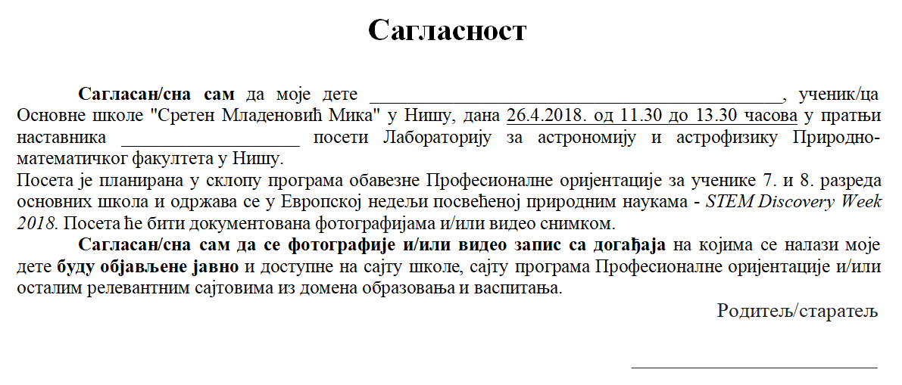
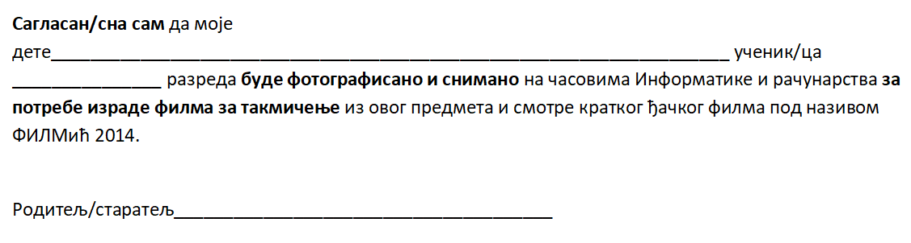

Лични подаци деце
========================================

Често се дешава да одрасли својим понашањем у дигиталном окружењу крше право детета на приватност.
То се најчешће догађа безазлено и „из најбољих намера“ попут ситуација када родитељи желе да се
на друштвеним мрежама похвале како њихова деца прослављају рођендане, остварују неке успехе у спортским
и другим такмичењима, или приказују фотографије када су им деца била мала, фотографије са летовања и слично. 
Такође и наставници често објављују фотографије својих ученика у жељи да прикажу како су били креативни на појединим часовима или вредни и успешни на неким такмичењима.

.. infonote::

    Заштита података о личности посебно је важна код деце, која су као рањива група мање свесна ризика и последица
    дељења својих података и својих права. Зато деца уживају право на посебну заштиту која се првенствено односи на
    употребу личних података у сврху маркетинга, као и на прикупљање личних података о деци приликом коришћења
    услуга које су специјално намењене њима.

Због тога школа често за такве објаве тражи и користи сагласност родитеља за снимање и објављивање фотографија ученика у различитим школским контекстима, попут излета, екскурзија, такмичења, прослава. 
На сликама су приказани примери таквих сагласности.

**Пример 1.**

**Пример 2.**

.. questionnote::

       Погледај пажљиво горње слике сагласности. Да ли је на њима јасно назначено који ће се подаци о ученицима прикупљати
       и где ће се и за које потребе користити? Можеш ли да се сетиш још неких начина и ситуација у којима
       одрасли крше право детета на приватност?

.. infonote::

    Због свега наведеног потребно је да разумеш улогу одраслих, родитеља и наставника
    у заштити твојих права у дигиталном окружењу. 

Узрасна ограничења
----------------------

Нису сви садржаји који постоје на интернету намењени деци. Зато је веомо важно да научиш да препознаш и да примењујеш
**узрасна ограничења за коришћење различитих сервиса на интернету**. Сви знамо да деца не воле ограничења, али је
поштовање узрасних ограничења од виталног значаја за осигурање њихове безбедности у дигиталном простору.

.. infonote::

     Старосни праг за добијање родитељског пристанка у Европској унији је између 13 и 16 година. 

За већину интернет услуга потребан је **пристанак родитеља или другог законског заступника** како би се лични подаци детета обрађивали на основу пристанка до одређене старости. 
Ово се односи на:

* друштвене мреже,
* платформе за преузимање музике и
* платформе за куповину игара „на мрежи“.

Стога компаније морају да уложе напоре, узимајући у обзир доступну технологију, да провере да ли је дата сагласност заиста у
складу са законом. Ово може укључивати спровођење мера за потврђивање старости, попут постављања питања
на које просечно дете не би могло да одговори, или захтева да малолетник достави електронску адресу својих родитеља,
како би се омогућио писани пристанак. 

Пракса показује да иако већина друштвених мрежа и апликација (Вајбер, Инстаграм, Тикток, Воцап, Фејсбук)
предвиђа законски регулисану старосну границу за регистрацију од 13 навршених година, деца могу веома лако
да се пријаве и да региструју своје профиле. 
Неретко родитељи отварају својој деци профиле, већ од рођења или у првих неколико година живота, или деле слике своје деце на својим профилима (појава која се назива „шерентинг“). Размисли, да ли овај поступак представља кршење права детета?
