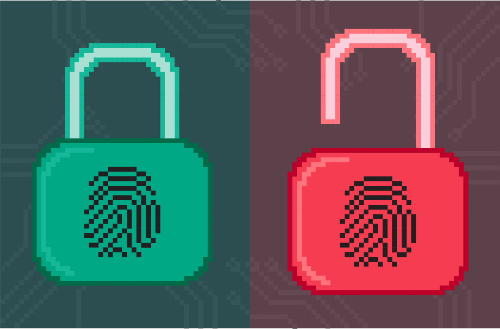

Од кога се штитимо?
========================

Процењује се да на Интернету данас има око 3,5 милијарде корисника. Највећи део њих су нормални људи који користе Интернет
да би обавили неки посао или се разонодили. Међутим, према *Закону великих бројева*, који се најлакше може описати
следећим стиховима

    *„Свашта се роди у мутној води“* (Ђорђе Балашевић),

међу 3,5 милијарде корисника Интернета има и превараната који ће покушати да искористе Интернет за своје смутне радње, а има и разних
типова умних поремећаја, о којима нећемо овом приликом у детаље. Поред тога, наше податке непрестано вребају и велике корпорације. Оне *непрестано* прикупљају *апсолутно све податке до којих могу да дођу*
јер њиховом анализом могу да схвате на шта највише трошимо време и новац. То им даје могућност да нам понуде још више тога
на шта већ трошимо велику количину времена и новца, и да тако увећају свој профит.

Заштита личних података
========================

Право на заштиту личних података и приватности јесте једно од *основних људских права* које је,
наглим развојем дигиталне технологије и Интернета, озбиљно доведено у питање.
Живимо у 21. веку у коме су информације најважнији ресурс, па се наше друштво са правом назива **информационо друштво.**
*У овој ери “великих података” лични подаци се третирају као посебно драгоцен ресурс који, ономе који их поседује, даје
надмоћ и контролу.*

Свака институција, организација или компанија, која је у законској обавези да нам утврди идентитет пре него што нам испоручи
услугу – школа, банка, интернет провајдер – прикупља податке о нама. 
Такође, продавци разне робе на основу уговора или наше дозволе, имају податке о, рецимо, нашој адреси на коју ће
нам испоручити производ или број нашег телефона.

.. infonote::

    Користећи информационе и комуникационе технологије, свако од нас,
    свесно или несвесно, оставља прегршт личних података на интернету, који у 21. веку представљају „дигиталну нафту“
    и заправо *валуту којом плаћамо одређене услуге.*
    Тако лични подаци заврше углавном у поседу корпорација и оглашивача који кроз прикупљање података прате понашања корисника интернета и персонализују претраге, огласе и медијске садржаје за сваког корисника.

Размисли
---------

Погледај у свој мобилни телефон па наведи неколико компанија чије „бесплатне“ сервисе користиш, а заправо су плаћени остављањем твојих личних података.
Направи овакву табелу па упореди са друговима у разреду:

.. csv-table:: *Моји подаци као дигитална валута*
    :header: **Компанија**, **Услуга**, **Остављени подаци**
    :widths: 20, 20, 20
    :align: center

    Компанија 1, Услуга 1, врста података
    Компанија 2, Услуга 2, врста података
    Компанија 3, Услуга 3, врста података

