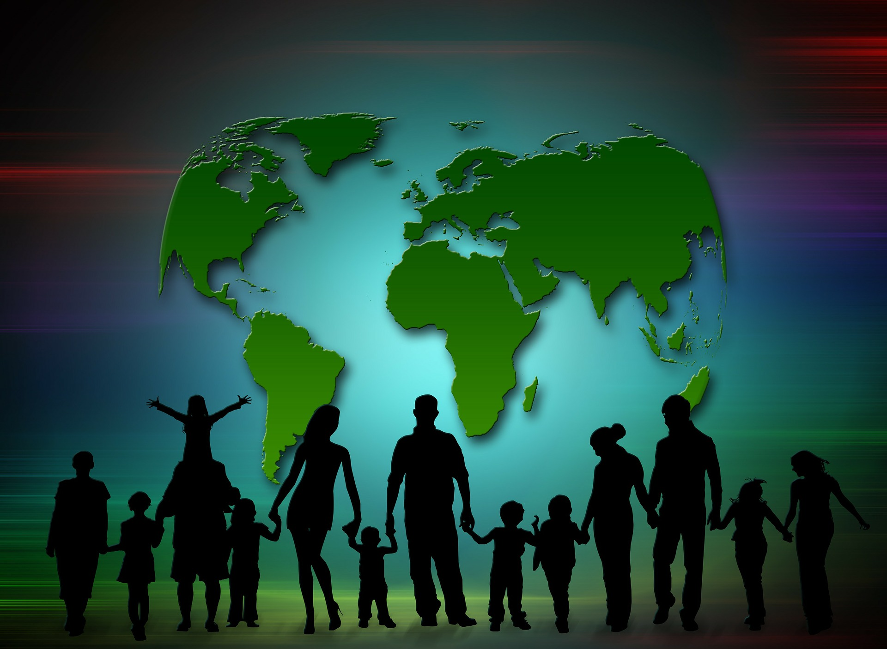
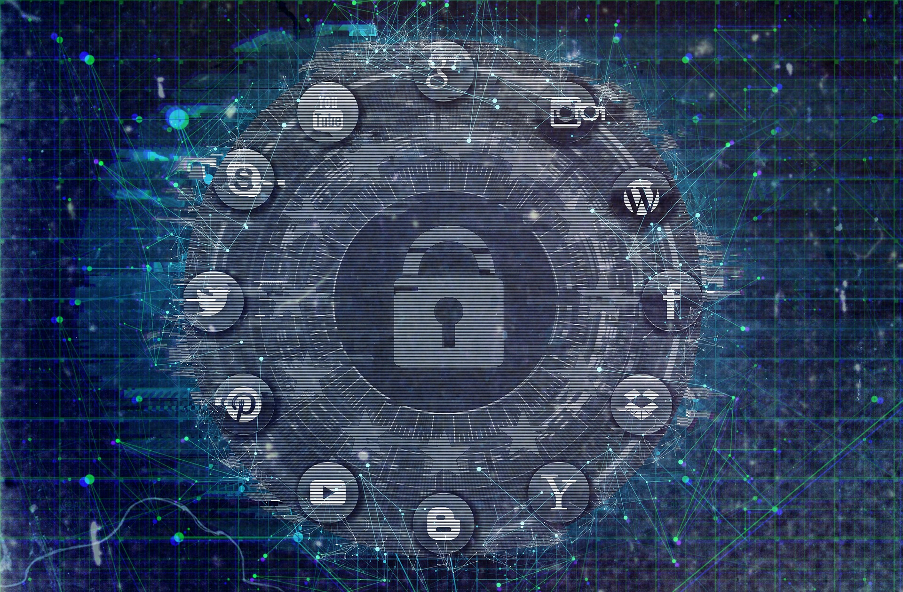

Права детета у дигиталном добу
===============================
.. infonote::

 У овом делу ћемо говорити о:
    •	Конвенцији о правима детета и њеној примени у дигиталном окружењу;
    • вези између ризика на интернету и кршења права.

Заштита података о личности посебно је важна код деце, који су као рањива група мање свесна ризика и последица дељења својих података и својих права. Законска регулатива у Србији и Европи предвиђа да све информације упућене посебно детету треба да буду прилагођене како би му биле лако доступне, користећи јасан и једноставан језик. 
Деца уживају право на посебну заштиту које се првенствено односи на употребу личних података деце у сврху маркетинга или стварања личних или корисничких профила, као и на прикупљање личних података о деци приликом коришћења услуга које су специјално намењене њима.

Конвенција о правима дететa
----------------------------

Конвенција о правима детета је најважнији међународни документ којим се штите права детета. У облику у којем ју је усвојила Генерална скупштина Уједињених нација 20. новембра 1989. године и у којем је ратификована од стране већине земаља у свету, Конвенција представља правни документ писан изразито стручним језиком. 
Да би млади људи разумели шта су њихова права и одговорности, ми ћемо овај документ - Конвенцију о правима детета интерпретирати сопственим речима. О томе говори Члан 42 Конвенције, којим се државе чланице УН обавезују да што шире, на одговарајући и активан начин упознају децу са принципима и одредбама овог документа. 
Значи, овај текст Конвенције о правима детета разликује се од оригинала како би вам омогућио боље разумевање ових права што ће вам уједно омогућити да се са више пажње односите према својим правима.
Са комплетним текстом Конвенције о правима детета можете се упознати на следећем линку https://www.unicef.org/serbia/media/3186/file/Konvencija%20o%20pravima%20deteta.pdf

Права и одговорности (обавезе) се не могу посматрати одвојено једни од других. Конвенција УН описује права која деци и младима гарантују владе. Као и код сваког односа – да би он функционисао – било да је то однос међу пријатељима, или унутар породице, у школи, у спортском друштву или између држава, морамо мислити и на то да ми према другим људима имамо и одређених одговорности (обавеза), као што, са друге стране, такве одговорности и обавезе других постоје према нама. Две темељне обавезе које имамо према другима јесу **поштовање и толеранција**. 
Конвенција УН о правима детета описује ове основне обавезе које владе имају према особама млађим од 18 година.

Права детета прописана Конвенцијом о правима детета **односе се и на дигитално окружење**. Заправо, уопште се не поставља питање да ли права детета важе и у дигиталном свету, већ како осигурати пуно поштовање права детета у дигиталном свету. 
Упознаћемо се са неким члановима ове Конвенције који се примењују и на дигитално окружење а односе се на **ризике и кршења права деце на интернету**, као што су изложеност дигиталном насиљу, говору мржње, стереотипима, предрасудама, затим изложеност непримереним садржајима као и злоупотреба личних података и идентитета.

Упознаћемо се са члановима 2, 16, 17, 19, 34 и 35 Конвенције о правима детета који се односе на ове аспекте у дигиталном окружењу.
 * **Члан 2. Забрана дискриминације**	Ниједно дете не сме бити дискриминисано с обзиром на боју коже, пол, језик, вероисповест, убеђење, порекло, имовно стање, онеспособљеност или припадност некој националној или етничкој мањини.
 * **Члан 16.	Заштита приватности**	Ниједно дете не сме да буде изложено мешању у његов приватни и породични живот, дом или преписку. Такође, ниједно дете не сме да буде изложено нападима на његову част и углед.
 * **Члан 17.	Приступ информацијама**	Свака држава мора да обезбеди детету приступ информацијама путем различитих средстава информисања и стицање сазнања битних за његово добро. Држава такође има дужност да дете заштити од штетних информација.
 * **Члан 19.	Заштита од злостављања**	Држава је одговорна за заштиту деце од злоупотребе од стране родитеља или других људи. Свако дете има право да зна како да избегне или поступа код сваког облика злоупотребе.
 * **Члан 34.	Заштита од сексуалног искоришћавања**	Свако дете има право на заштиту од сексуалног израбљивања и сексуалне злоупотребе, те од проституције и порнографије.
 * **Члан 35.	Заштита од продаје и трговине**	Држава мора да предузме све што је у њеној моћи да спречи насилно одвођење деце или трговину децом.
 

Ризици на интернету и кршење права
---------------------------------------------------------------------------------

Често се дешава да одрасли својим понашањем у дигиталном окружењу крше право детета на приватност. То се најчешће догађа безазлено и “из најбољих намера” попут ситуација када родитељи желе да се на друштвеним мрежама похвале неким ситуацијама када њихова деца прослављају рођендане или имају неке успехе у спортским и другим такмичењима, или приказују фотографије су им деца била мала, фотографије са летовања и слично. 
Такође и наставници често објављују фотографије својих ученика у жељи да прикажу како су били креативни на појединим часовима или вредни и успешни на неким такмичењима. Због тога школа често за такве објаве тражи и користи сагласност родитеља за снимање и објављивање фотографија ученика у различитим школским контекстима, попут излета, екскурзија, такмичења, прослава. 
На сликама су приказани примери таквих сагласности.

.. image:: ../../_images/Saglasnost1.png
   :width: 600 px
   :align: center 

.. image:: ../../_images/Saglasnost2.png
   :width: 600 px
   :align: center 

Погледај пажљиво слике сагласности. Да ли је на њима јасно назначено који ће се подаци о ученицима прикупљати и где ће се и за које потребе користити?
Можете ли да се сетите још неких начина и ситуација у којима одрасли крше право детета на приватност?

.. image:: ../../_images/STEMsaglasnost1.png
   :width: 500 px
   :align: left 

.. image:: ../../_images/STEMsaglasnost2.png
   :width: 450 px
   :align: right 

.. image:: ../../_images/STEMsaglasnost3.png
   :width: 450 px
   :align: right 

Због свега наведеног је потребно да разумете улогу одраслих, родитеља, наставника, креатора интернет садржаја и јавних политика у заштити ваших права у дигиталном окружењу. 

Нису сви садржаји који постоје на интернету намењени деци. Зато је веомо важно да научите да препознате и да примењујете **узрасна ограничења за коришћење различитих сервиса на интернету**, што је од виталног значаја за осигурање ваше безбедности у дигиталном простору. 
На тај начин заштитићете себе од утицаја и последица које многи садржаји непримерени за ваш узраст могу имати на ваше психичко и физичко здравље.

За већину интернет услуга потребан је **пристанак родитеља или другог законског заступника** како би се лични подаци детета обрађивали на основу пристанка до одређене старости. 
Ово се односи на друштвене мреже, платформе за преузимање музике и куповину игара „на мрежиˮ. Старосни праг за добијање родитељског пристанка у Европској унији је између 13 и 16 година. 
Стога компаније морају да уложе напоре, узимајући у обзир доступну технологију, да провере да ли је дата сагласност заиста у складу са законом. Ово може укључивати спровођење мера за потврђивање старости, попут постављања питања на које просечно дете не би могло да одговори или да захтева да малолетник достави електронску адресу својих родитеља, како би се омогућио писани пристанак. 
Такође, постоје и превентивне или саветодавне услуге које се деци нуде директно, али су изузете из захтева за родитељски пристанак, у циљу заштите најбољег интереса детета. 
Пракса показује да иако већина друштвених мрежа и апликација (Вајбер, Инстаграм, Тикток, Воцап, Фејсбук) предвиђа законски регулисану старосну границу за регистрацију од 13 навршених година, деца могу да се веома лако пријаве и региструју своје профиле. 
Неретко родитељи отварају својој деци профиле, већ од рођења или у првих неколико година живота, или деле слике своје деце на својим профилима (појава која се назива „шерентингˮ). Размисли, да ли овај поступак представља кршење права детета?

Са развојем технологије појавила се нова генерација „паметнихˮ играчака и предмета за децу, опремљена микрофоном, камером, сензором и сл., попут паметних сатова и паметних играчака, који се повезују на интернет, које деца све чешће купују и добијају, а који подразумевају ризик од злоупотребе личних података.
Све су то околности о којима морате додатно водити рачуна када је у питању заштита ваших личних података.

**Закључак** - свака ваша активност на мрежи или коришћење различитих дигиталних апликација, сервиса и услуга, најчешће открива много више о вама него што то знате или мислите. Зато критички приступајте својим будућим активностима на мрежи, али и разумите важност принципа заштите приватности и однос према информацијама које су од јавног значаја.

.. infonote::

 Правила за заштиту личних података на интернету:
    •	Никада не дај информације о себи на интернету. Пре него што нешто о другима и себи објавиш, размисли коме ће све те информације бити доступне и колико дуго.
    • Не објављуј фотографије које откривају много података о теби. Пре него што објавиш своју фотографију, размисли које податке о теби она садржи. 
    • Никоме, осим својим родитељима, немој да дајеш своју лозинку. Твоја лозинка је као кључ од твог стана – не дели се ни са ким. 
    • Када приметиш информације о себи због којих се осећаш непријатно, обавести своје родитеље. 
    • Немој да „кликнешˮ ни на једну понуђену могућност на интернету, док се не консултујеш са родитељима или наставницима. Сваки пут када се на интернету појави опција да одговориш и оставиш своје податке, прво провери са одраслима да ли је за тебе добро да то урадиш. 
    • Никада немој да објавиш о себи и другима ништа због чега би једног дана могао/-ла да се стидиш. Када објављујеш о себи или другима нешто, размисли да ли ће то друге постидети или можда једног дана и тебе.