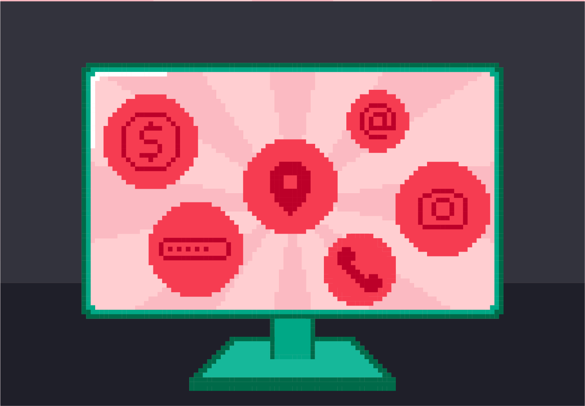

Увод
==================

Свака твоја активност на мрежи, било да се ради о приступању неком сајту или употреби неке апликације,
открива много више о теби него што се то на први поглед чини:

* неки сервиси желе да дођу до твог имена и броја телефона;
* неки сервиси захтевају да унесеш корисничко име и лозинку (*username* и *password*);
* неки сервиси желе да знају твоју локацију;
* други желе да дођу до твоје фотографије, снимка твог гласа или филмића са тобом у главној улози;
* када будеш имао свој рачун у банци, тек онда ћеш видети колико интернет сервиса жели број твог банковног рачуна.

У овој лекцији
----------------

У овој лекцији ћемо говорити:

1. о томе шта су лични подаци;
2. о заштити личних података;
3. о томе како осетљиве податке о себи несмотрено можемо да оставимо разним сервисима;
4. о личним подацима деце која представљају посебно осетљиву категорију корисника интернета; и
5. о томе како да се заштитимо на Интернету.
