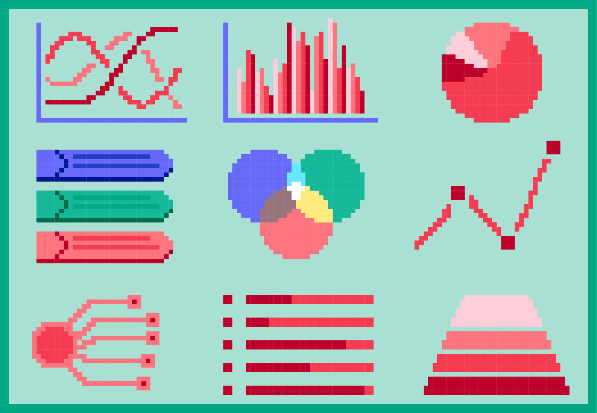

Визуaлизација отворених података и инфографик
====================================================

**Визуализација података** помаже човеку да разуме податке који су представљени сликом.
Циљ визуализације података (било да су то отворени подаци или не) јесте да једноставно и
ефектно пренесу корисницима сложене информације. 
Ево неколико примера добрих визуелизација података:

* Видео Визуaлизација ваздушног саобраћаја у Европи (енгл.) https://bit.ly/2IJ67Zh 
* Визуализација пораста производње нуклеарне енергије у Индији од 2010. до 2016. године (график, енгл.) https://bit.ly/2EkmuGa 
* Интерактивни алат о потрошњи јавног буџета по ставкама у земљама ЕУ (вишејезично) https://bit.ly/2wxti05 

**Инфографик** је комбинација слике и текста који у форми „сликовнице“ преноси информацију гледаоцу,
као причу која својим дизајном и текстом треба да га заинтересује. Инфографик може бити у форми постера,
банера за веб (једне JPG слике или анимиране GIF слике нпр.), видеа или неког другог облика
за приказ покретних и непокретних слика са текстом. 

Инфографик је врло погодан за приказ обрађених сетова података људима који нису експерти за ту област,
јер поједностављено, и на интересантан начин, за дату циљну групу приказује закључке и резултате обраде података.
Ево неколико интересантних инфографика:

* Инфографик о сиромаштву у Србији https://bit.ly/2GTZ1iF 
* Инфографик о коришћењу платних картица у Србији https://bit.ly/2XsubTD 
* Инфографик о статусу породичних фирми у Србији https://bit.ly/2TrqP3S 

.. infonote::

    У сарадњи са наставником припреми инфографик о броју ученика који су се уписали у твоју
    школу у последњих пет или десет година.
