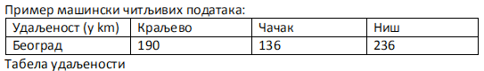

Формати отворених података 
=================================

Подаци могу бити тако форматирани да могу бити само људима читљиви и разумљиви или да буду читљиви и разумљиви и за машину.
Машинска читљивост је једна од кључних особина отворених података.

.. questionnote::

    Да се подсетимо: зашто је важно да велике количине података буду
    представљене тако да рачунари лако могу да их прочитају?

.. reveal:: ФОП-02
    :showtitle: Одговор
    :hidetitle: Сакриј

        За рачунарску обраду података неопходно је да буду машински читљиви тј. да буду јасно дефинисани и добро форматирани
        да би могао да их чита и обрађује рачунар. 

Пример податка који није машински читљив: 
„Удаљеност Београда до Краљева је 190km, Чачак је удаљен 136km од Београда, а Ниш 236km.“ Ове податке човек лако чита и разуме, али смештени у реченицу су нечитљиви за рачунар (иако се може очекивати да се са напретком рачунарских технологија превазиђе ово ограничење). 

На основу података у табели удаљености је лако написати програм који ће увести податке из табеле и обрадити их како желимо нпр. наћи који је од наведених градова најближи Београду, док за сет података исказаних реченицом не можемо рећи да су „машински читљиви“ и самим тим их није могуће искористити да се обрађују рачунарем, осим ако се не припреме тј.ако се од реченице ови подаци претворе у већ приказану табелу. 

.. image:: ../../_images/masinskicitljivipodaci.png
   :width: 350 px
   :align: center 

Зато се отворени подаци припремају и објављују у неком од *отворених дигиталних формата*.
**Дигитални формат** представља договор међу људима који припремају и обрађују
податке помоћу рачунара о томе како записивати податке тако да сваки рачунар може да их прочита.
**Отворени формат** је сваки систем записивања података за кога не треба никоме плаћати
да би се користио.

.. infonote::

    Подсетимо се: назив сваке датотеке је тачком раздвојен од скраћенице за назив формата у којем су подаци датотеке.\
    Датотека ``Troskovi2022.xlsx`` има назив ``Troskovi2022`` и формат ``xlsx`` који указује на то у којем програму
    може да се „отвори“ или направи датотека (Ексел, у овом примеру).

.. questionnote::

    Да ли је ``xlsx`` отворени формат? Да ли можеш слободно да правиш и читаш датотеке у овом формату
    или мораш да купиш програм од неке велике компаније да би могао да читаш ``xlsx`` датотеке?

.. questionnote::

    Да ли знаш неки отворени формат, неки тип датотеке који може да се прави и чита
    на било ком рачунару, на било ком оперативном систему, и за кога не мораш да платиш
    да би га користио?

.. reveal:: ФОП-01
    :showtitle: Одговор
    :hidetitle: Сакриј

        * txt

За чување великих података се често користе следећи формати датотека:

* за чување нумеричких и текстуалних података најчешће заступљени на порталима отворених података су формат компаније
  Microsoft **„xlsx“** и отворени **„ods“** – оба су базирана на XML стандарду и оба се могу читати и
  обрађивати алатима **MS Excel** или **Apache OpenOffice Calc** (и многим другим);
* за чување података о географској локацији користи се XML варијанта **„КML“**
  која је оригинално направљена за „Google Earth“;
* за чување сликовних података користе се формати слика као што су **JPG**, **PNG** и слични.

Све чешће се на отвореним порталима могу наћи и нумерички и текстуални подаци у облику обичних
текстуалних датотека у којима су подаци записани уз поштовање неких договора. Типични примери су

* json
* csv
* tsv

.. questionnote::

    Да ли си чуо за неки од ова три формата? Потражи на Интернету неке информације и њима
    и погледај како се компликовани подаци могу записати у најобичнијој текстуалној датотеци.

.. questionnote::

    На Порталу отворених података Ирске на страни https://data.gov.ie/dataset са леве стране се може видети
    у којим су све форматима подаци. Наведи бар 5 формата на које си наишао када си проучавао
    овај портал отворених података. 

