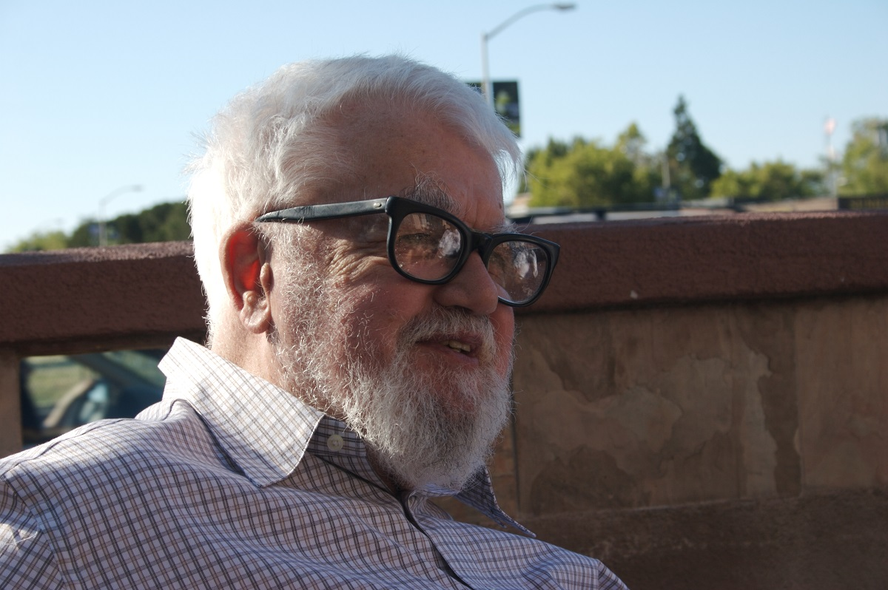

Појам вештачке интелигенције
============================

.. infonote::

 На овом часу ћемо говорити о:
     •   настанку појма вештачке интелигенције;
     •   раном оптимизму XX века;
     •   јакој и слабој дефиницији вештачке интелигенције;
     •   Тјуриновом тесту као оперативном појму вештачке интелигенције.

Настанак појма "вештачка интелигенција"
---------------------------------------

Први електронски рачунар, ENIAC, прорадио је 12. јула 1946. године на универзитету Илиној у Чикагу, САД.

   ENIAC
   
   извор: (Science Photo Library, NTB scanpix), слика објављена под `Ауторство-Некомерцијално-Делити под истим условима 4.0 Међународном лиценцом (CC BY-NC-SA 4.0) <https://creativecommons.org/licenses/by-nc-sa/4.0/deed.sr_LATN>`_

Иако су и пре ENIACа постојале разне рачунске машине, ENIAC је означио почетак потпуно нове ере у развоју
савремене цивилизације: из данашње перспективе је јасно да су електронски рачунари потпуно променили начин
на који живимо. Електронске рачунаре користимо у скоро свим аспектима савременог живота: да платимо рачуне,
да урадимо неки важан и озбиљан посао, да напишемо текст за школу, да се забавимо, па чак и да проћаскамо.

За разлику од свих других машина које су људи направили у протеклих скоро 10.000 година развоја наше цивилизације,
електронски рачунар је прва и једина *универзална* машина коју смо направили: иако на први поглед не може сам
да уради ништа, уз одговарајући програм рачунар може да *симулира сваку другу машину*
што му омогућује да уз одговарајуће хардверске додатке *управља радом других врста машина*.

Осим тога, на самом почетку ере електронских рачунара научници су схватили да рачунари могу да симулирају и неке
типично људске активности као што је играње шаха. Један од пионира вештачке интелигенције, Алан Тјуринг (Alan Turing)
је о томе писао још давне 1950. године у свом чланку `Computing machinery and intelligence <https://academic.oup.com/mind/article/LIX/236/433/986238>`_.

.. figure:: ../../_images/Alan_Turing.jpg
   :height: 500px

   Алан Тјуринг (Alan Turing, 1912-1954)
   
   Непознат аутор, лиценца: Public Domain, извор: Wikimedia Commons

Алан Тјуринг је аутор првог програма за играње шаха. Прва партија шаха између човека и рачунарског програма одиграна је 1952. године,
а одиграли су је Алик Глени (Alick Glennie) и Алан Тјуринг, при чему је Тјуринг играо тако што је глумио рачунар и извршавао свој програм
који је био написан на папиру. На `овом линку <https://www.chessgames.com/perl/chessgame?gid=1356927>`_ можете да погледате како је текла партија.
(Победио је човек, али тек након 29 потеза!)

.. infonote::

   **То што се показало да рачунари могу да симулирају неке интелектуалне активности довело је до настанка појма
   "вештачка интелигенција".**

Термин "вештачка интелигенција" (енгл. *artificial intelligence -- AI*) је настао у лето 1956. године на састанку одржаном
на Дартмут колеџу (Dartmouth College, USA) коме су присуствовали неки од најзначајнијих истраживача у овој области:

- Џон Мекарти (John McCarthy),
- Клод Шенон (Claude Shannon),
- Марвин Мински (Marvin Minsky),
- Ален Њуел (Allen Newell) и
- Херберт Сајмон (Herbert Simon),

а термину је кумовао Џон Мекарти. То је била група математичара, психолога и научника који се баве физиологијом и когнитивним
наукама, а њихов циљ је био, речима Џона Мекартија:

    *Наш коначни циљ је да направимо програме који ће моћи да уче из сопственог искуства
    као што то раде људи.* (Џон Мекарти)

   Џон Мекарти (John McCarthy, 1927-2011)
   
   аутор фотографије: ``null0``, слика је објављена под `Ауторство-Делити под истим условима 2.0 Генеричком лиценцом (CC BY-SA 2.0) <https://creativecommons.org/licenses/by-sa/2.0>`_, извор: Wikimedia Commons

Задатак.
''''''''

Приметимо да међу основачима вештачке интелигенције није било ниједног научника из области рачунарства. Шта мислиш зашто?
(Одговор: *шта мислиш, да ли су у то време постојале рачунарске науке као научна дисциплина?*)

Рани оптимизам XX века и јака дефиниција вештачке интелигенције
---------------------------------------------------------------

На самом почетку развоја вештачке интелигенције (1950е и 1960е године XX века)
веровало се да је вештачка интелигенција ту, одмах иза угла. Само треба да схватимо
како да на одговарајући начин представимо људско знање/искуство и како да направимо програме
који ће моћи да анализирају тако представљено знање и да га увећавају.
Дакле, рани оптимисти су били искрени поборници онога што данас називамо *јака дефиниција вештачке интелигенције*:

.. infonote::

   **Јака дефиниција вештачке интелигенције.** Вештачка интелигенција је рачунарски програм
   који обухвата перцепцију, резоновање и деловање. Другиме речима, то је формални систем који представља
   математички модел свести човека.

Зато нам је било потребно да разумемо нашу људску, природну интелигенцију. Рани оптимисти су и ту бујали оптимизмом:

    *Тајна интелигенције је у томе да нема никакве тајне - нема ту никаквог посебног, магичног трика!* (Марвин Мински)

    *Систем симбола* (тј. рачунарски програм- прим. аут.) *има довољне способности за обављање интелигентних акција.* (Ален Њуел и Херберт Сајмон)

Једини проблем је био у томе што у то време (а ни дан данас!) нико не зна шта је то тачно природна интелигенција!
Тако се у то време, мотивисане развојем вештачке интелигенције, интензивно развијају когнитивне науке (науке које покушавају
да на што прецизнији, скоро математички прецизан начин, опишу рад људског ума).

Скоро у исто време јављају се и скептици који сматрају да је вештачка интелигенција по јакој дефиницији
недостижна и да је покушај да се направи "интелигентнта машина" промашај. Они су предложили тзв.
*слабу дефиницију* вештачке интелигенције која гласи:

.. infonote::

   **Слаба дефиниција вештачке интелигенције.**
   Вештачка интелигенција ни на који начин не треба да представља *интелигентну машину*.
   То треба да буде збирка корисних алгоритама и техника који покушавају да *симулирају* неке когнитивне процесе
   како би решили свакодневне проблеме људи.

Нажалост, научна заједница тог времена је одбацила овакав став и фокусирала се на јаку дефиницију, а епилог
(и ко је заиста био у праву!) ћемо видети на следећем часу!

Задатак.
''''''''

У финансирање истраживања у области вештачке интелигенције и когнитивних наука се укључују државе, војска и велике корпорације.
Шта мислиш, зашто?

(*Пут ка одговору*: размисли о томе шта је ефикасније - радник/војник који свако мало мора да једе, да оде до тоалета, који се
брзо умара и не може да ради дуже од осам сати, који има своје мишљење и систем вредности,
који је често нерасположен, а може да буде и демотивисан и безвољан; или вештачки интелигентан
робот чије батерије се пуне у тачно одређеним временским интервалима, који се сервисира у тачно одређеним временским интервалима
и који беспоговорно ради оно што му је наређено.)

Тјурингов тест - оперативни поглед на вештачку интелигенцију
------------------------------------------------------------

Рани истраживачи у области вештачке интелигенције су имали само један "мали" проблем: нико није знао (као што и данас не зна)
одговор на основно питање: *шта је то интелигенција?*

Тај "мали" проблем је тако произвео следећи **велики** проблем: Како да направимо програм који се понаша *интелигентно*
када немамо дефиницију појма интелигенције која је довољно формална и довољно свеобухватна?

Кључни допринос разрешењу овог проблема је поново дао Алан Тјуринг у свом чланку
`Computing machinery and intelligence <https://academic.oup.com/mind/article/LIX/236/433/986238>`_
из 1950. године који се заснива на следећем низу идеја:

1. с једне стране, ми људи *не умемо* да дефинишемо интелигенцију на довољно прецизан начин;
2. с друге стране, ми људи **умемо да препознамо** интелигентно понашање;
3. дакле, интелигентно је оно и само оно понашање које ми људи доживљавамо као интелигентно понашање.

Иако на први поглед овај низ идеја може да делује као празњикаво филозофирање, ради се о веома
важном погледу на појам интелигенције *као природног и друштвеног, а не математичког феномена*
који је довео до *јединог оперативног појма вештачке интелигенције који имамо*,
а који се зове **Тјурингов тест**.

Да би неки рачунарски програм прошао Тјурингов тест треба довољно пута да победи у *игри имитације*.
Игра имитације се игра тако што се пред рачунарски терминал доведе испитаник, што је "обичан пролазник са улице",
неко ко није рачунарски стручњак, али је разборит и просечно образован.
Путем рачунарског терминала испитаник разговара (говорним језиком!) са два ентитета: ентитетом "А" и ентитетом "Б".
Испитаник зна да је један од та два ентитета човек, а други рачунарски програм и његов задатак је да после неког времена
проведеног у разговору утврди који ентитет је човек, а који рачунар.

.. figure:: ../../_images/TuringTest.jpg

   Тјурингов тест

   аутор слике: ``Juan Alberto Sánchez Margallo``, слика је објављена под `Ауторство 2.5 Генеричком лиценцом (CC BY 2.5) <https://creativecommons.org/licenses/by/2.5/deed.sr_LATN>`_, извор: Wikimedia Commons

Према Тјуринговим ставовима рачунарски програм се сматра вештачки интелигентним ако победи у више од 50% случајева.

Тјурингов тест је од 1950. до данас остао један од најконтроверзнијих погледа на вештачку интелигенцију јер
се ослања на доживљај интелигентног понашања и зависи од културе и времена у коме се дешава. Тако би раних 1960их када
"обичан пролазник са улице" скоро ништа није знао о рачунарима већ веома једноставни програми могли да буду
проглашени за вештачки интелигентне, док исти ти програми пред испитаницима из савремене западне цивилизације
не би успели да прођу тест. Такође, може се десити да у истом историјском тренутку један програм прође тест када
о томе одлучују испитаници из једне културе, а не прође тест када о томе одлучују испитаници друге културе.

И поред свега, Тјурингов тест до данас остаје једини оперативни поглед на вештачку интелигенцију.
И данас се често могу прочитати вести о томе како је овај или онај програм прошао Тјурингов тест,
али обично се тек при дну текста (и то ситним словима) наводи податак да је програм успео да победи у игри
имитације тек у неких 30% случајева.

Задатак.
''''''''

Потражи на интернету дефиницију интелигенције, па покушај да направиш мали каталог различитих дефиниција.
Важно је да приметиш да ниједна од њих није задовољавајућа у смислу да се може лако и брзо преточити у програм.

Задатак.
''''''''

Џозеф Вајзенбаум (Joseph Weizenbaum) је написао програм "Елиза" 1964. године.
Био је то први програм који је могао да разговара са корисником
природним језиком (данас такве програме зовемо *chatbot*).

Потражи у библиотеци Вајзенбаумову књигу "Моћ рачунара и људски ум" (Рад, Београд, 1980) и у њој потражи одломак
о томе како је Елизу доживела Вајзенбаумова секретарица. Каква је била Вајзенбаумова реакција?

Задатак.
''''''''

Пронађи на интернету неки јавно доступан *chatbot* и покушај да попричаш са њим.

Задатак.
''''''''

Пронађи на интернету чланак о неком новијем програму који је "прошао" Тјурингов тест, па покушај из текста
да утврдиш проценат његове успешности у игри имитације.

Задатак.
''''''''

Потражи у видеотеци и погледај филм `"The imitation game" <https://www.imdb.com/title/tt2084970/>`_ о житвоту Алана Тјуринга.
