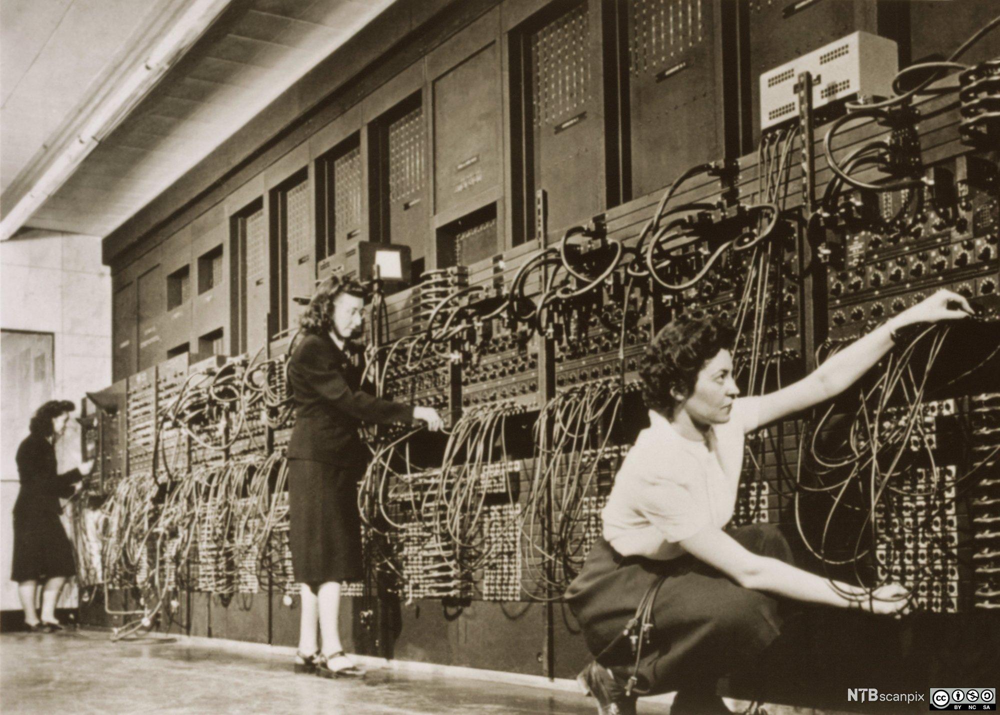

Настанак вештачкe интелигенцијe
========================================

Први електронски рачунар, ENIAC, прорадио је 12. јула 1946. године на Универзитету Илиној у Чикагу, САД.
Иако су и пре ENIAC-а постојале разне рачунске машине, ENIAC је означио почетак потпуно нове ере у развоју
савремене цивилизације. Електронски рачунари су потпуно променили начин
на који живимо: данас их користимо да платимо рачуне,
да урадимо неки важан и озбиљан посао, да напишемо текст за школу, да се забавимо, па чак и да проћаскамо.

   ENIAC
   
   извор: (Science Photo Library, NTB scanpix), слика објављена под `Ауторство-Некомерцијално-Делити под истим условима 4.0 Међународном лиценцом (CC BY-NC-SA 4.0) <https://creativecommons.org/licenses/by-nc-sa/4.0/deed.sr_LATN>`_

.. infonote::

    За разлику од свих других машина које су људи направили у протеклих скоро 10.000 година развоја наше цивилизације,
    електронски рачунар је прва и једина *универзална* машина коју смо направили: иако на први поглед не може сам
    да уради ништа, уз одговарајући програм рачунар може да *симулира сваку другу машину*
    што му омогућује да уз одговарајуће хардверске додатке *управља радом других врста машина*.

Осим тога, на самом почетку ере електронских рачунара научници су схватили да рачунари могу да симулирају и неке
типично људске активности као што је играње шаха. Један од пионира вештачке интелигенције, Алан Тјуринг (Alan Turing)
је о томе писао још давне 1950. године у свом чланку `Computing machinery and intelligence <https://academic.oup.com/mind/article/LIX/236/433/986238>`_.

.. figure:: ../../_images/Alan_Turing.jpg
   :height: 500px

   Алан Тјуринг (Alan Turing, 1912-1954)
   
   Непознат аутор, лиценца: Public Domain, извор: Wikimedia Commons

Алан Тјуринг је аутор првог програма за играње шаха. Прва партија шаха између човека и рачунарског програма одиграна је 1952. године,
а одиграли су је Алик Глени (Alick Glennie) и Алан Тјуринг, при чему је Тјуринг играо тако што је глумио рачунар и извршавао свој програм
који је био написан на папиру. На `овом линку <https://www.chessgames.com/perl/chessgame?gid=1356927>`_ можете да погледате како је текла партија.
(Победио је човек, али тек након 29 потеза!)

.. infonote::

   **То што се показало да рачунари могу да симулирају неке интелектуалне активности довело је до настанка
   вештачкe интелигенцијe.**

Термин „вештачка интелигенција“ (енгл. *artificial intelligence -- AI*) настао је у лето 1956. године на састанку одржаном
на Дартмут колеџу (Dartmouth College, USA) коме су присуствовали неки од најзначајнијих истраживача у овој области:

- Џон Мекарти (John McCarthy),
- Клод Шенон (Claude Shannon),
- Марвин Мински (Marvin Minsky),
- Ален Њуел (Allen Newell) и
- Херберт Сајмон (Herbert Simon),

а термину је кумовао Џон Мекарти. То је била група математичара, психолога и научника који се баве физиологијом и когнитивним
наукама, а њихов циљ је био, речима Џона Мекартија:

    *Наш коначни циљ је да направимо програме који ће моћи да уче из сопственог искуства
    као што то раде људи.* (Џон Мекарти)

   Џон Мекарти (John McCarthy, 1927-2011)
   
   Аутор фотографије: ``null0``, слика је објављена под `Ауторство-Делити под истим условима 2.0 Генеричком лиценцом (CC BY-SA 2.0) <https://creativecommons.org/licenses/by-sa/2.0>`_, извор: Wikimedia Commons

.. questionnote::

    Приметимо да међу основачима вештачке интелигенције није било ниједног научника из области рачунарства. Шта мислиш зашто?

.. reveal:: AI-01
    :showtitle: Одговор
    :hidetitle: Сакриј
    
        У то време **нису постојале** рачунарске науке као научна дисциплина!
        Рачунарске науке се као посебна научна дисциплина јављају тек крајем 1960их година.

Задатак
''''''''

Потражи у видеотеци и погледај филм `„The imitation game“ <https://www.imdb.com/title/tt2084970/>`_ о житвоту Алана Тјуринга.
