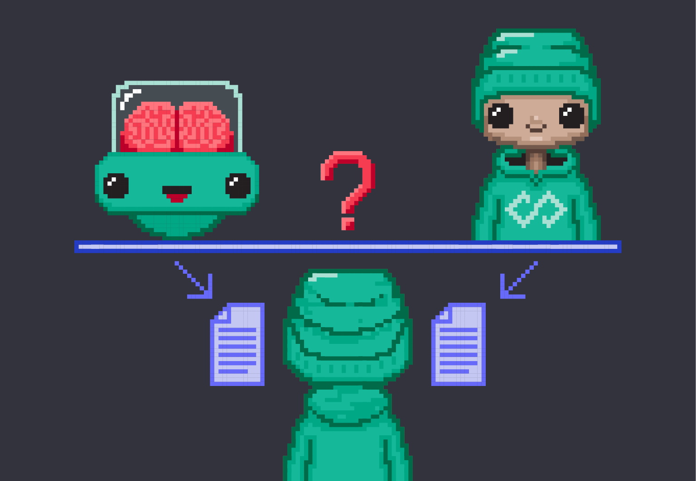

Тјурингов тест
====================================================================

Рани истраживачи у области вештачке интелигенције су имали само један „мали“ проблем: нико није знао (као што и данас не зна)
одговор на основно питање: *шта је то интелигенција?*
Тај „мали“ проблем је тако произвео следећи **велики** проблем: Како да направимо програм који се понаша *интелигентно*
када немамо дефиницију појма интелигенције која је довољно формална и довољно свеобухватна?

:math:`\ `

Кључни допринос разрешењу овог проблема поново је дао Алан Тјуринг у свом чланку
`Computing machinery and intelligence <https://academic.oup.com/mind/article/LIX/236/433/986238>`_
из 1950. године који се заснива на следећем низу идеја:

1. с једне стране, ми, људи, *не умемо* да дефинишемо интелигенцију на довољно прецизан начин;
2. с друге стране, ми, људи, **умемо да препознамо** интелигентно понашање;
3. дакле, интелигентно је оно и само оно понашање које ми људи доживљавамо као интелигентно понашање.

.. infonote::

      Иако на први поглед овај низ идеја може да делује као празњикаво филозофирање, ради се о веома
      важном погледу на појам интелигенције *као природног и друштвеног, а не математичког феномена!*
      Он је довео до *јединог оперативног појма вештачке интелигенције који имамо*,
      а који се зове **Тјурингов тест**.

Да би неки рачунарски програм прошао Тјурингов тест треба довољно пута да победи у *игри имитације*.
Игра имитације се игра тако што се пред рачунарски терминал доведе испитаник, што је „обичан пролазник са улице“,
неко ко није рачунарски стручњак, али је разборит и просечно образован.
Путем рачунарског терминала испитаник разговара (говорним језиком!) са два ентитета: ентитетом „А“ и ентитетом „Б“.
Испитаник зна да је један од та два ентитета човек, а други рачунарски програм и његов задатак је да после неког времена
проведеног у разговору утврди који ентитет је човек, а који рачунар.

    
Према Тјуринговим ставовима рачунарски програм се сматра вештачки интелигентним ако победи у више од 50% случајева.

Тјурингов тест је од 1950. године до данас остао један од најконтроверзнијих погледа на вештачку интелигенцију јер
се ослања на доживљај интелигентног понашања и зависи од културе и времена у коме се дешава. Тако би раних 1960-их, када
„обичан пролазник са улице“ скоро ништа није знао о рачунарима, већ веома једноставни програми могли да буду
проглашени за вештачки интелигентне, док исти ти програми, пред испитаницима из савремене западне цивилизације,
не би успели да прођу тест. Такође, може се десити да у истом историјском тренутку један програм прође тест када
о томе одлучују испитаници из једне културе, а не прође тест када о томе одлучују испитаници друге културе.

.. questionnote::

    Зашто се филм о животу Алана Тјуринга који смо препоручили да погледаш зове баш „The Imitation Game“?
    Одговор је компликованији него што се на први поглед чини! Продискутуј са наставником!

И поред свега, Тјурингов тест до данас остаје једини оперативни поглед на вештачку интелигенцију.
И данас се често могу прочитати вести о томе како је овај или онај програм прошао Тјурингов тест,
али обично се тек при дну текста (и то ситним словима) наводи податак да је програм успео да победи у игри
имитације тек у неких 30% случајева.

Задатак.
''''''''

Пронађи на интернету неки јавно доступан *chatbot* и покушај да попричаш са њим.

Задатак.
''''''''

Пронађи на интернету чланак о неком новијем програму који је „прошао“ Тјурингов тест, па покушај из текста
да утврдиш проценат његове успешности у игри имитације.

