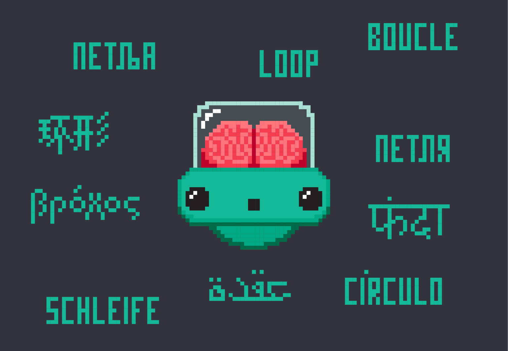

Примене вештачке интелигенције
================================================

Прагматичан поглед на вештачку интелигенцију коју је са собом донела слаба дефиниција
(која полази од става да рачунар *не може* да опонаша људски мозак у свој његовој комплексности,
али *може* да репродукује неке когнитивне процесе са циљем решавања свакодневних проблема)
довела је до експлозије нових технологија и до скоро неслућених примена вештачке интелигенције.

* **Оптичко препознавање знакова**
  (енгл. *Optical Character Recognition*, OCR) је софтверска технологија која претвара *слике* бројева, слова и
  знакова интерпункције са штампаних или писаних докумената у симболе које могу да читају други програми.
  Данас су већ развијени алгоритми који могу да нпр. потпуно разликују рукописе две различите особе.

* **Препознавање лица**
  (енгл. *facial recognition*) је технологија која подразумева утврђивањe идентитета особе на основу
  специфичних детаља њеног лица (размак очију, носа, јагодица, контуре усана, ушију, браде, итд).
  Препознавање лица може да се користи како би се људи идентификовали на фотографијама,
  видео записима или у реалном времену. Идентификација се обавља тако што се параметри добијени
  са дигиталне слике упоређују са параметрима особа у бази података. Овакви аутоматизовани системи за идентификацију
  врше проверу идентитета појединаца веома брзо (у само неколико секунди, па и брже). Напредне верзије ове технологије
  могу да се користе за још сложеније анализе израза лица како би се идентификовале *емоције* као што су гађење, радост, бес,
  изненађење, страх или туга.

* **Паметни системи за превођење** аутоматизују процес превођења *текста* са једног језика на други.
  Обично на самом почетку ови системи раде веома лоше и често су предмет разних шала на интернету,
  али временом, како расте број корисника система који у њега уграђују своје знање,
  ови системи постају све бољи и бољи.

* **Препознавање говора** (енгл. *speech recognition*) представља технологију која има за циљ да *изговорене* речи
  (низ звукова) преведе у низ симбола како би се он онда могао обрадити другим техникама.
  Ова технологија се, између осталог, користи за имплементацију
  **гласовних асистената**, што су технологије које анализирају комуникацију са корисником како би
  извршиле неке даље акције као што је слање СМС поруке, слање електронске поште, а у новије време
  и заказивање састанака.

* **Системи за препоруке услуга/производа** (енгл. *recommendation systems*)
  представљају системе који на основу анализе претходног понашања корисника
  бирају (*препоручују*) садржај који се приказује корисницима на интернету и на друштвеним мрежама.
  Такви системи, на пример, одређују које рекламне поруке ће бити приказане кориснику,
  које објаве пријатеља на друштвеним мрежама
  ће бити истакнуте, дају препоруке за филмове које корисник треба да погледа и слично.
  Ови алгоритми се користе и у системима за филтрирање нежељене поште.

* **Вештачка интелигенција у видео-играма** се користи да се моделује понашање противничког играча
  како би игра против рачунара била интересантнија. Највећа препрека за примену вештачке интелегенције у овом домену
  је потреба да рачунар одреагује у веома кратком времену. У ту сврху се користе разне врсте алгоритама:
  налажење оптималне путање, доношење одлука, као и тактичка и стратешка интелигенција.

* **Аутономно управљање возилима** је технологија у настанку која окупља скоро све претходно наведене технологије
  са циљем да се направе аутомобили који ће сами моћи да довезу путника до жељеног места, уз минималне интервенције
  возача. Поред алгоритама вештачке интелигенције, системи за аутономно управљање возилима користе и низ технологија
  за лоцирање и комуникацију као што су радари, лидари, камере, сателитска комуникација и коришћење сервиса „у облаку“.

У скоро свим наведеним примерима кључни елемент представља *обучавање система* употребом
алгоритама **машинског учења** који се заснива на анализи *огромног броја* случајева како би систем
профинио своје критеријуме и тако повећао тачност.

:math:`\ `

Обично је потребно анализирати милионе, ако не и милијарде, случајева да би систем
достигао ниво употребљивости који је прихватљив за комерцијалну употребу.
Један од начина да се обезбеди довољно велики узорак је оснивање друштвене мреже на којима је
коришћење ових алгоритама врло изражено од самог почетка. Корисници мреже (таговањем пријатеља на сликама
или коментарима на постојећи садржај) добровољно постају бесплатна радна снага која се користи за тренинг алгоритама
вештачке интелигенције, док системи који су на тај начин обучени припадају приватним компанијама
које онда продају ове услуге, рецимо, маркетиншким компанијама.

Задатак
''''''''

*Google Translate Game* је игра која се игра овако:

1. Одабери неку реченицу или краћи текст на српском.
2. Користећи *Google Translate* преведи тај текст са српског на енглески.
3. Користећи *Google Translate* преведи тај текст са енглеског на руски.
4. Користећи *Google Translate* преведи тај текст са руског на немачки.
5. Користећи *Google Translate* преведи тај текст са немачког назад на српски.

Наравно, можеш одабрати и било коју другу комбинацију страних језика; једино је важно да кренеш од текста на српском
и да на крају поново добијеш текст на српском. Пробај ову игру, па упореди полазни и крајњи текст.

Задатак
''''''''

Покушај да пошаљеш СМС поруку другу или другарици користећи дигиталног асистента на свом телефону
(*Google Assistant*, *Siri*, *Amazon Alexa*, *Bixby*...).

Задатак
''''''''

Пронађи на интернету чланке о једној од следећих технологија и припреми кратак извештај:

- *Image Processing*
- *Natural Language Processing (NLP)*
- *Internet of Things (IoT)*
- *Smart Cities*

Задатак
''''''''

Опиши како се у аутономном управљању возилима користе технологије као што су:

- оптичко препознавање знакова
- препознавање лица
- препознавање говора
- системи за препоруке
- *Image Processing*
- *Natural Language Processing (NLP)*
- *Smart Cities*

