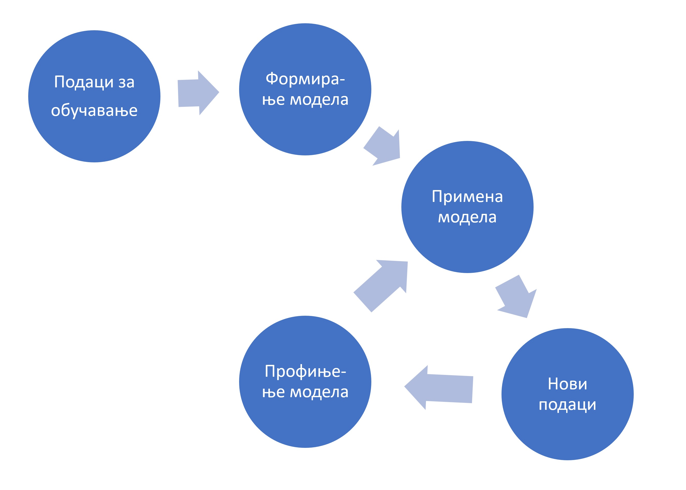

Примене вештачке интелигенције
================================================

Прагматичан поглед на вештачку интелигенцију коју је са собом донела слаба дефиниција
(која полази од става да рачунар *не може* да опонаша људски мозак у свој његовој комплексности,
али *може* да репродукује неке когнитивне процесе са циљем решавања свакодневних проблема)
довела је до експлозије нових технологија и до скоро неслућених примена вештачке интелигенције.

:math:`\ `

**Оптичко препознавање знакова**
(енгл. *Optical Character Recognition*, OCR) је софтверска технологија која претвара *слике* бројева, слова и
знакова интерпункције са штампаних или писаних докумената у симболе које могу да читају други програми.

**Пример.** Програм који на наплатној рампи аутопута чита регистарске таблице аутомобила.

**Пример.** Препознавање рукописа и идентификација особе на основу рукописа.

:math:`\ `

**Препознавање лица**
(енгл. *facial recognition*) је технологија која подразумева утврђивањe идентитета особе на основу
специфичних детаља њеног лица (размак очију, носа, јагодица, контуре усана, ушију, браде, итд).
Идентификација се обавља тако што се параметри добијени
са дигиталне слике упоређују са параметрима особа у бази података. Овакви аутоматизовани системи за идентификацију
врше проверу идентитета појединаца веома брзо (у само неколико секунди, па и брже). Напредне верзије ове технологије
могу да се користе за још сложеније анализе израза лица како би се идентификовале *емоције* као што су гађење, радост, бес,
изненађење, страх или туга.

**Пример.** Идентификација особа на фотографијама и видео записима (такозвано *таговање*),
што користе разне друштвене мреже (Фејсбук, Инстаграм), али и полиција када тражи починиоца неког кривипног дела.

**Пример.** Идентификација особа *у реалном времену*: интелигнентни системи непрекидно анализирају видео записе
са камера које су постављене на јавним местима и бележе сва лица која препознају. Ово представља озбиљно
задирање у приватност, а детаљнију расправу остављамо за следећи сегмент (Будућност вештачке интелигенције и етичка питања).

:math:`\ `

**Паметни системи за превођење** аутоматизују процес превођења *текста* са једног језика на други.
Обично на самом почетку ови системи раде веома лоше и често су предмет разних шала на интернету,
али временом, како расте број корисника система који у њега уграђују своје знање,
ови системи постају све бољи и бољи.

**Пример.** Сервис *Google Translate (translate.google.com)* сада већ прилично вешто преводи једноставније текстове
са сваког од неколико стотина језика на сваки други.

:math:`\ `

**Препознавање говора** (енгл. *speech recognition*) представља технологију која има за циљ да *изговорене* речи
(низ звукова) преведе у низ симбола како би се он онда могао обрадити другим техникама.

**Пример.** Многа такси удружења у Србији већ имају таблет уређаје у својим возилима са којима таксиста може да
комуницира гласом.

**Пример.** Гласовни асистенати представљају пакет технологија које анализирају комуникацију са корисником како би
извршиле неке даље акције као што је слање СМС поруке, слање електронске поште, а у новије време
и заказивање састанака.

:math:`\ `

**Системи за препоруке услуга/производа** (енгл. *recommendation systems*)
представљају системе који на основу анализе претходног понашања корисника
бирају (*препоручују*) садржај који се приказује корисницима на интернету и на друштвеним мрежама.

**Пример.** Рекламне поруке и нови видео материјали који ће бити приказани кориснику YouTube сервиса.

**Пример.** Објаве пријатеља на друштвеним мрежама које ће бити истакнуте или премештене на
почетак конверзације.

**Пример.** Системи за филтрирање нежељене поште.

:math:`\ `

**Вештачка интелигенција у видео-играма** се користи да се моделује понашање противничког играча
како би игра против рачунара била интересантнија. Највећа препрека за примену вештачке интелегенције у овом домену
је потреба да рачунар одреагује у веома кратком времену. У ту сврху се користе разне врсте алгоритама:
налажење оптималне путање, доношење одлука, као и тактичка и стратешка интелигенција.

**Пример.** Коју видео игру радо играш? Колико је „паметан“ програм када играш у режиму „човек против машине“?

:math:`\ `

**Аутономно управљање возилима** је технологија у настанку која окупља скоро све претходно наведене технологије
са циљем да се направе аутомобили који ће сами моћи да довезу путника до жељеног места, уз минималне интервенције
возача. Поред алгоритама вештачке интелигенције, системи за аутономно управљање возилима користе и низ технологија
за лоцирање и комуникацију као што су радари, лидари, камере, сателитска комуникација и коришћење сервиса „у облаку“.

**Пример.** Многи новији аутомобили данас имају уграђен систем који обезбеђује да аутомобил остане у својој траци,
а неки чак одбијају да промене траку док возач не укључи одговарајући индикатор промене правца („жмигавац“).

**Пример.** Многи савременији аутомобили имају уграђеног паркинг асистента, који уме сам да се упаркира на
паркинг место поред кога се возач зауставио.

**Пример.** Најсавременији аутомобили имају режим аутономне вожње, где су интервенције возача минималне.

.. image:: ../../_images/Prevodilac.png
    :width: 400
    :align: center

Машинско учење
---------------------

У скоро свим наведеним примерима кључни елемент представља *обучавање система* употребом
алгоритама машинског учења.

**Машинско учење** је грана вештачке интелигенције заснована на идеји да специјалозовани програми
могу да идентификују обрасце понашања и доносе одлуке уз минималну људску интервенцију на основу расположивих података.
Сваки систем за машинско учење гради и временом профињује *математички модел* података који су му на располагању.
На основу формираног модела рачунар може да предвиђа будуће понашање система кога прати, уколико оно не одступи превише
од података на којима је програм обучен. Процес машинског учења се укратко може представити овако:

Први корак у процесу машинског учења се састоји у томе да људи који су заинтересовани за неки проблем
прикупе податке о жељеном понашању система (*историјски подаци*) који се користе
као *подаци за обучавање* (енгл. *training data*). Машинском анализом података за обучавање уз употребу низа
компликованих алгоритама (метод потпорних вектора, алгоритам *k* најближих суседа, градијентни спуст, конволутивне неуронске мреже итд)
формира се *математички модел* понашања система. Потом се модел тестира на „свежим“ подацима који нису били укључени
у податке за обучавање, па се резултат који је дао рачунар упоређује са „стањем на терену“.
Ако се модел не понаша довољно добро, он се може поправити формирањем нових сетова података за обучавање
и додатним тренингом модела.

:math:`\ `

Обично је потребно анализирати милионе, ако не и милијарде, случајева да би модел
достигао ниво употребљивости који је прихватљив за комерцијалну употребу.
Један од начина да се обезбеди довољно велики узорак је оснивање друштвене мреже на којима је
коришћење ових алгоритама врло изражено од самог почетка. Корисници мреже (таговањем пријатеља на сликама
или коментарима на постојећи садржај) добровољно постају бесплатна радна снага која се користи за тренинг алгоритама
вештачке интелигенције, док системи који су на тај начин обучени припадају приватним компанијама
које онда продају ове услуге, рецимо, маркетиншким компанијама.

Задатак
''''''''

*Google Translate Game* је игра која се игра овако:

1. Одабери неку реченицу или краћи текст на српском.
2. Користећи *Google Translate* преведи тај текст са српског на енглески.
3. Користећи *Google Translate* преведи тај текст са енглеског на руски.
4. Користећи *Google Translate* преведи тај текст са руског на немачки.
5. Користећи *Google Translate* преведи тај текст са немачког назад на српски.

Наравно, можеш одабрати и било коју другу комбинацију страних језика; једино је важно да кренеш од текста на српском
и да на крају поново добијеш текст на српском. Пробај ову игру, па упореди полазни и крајњи текст.

Задатак
''''''''

Покушај да пошаљеш СМС поруку другу или другарици користећи дигиталног асистента на свом телефону
(*Google Assistant*, *Siri*, *Amazon Alexa*, *Bixby*...).

Задатак
''''''''

Пронађи на интернету чланке о једној од следећих технологија и припреми кратак извештај:

- *Image Processing*
- *Natural Language Processing (NLP)*
- *Internet of Things (IoT)*
- *Smart Cities*

Задатак
''''''''

Опиши како се у аутономном управљању возилима користе технологије као што су:

- оптичко препознавање знакова
- препознавање лица
- препознавање говора
- системи за препоруке
- *Image Processing*
- *Natural Language Processing (NLP)*
- *Smart Cities*

