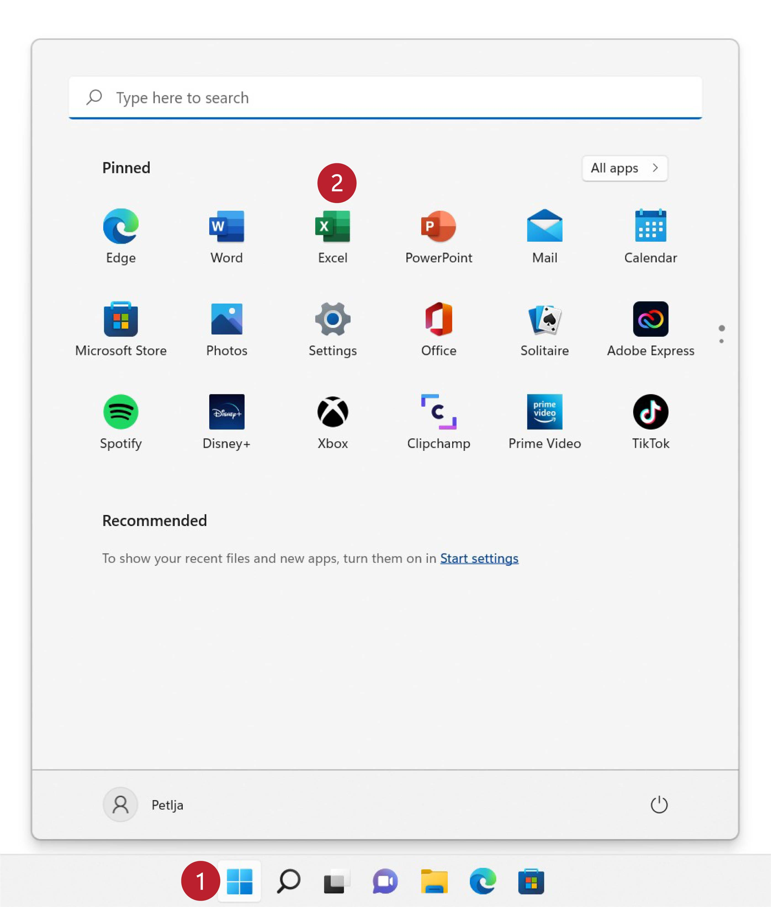
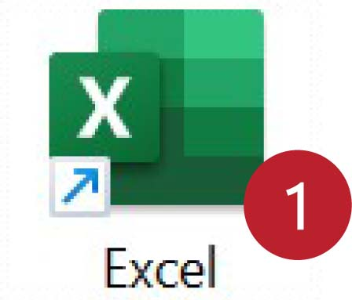

Покретање Ексела
======================

Мајкрософтов Ексел (*Microsoft Excel*) представља један од најраспрострањенијих софтверских производа
за обраду табеларно представљених података. Ексел своју популарност дугује томе што је табела у
коју се уносе подаци „опипљива“, она је ту, корисник може само да кликне на поље и да унесе податак или формулу.

Да бисмо га покренули, прво морамо да пронађемо Ексел на рачунару. Оперативни систем *Windows* омогућује да до програма дођемо на разне начине.

Највероватније је пречица већ издвојена на Старт менију. Кликни на Старт дугме (1), па на пречицу (2):

Ако то није случај, можемо га потражити у списку свих апликација које су инсталиране на рачунару.
Кликни на Старт дугме (1), па на „All apps“ (2):

па потражи апликацију на списку и кликни на њу (3):

.. image:: ../../_images/StartExcel1b.jpg
   :width: 600px
   :align: center

Постоји и могућност да се пречица која води ка програму већ налази на радној површини (десктоп):

У сваком случају, када се покрене, Ексел нам нуди могућност да направимо нови документ (1),
или да потражимо документ међу фајловима који су на рачунару (2),
или да учитамо неки од докумената на којима смо недавно радили (3):

.. image:: ../../_images/OpenExcel.jpg
   :width: 600px
   :align: center

Ако се одлучимо да кренемо од празног документа (*Blank workbook*) отвориће се нови празан радни лист:

.. image:: ../../_images/Excel0.jpg
   :width: 600px
   :align: center

..
   Следећи видео илуструје могућности покретања Ексела:

   .. ytpopup:: 4CHs9C-av6A
      :width: 735
      :height: 415
      :align: center
   
Одмах испод заглавља прозора налази се *командна трака* (енг. *command ribbon* или кратко само *ribbon*) на којој су сличицама (које се зову *иконе* или *иконице*) приказане разне акције које Ексел уме да изврши. О некима од њих ћемо детаљно причати касније.

