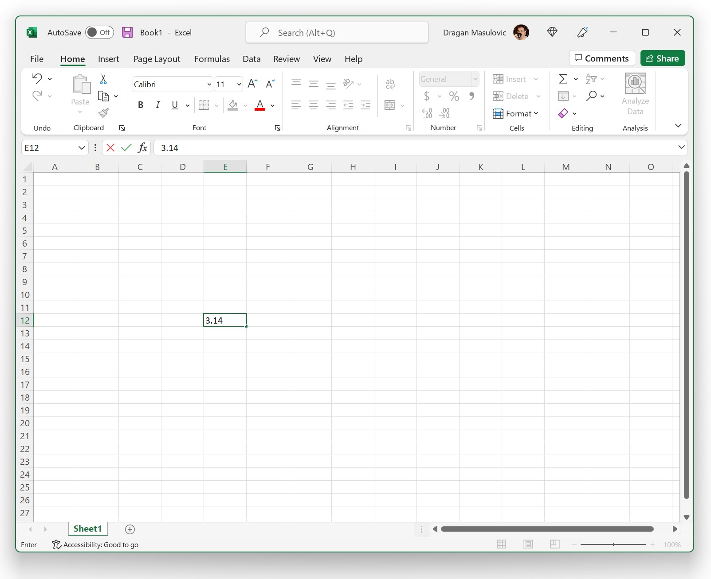
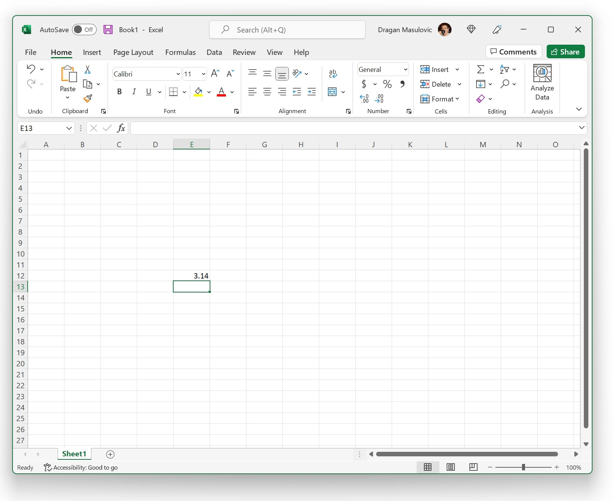
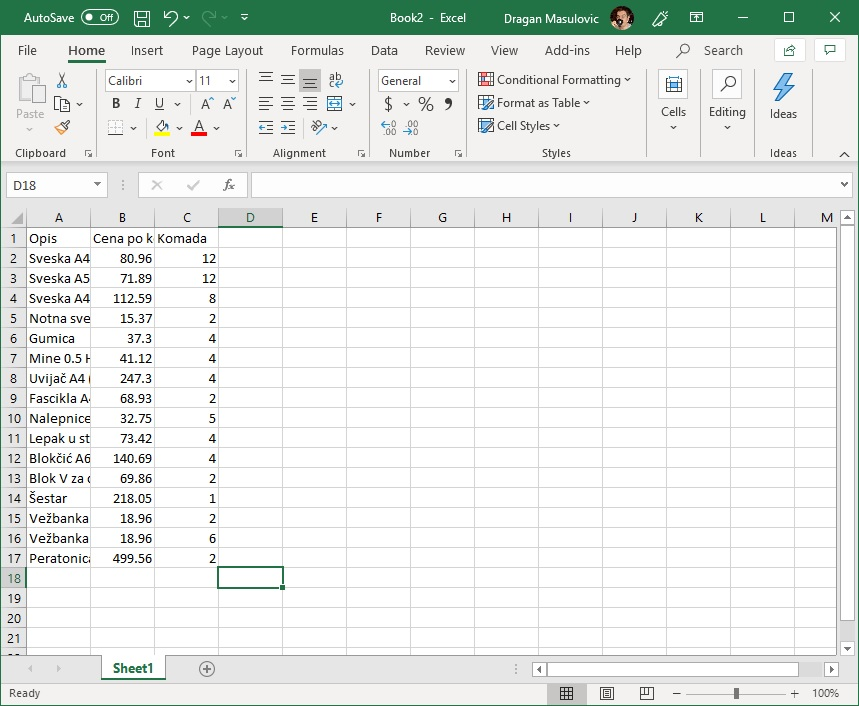
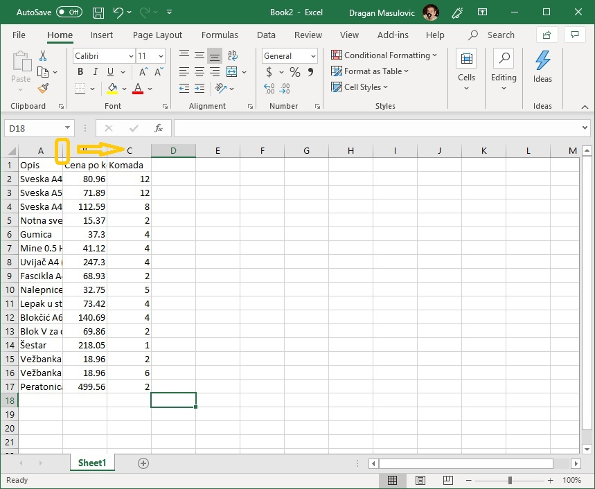
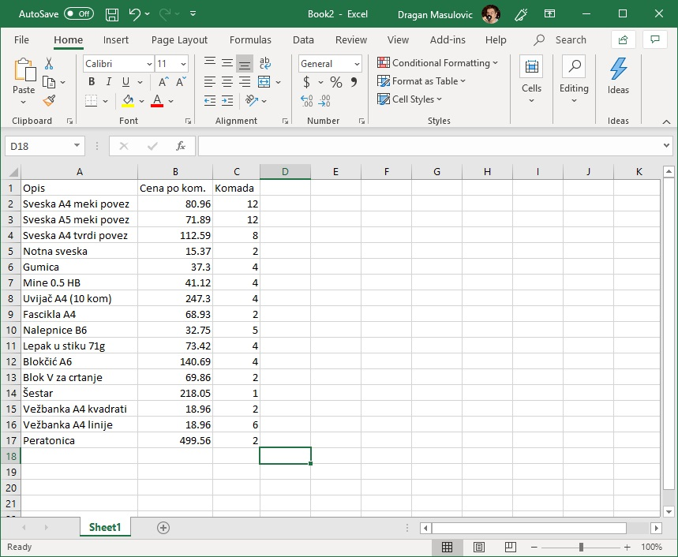
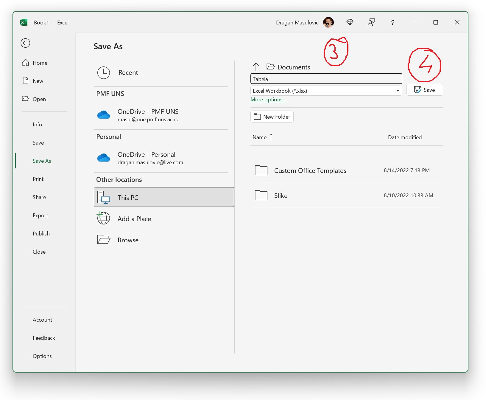

Навигација и уношење података у табелу
============================================

Највећи део прозора представља табела чије колоне су означене словима (A, B, C, D, ...), а врсте бројевима (1, 2, 3, ...). Табела се састоји од "кућица" које зовемо *ћелије*. Ћелија може да садржи

- неки текст (опис),
- неки број, или
- *формулу*, што је главна снага Ексела.

.. infonote::

    Име сваке ћелије се састоји од слова (колоне у којој се налази) и броја (врсте у којој се налази). Дакле, као у шаху!

Ћелија око које се налази зелени оквир се зове *активна ћелија*. Активна ћелија је ћелија у коју можемо да унесемо неки садржај. Погледајмо кратак видео:

.. ytpopup:: GmQeSPrvMnQ
   :width: 735
   :height: 415
   :align: center

Да бисмо унели неки податак рецимо у ћелију Е12 треба да кликнемо мишем на њу или да се стрелицама "дошетамо" до ње. Онда можемо да унесемо неки текст или број, рецимо овако:

.. infonote::

       Након уноса податка обавезно треба притиснути тастер [ENTER]**:

Следећи видео илуструје унос података у Ексел табелу:

.. ytpopup:: Rivrb_UfOMA
   :width: 735
   :height: 415
   :align: center

.. infonote::

    **ПАЖЊА!** У зависности од тога како су у оперативном систему постављена регионална подешавања (*Regional Settings*) Ексел приказује бројеве користећи децималну тачку (по англо-саксонском стандарду) или користећи децимални зарез (по централноевропском стандарду кога је усвојила и Србија).

**У овом курсу ћемо користити англо-саксонски стандард јер је то стање ствари у програмирању на свим континентима и у свим државама света!**

Пример
-----------

Сада ћемо направити нови празан документ и у њега унети табелу са почетка (куповина школског прибора). Не морате да прекуцавате податке. Уместо тога унесте неке своје податке, али водите рачуна да табела треба да има три колоне које се зову "Опис", "Цена по ком." и "Комада" и да мора да има барем 15 редова.

Кренемо од празне табеле:

.. image:: ../../_images/Excel100.jpg
   :width: 600px
   :align: center

Ексел аутоматски додели неку "стандардну" ширину колонама и висину врстама табеле. Ако ништа не променимо унос података ће бити непријатан и табела ће на крају изгледати некако овако:

Пошто су колоне сувише уске описи се не виде добро. Колоне се могу проширити тако што мишем "ухватите" границу између два слова у заглављу табеле и развучете колону колико вам прија:

Тако добијамо табелу која је много прегледнија:

На исти начин се могу проширити и врсте у табели, али то нам у овом примеру није било потребно.

Да нам труд не пропадне треба да снимимо табелу коју смо направили. Кликните на "File":

па онда на "Save as" и "This PC":

У одговарајуће поље унесите име фајла и кликните на "Save":

Погледајмо и кратак видео:

.. ytpopup:: ono-ZxBnTiU
   :width: 735
   :height: 415
   :align: center

