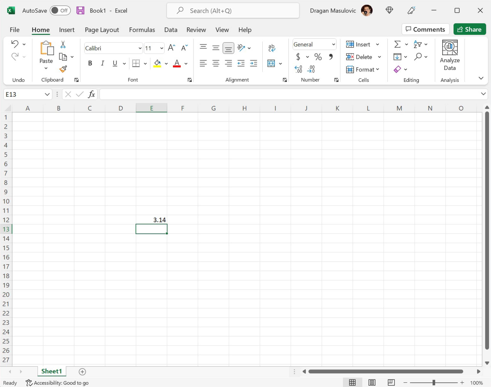
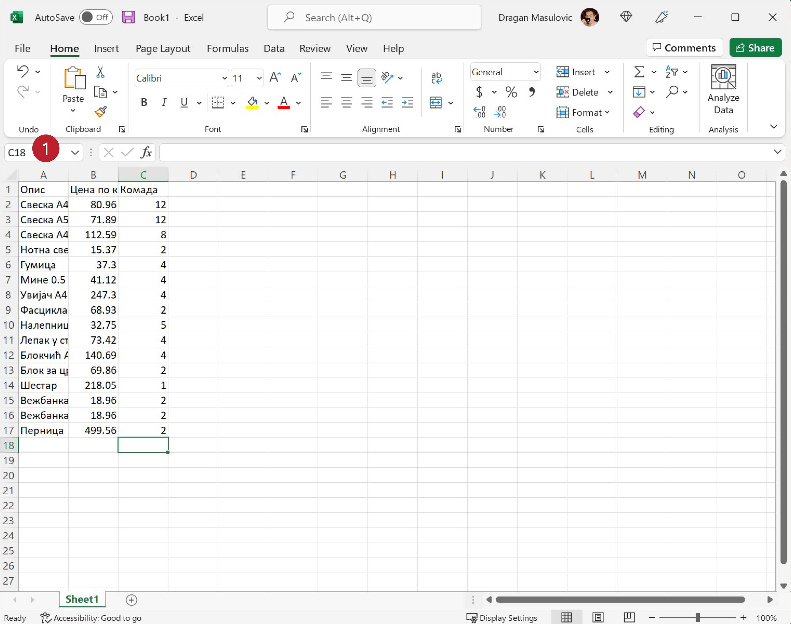

Навигација и уношење података у табелу
============================================

Највећи део прозора представља табела чије колоне су означене словима (A, B, C, D, ...), а врсте бројевима (1, 2, 3, ...).
Табела се састоји од „кућица“ које зовемо *ћелије*. Ћелија може да садржи:

- неки текст (опис),
- неки број, или
- *формулу*, што је главна снага Ексела.

.. infonote::

    Име сваке ћелије се састоји од слова (колоне у којој се налази) и броја (врсте у којој се налази). Дакле, као у шаху!

Ћелија око које се налази подебљани оквир се зове *активна ћелија*. Активна ћелија је ћелија у коју можеш
да унесеш неки садржај.

.. Погледај кратак видео:
   .. ytpopup:: GmQeSPrvMnQ
      :width: 735
      :height: 415
      :align: center

Да би унео неки податак -- рецимо у ћелију Е12 -- треба да кликнеш мишем на њу или да се стрелицама
„дошеташ“ до ње. Онда можеш да унесеш неки текст или број, рецимо овако:

.. image:: ../../_images/Excel2.jpg
   :width: 600px
   :align: center

.. infonote::

       Након уноса податка обавезно треба притиснути тастер [ENTER]:

.. Следећи видео илуструје унос података у Ексел табелу:

   .. ytpopup:: Rivrb_UfOMA
      :width: 735
      :height: 415
      :align: center
   
.. infonote::

    **ПАЖЊА!** У зависности од тога како су у оперативном систему постављена регионална подешавања
    (*Regional Settings*) Ексел приказује бројеве користећи децималну тачку (по англо-саксонском стандарду)
    или користећи децимални зарез (по централноевропском стандарду који је усвојила и Србија).

**У овом курсу ћемо користити англо-саксонски стандард јер је то стање ствари у програмирању на свим
континентима и у свим државама света!**

Пример
-----------

Сада ћемо направити нови празан документ и у њега унети табелу са почетка (куповина школског прибора).
Не мораш да прекуцаваш податке. Уместо тога унеси неке своје податке, али води рачуна да табела треба
да има три колоне које се зову: „Опис“, „Цена по ком.“ и „Комада“ и да мора да има барем 15 редова.

Крени од празне табеле:

Ексел аутоматски додели неку „стандардну“ ширину колонама и висину врстама табеле.
Ако ништа не промениш унос података ће бити непријатан и табела ће на крају изгледати некако овако:

Пошто су колоне сувише уске описи се не виде добро. Колоне можеш проширити тако што мишем „ухватиш“
границу између два слова у заглављу табеле (1) и развучеш колону колико ти прија:

Тако добијаш табелу која је много прегледнија:

На исти начин се могу проширити и врсте у табели, али то нам у овом примеру није било потребно.

Да ти труд не пропадне треба да снимиш табелу. Кликни на „File“ (1):

па онда на „Save as“ (1) и „This PC“ (2):

.. image:: ../../_images/Excel104.jpg
   :width: 600px
   :align: center

У одговарајуће поље унеси име фајла (3) и кликни на „Save“ (4):

.. image:: ../../_images/Excel105.jpg
   :width: 600px
   :align: center

.. Погледај и кратак видео:

   .. ytpopup:: ono-ZxBnTiU
      :width: 735
      :height: 415
      :align: center

