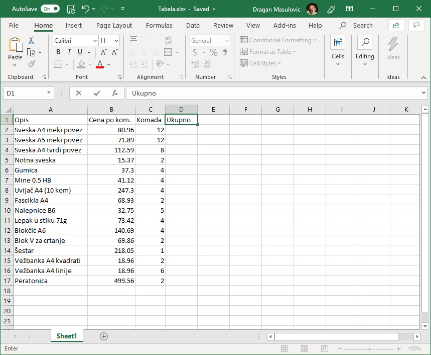
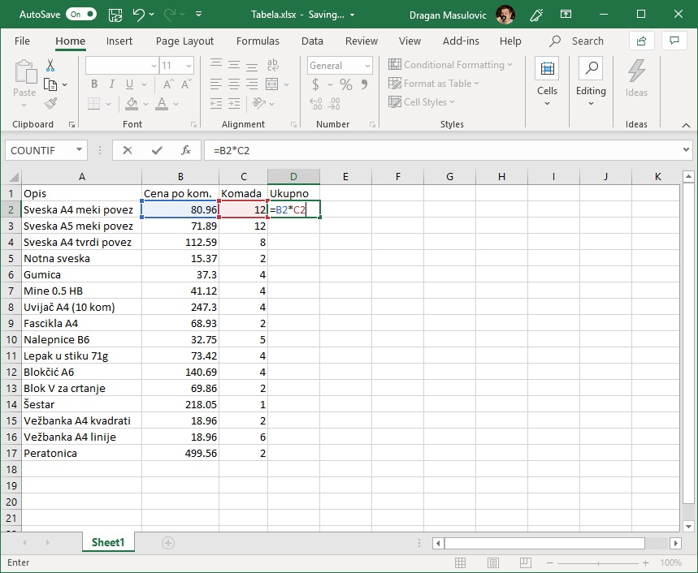
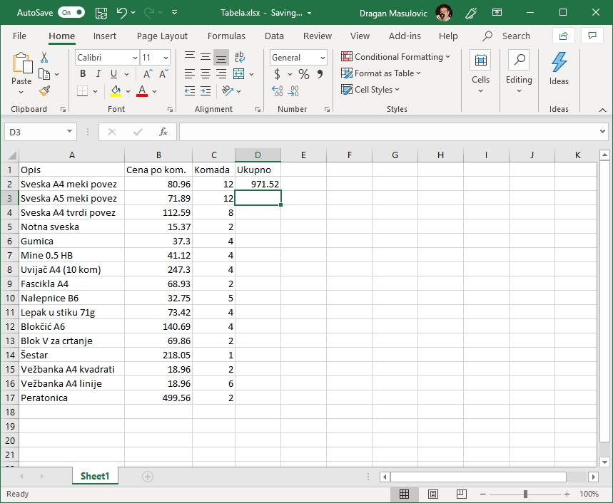
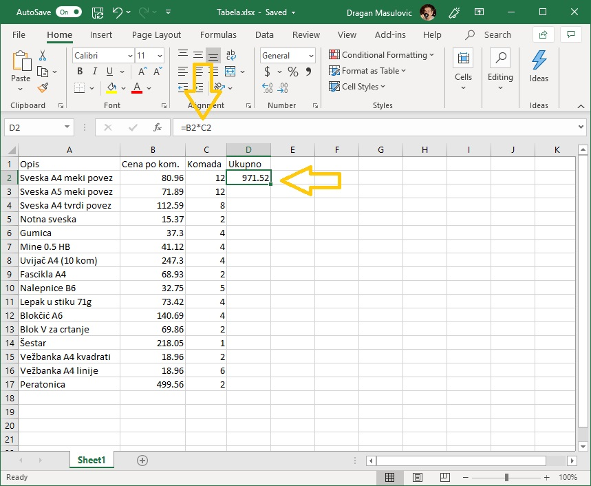
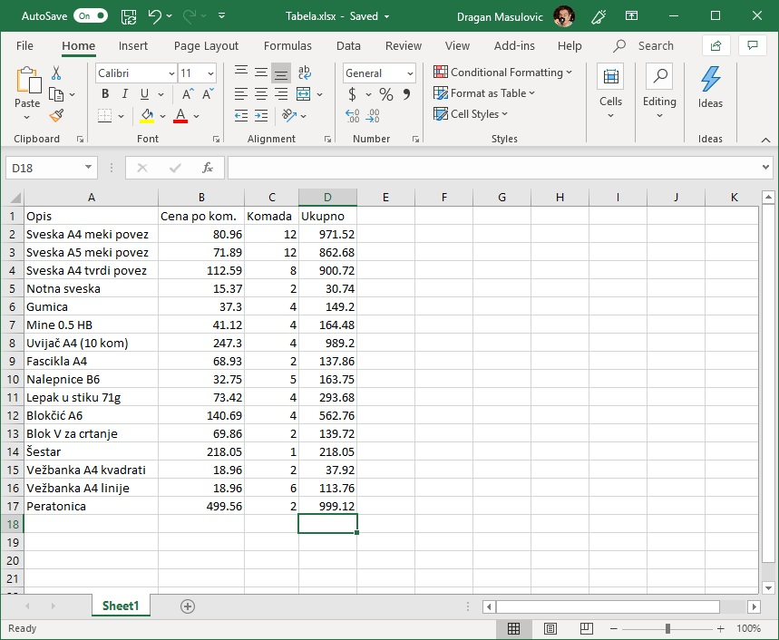
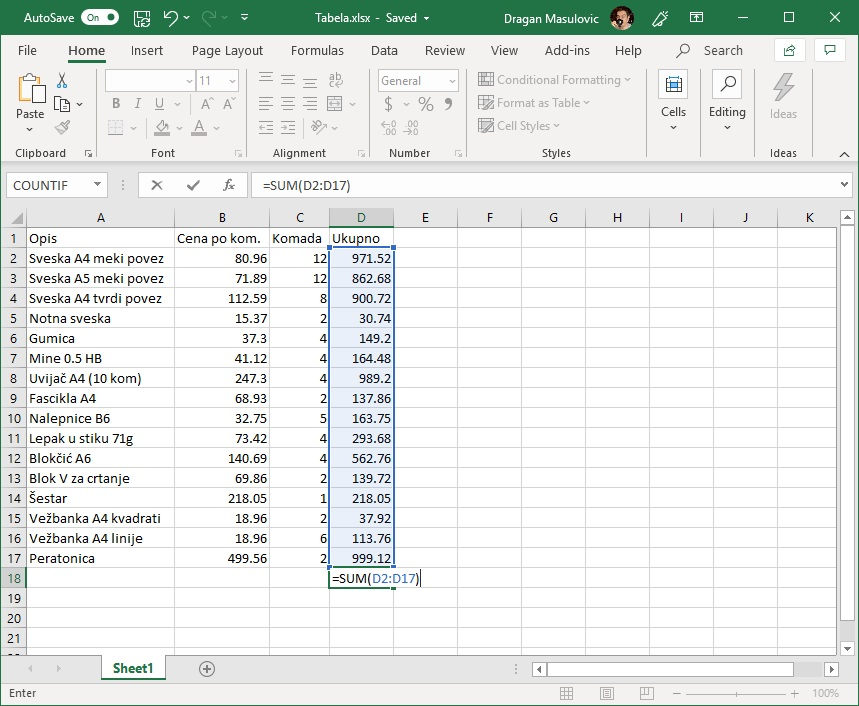
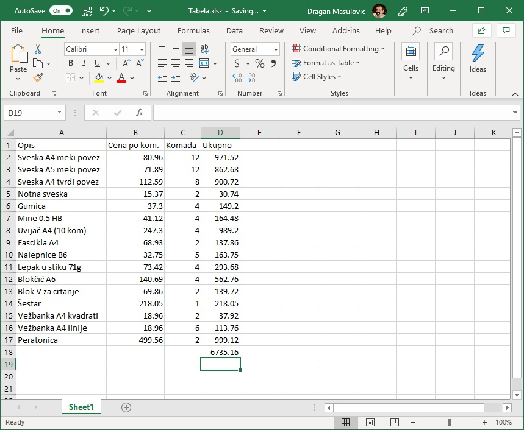

Једноставне формуле
======================

Моћ Ексела лежи у томе што у ћелију можемо да упишемо формулу која објашњава како треба да се израчуна вредност ћелије.

.. infonote::

    Све Ексел формуле почињу знаком = (једнако). Идеја је јасна: „Будућа вредност ћелије = формула“.

Формула се у ћелију уноси тако што се кликне на ћелију и откуца „= формула“. Најједноставније формуле изгледају овако:
::

    =(B3+C3)/2
    =C7+D7*(D8-12)

Дакле, то су неки математички изрази који описују како се од вредности уписаних у неке друге ћелије рачуна вредност
ћелије у којој је формула. Заграде користимо као што смо и навикли, док су симболи операција мало другачији него у математици:
множење се означава звездицом, а дељење косом цртом.

:math:`\ `

Сада ћемо показати како у примеру са школским прибором објаснити Екселу да за нас израчуна колико је новца потрошено.

Корак 1.
-----------------

Прво кликни на ћелију D1 и у њу упиши „Ukupno“, да се зна шта представљају подаци у тој колони:

Потом кликни на ћелију D2 и у њу унеси формулу:
::

    =B2*C2

Како уносиш формулу Ексел показује које ћелије учествују у формули:

Када притиснеш [ENTER] Ексел ће израчунати вредност формуле и уписати одговарајући број у ћелију:

Важно је да разумеш да *Ексел није заборавио формулу!* Она је и даље уписана у ћелију, али се приказује
*вредност формуле* јер је то оно што корисник желимо да види. Ако сада поново кликнеш на ћелију,
формула се јасно види у реду изнад (који се зове *formula bar*):

Корак 2.
---------------

Сада у ћелију D3 унеси формулу
::

    =B3*C3

и тако до краја. Ово је мало досадно и може се убрзати, али о томе ћемо касније:

Ево целог поступка и у облику кратког видеа:

.. ytpopup:: L0e5iERYhyE
   :width: 735
   :height: 415
   :align: center

На овај начин је Ексел за нас израчунао колико новца је потрошено на сваку појединачну ставку.
Још само да видимо колико новца је укупно потрошено, и задатак је готов.

Корак 3.
---------------------

Сада желимо да у ћелији D18 (*Пази! У твом случају то може бити нека друга ћелија!*) израчунамо колико је
укупно новца потрошено према овој табели. Један од начина да то урадиш је да у ћелију унесеш формулу:
::

    = D2 + D3 + D4 + D5 + D6 + D7 + D8 + D9 + D10 + D11 + D12 + D13 + D14 + D15 + D16 + D17

али је то неудобно, и приликом уноса можеш направити разне грешке.

Уместо тога, унеси у ћелију следећу формулу:
::

    =SUM(D2:D17)

Ова формула каже Екселу да у ћелију D18 упише *збир* (SUM) вредности уписаних
у ћелије D2, D3,..., D17 (D2:D17), што смо и желели. „SUM“ се зове *функција*,
а запис „D2:D17“ се зове *распон* или *опсег ћелија.*

Приликом уноса формуле Ексел означава ћелије које учествују у рачуну:

па када притиснеш [ENTER] добијаш:

Следи кратак видео који илуструје овај поступак:

.. ytpopup:: 5rOpsfWS1Bk
   :width: 735
   :height: 415
   :align: center

Корак 4.
-----------

Задатак је готов! Само још једном сними табелу.

