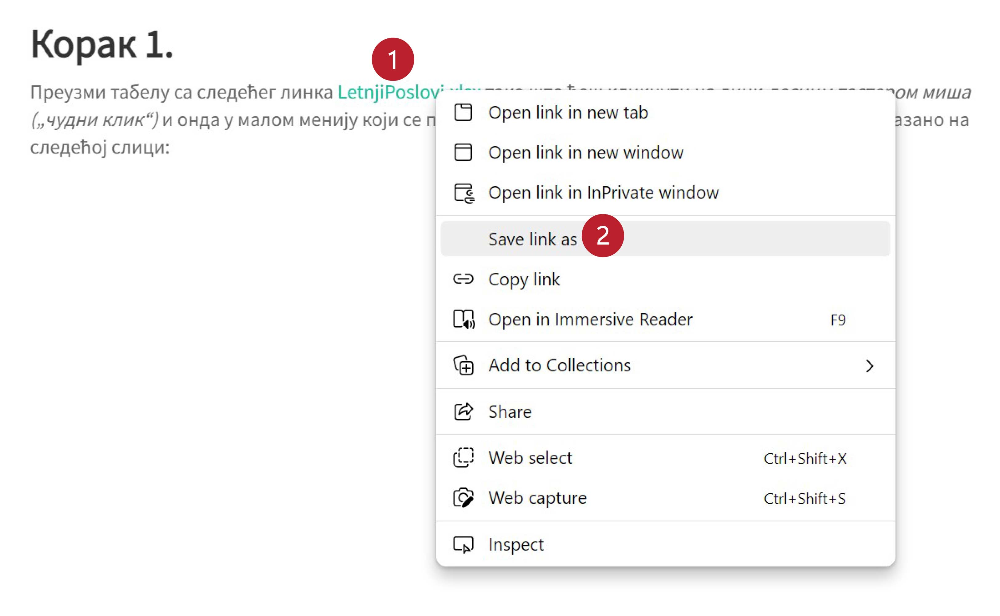

Аутоматска рекалкулација
==================================================

Ако смо Ексел табелу напунили подацима и формулама, па нешто изменимо,
Ексел ће аутоматски израчунати нове вредности свих ћелија које зависе од
измењених вредности. Ово својство се зове **аутоматска рекалкулација**.

.. questionnote::

     Наша реч „калкулација“ води порекло од латинске речи *calculus* што значи *камен*.
     Какве везе има вештина рачунања са камењем? (Одговор је изненађујуће једноставан!)

Аутоматска рекалкулација нам омогућује да над подацима у табели веома лако 
вршимо такозване „What if“ анализе. Шта би се десило ако ову вредност мало повећамо? Изменимо табелу
па погледамо!

Пример: Летњи послови -- формуле у Ексел табели
-------------------------------------------------

Неколико студената је током лета радило преко Студентске задруге како би зарадили мало новца за летовање.
Студентска задруга плаћа послове по сату, с тим да је накнада за сат рада током радног дана нижа од накнаде за сат
рада преко викенда. Студенти су радили на различитим пословима, па су се и накнаде разликовале.
У овој лекцији ћемо обрадити податке о студентским накнадама.

Корак 1.
------------------

Преузми табелу са следећег линка `LetnjiPoslovi.xlsx <https://petljamediastorage.blob.core.windows.net/root/Media/Default/Kursevi/informatika_VIII/epodaci/LetnjiPoslovi.xlsx>`_
тако што ћеш кликнути на линк *десним тастером миша („чудни клик“)* и онда у малом менију који се појави одабрати опцију
„Save link as...“ како је то показано на следећој слици:

Корак 2.
-----------------------

Пронађи табелу на свом рачунару (највероватније је завршила у *Downloads* фолдеру) и отвори је:

.. image:: ../../_images/Recalc1.jpg
   :width: 600px
   :align: center

Ево целог поступка и у облику кратког видеа:

.. ytpopup:: yHt5CJDCuP0
   :width: 735
   :height: 415
   :align: center

