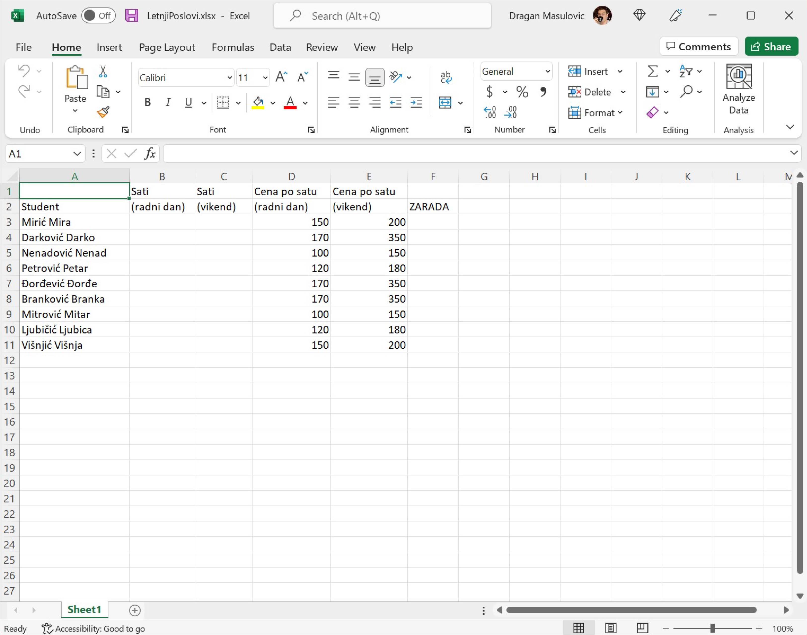
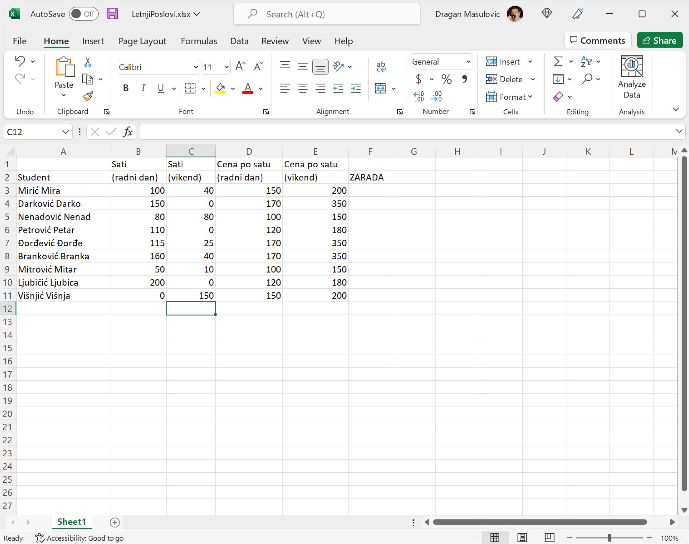
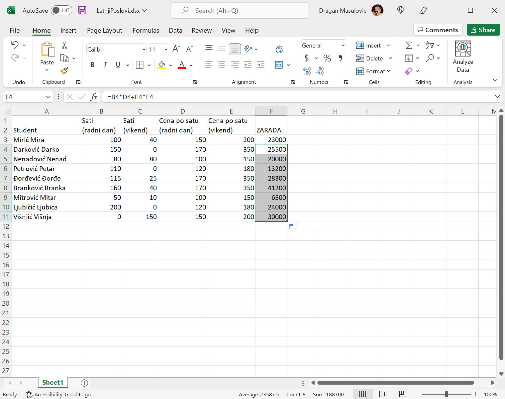
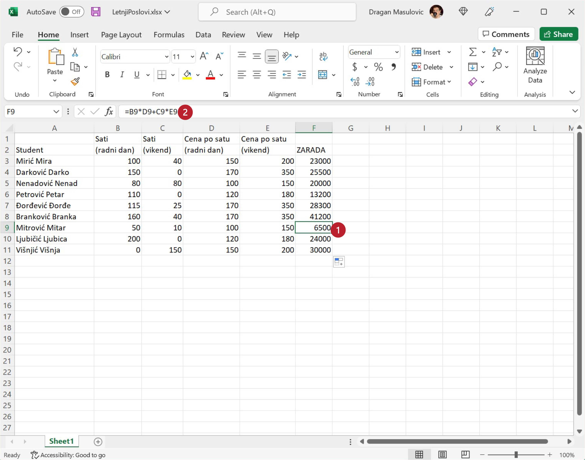

Унос података и формула у табелу
======================================

Неколико студената је током лета радило преко Студентске задруге како би зарадили мало новца за летовање.
Студентска задруга плаћа послове по сату, с тим да је накнада за сат рада током радног дана нижа од накнаде за сат
рада преко викенда. Студенти су радили на различитим пословима, па су се и накнаде разликовале.
У овој лекцији ћемо обрадити податке о студентским накнадама.

Корак 1.
------------------

Преузми табелу са следећег линка `LetnjiPoslovi.xlsx <https://petljamediastorage.blob.core.windows.net/root/Media/Default/Kursevi/informatika_VIII/epodaci/LetnjiPoslovi.xlsx>`_
тако што ћеш кликнути на линк *десним тастером миша („чудни клик“)* и онда у малом менију који се појави одабрати опцију
„Save link as...“ како је то показано на следећој слици:

.. image:: ../../_images/Recalc2.jpg
   :width: 600px
   :align: center

Корак 2.
-----------------------

Пронађи табелу на свом рачунару (највероватније је завршила у *Downloads* фолдеру) и отвори је:

.. Ево целог поступка и у облику кратког видеа:

   .. ytpopup:: yHt5CJDCuP0
      :width: 735
      :height: 415
      :align: center
   
Сада за сваког студента унеси бројеве који представљају сате проведене на послу радним даном и викендом
и израчунај колико је сваки студент зарадио на свом летњем послу.

Корак 3.
--------------

Унеси у табелу произвољне вредности.
Када завршиш табела треба да изгледа овако (с тим да се може десити да добијеш другачије вредности у колонама B и C):

Корак 4.
----------------------

За првог студента на списку коначна зарада се рачуна по формули:
::

    = B3*D3 + C3*E3

Како гласи формула за другог студента?

.. image:: ../../_images/Recalc5.jpg
   :width: 600px
   :align: center

Вероватно ти се по глави већ мота она народна: „И тако летњи дан до подне.“
Да не бисмо исти досадни посао радили још сто пута (и при томе вероватно направили доста грешака),
*сада ћемо показати користан трик који ће за нас урадити посао.* Кликни на ћелију F4 и примети да је доњи десни угао
зеленог оквира око ћелије истакнут (оквир има „бубуљицу“):

.. image:: ../../_images/Recalc6.jpg
   :width: 600px
   :align: center

Ухвати мишем бубуљицу и „развуци оквир“ до дна колоне. Ексел ће попунити ћелије неким вредностима:

Кликни сада, рецимо, на ћелију F9 и погледај у оквиру за формуле (*formula bar*) која формула је уписана у ћелију.

.. infonote::

   **Ооооо, да! Ексел је „погодио“ коју формулу смо желели да упишемо у ћелију!**

.. Ево и кратког видеа:

    .. ytpopup:: 2XiSIC0NU_A
       :width: 735
       :height: 415
       :align: center
    
Да буде одмах јасно, ово није никаква магија већ прост алгоритам. На основу формуле која је била уписана у
ћелију F4 Ексел је простим алгоритмом генерисао формуле и уписао их редом у све ћелије кроз које смо „развукли оквир“.
Идеја алгоритма је да се слова у адреси ћелије не мењају, а бројеви у адреси ћелије се редом повећавају.
Ево и табеларног прегледа:

.. csv-table:: Формуле у одговарајућим ћелијама табеле
   :header: "Ћелија", "Формула"
   :align: left

   "F3", "= B3*D3 + C3*E3"
   "F4", "= B4*D4 + C4*E4"
   "F5", "= B5*D5 + C5*E5"
   "F6", "= B6*D6 + C6*E6"

и тако даље. Ова погодност се зове *брзо копирање формула* и често ћемо је користити.

Корак 5.
----------------

Израчунаћемо сада колико су просечно сати радили студенти радним данима и викендом, и колико су зарадили у просеку.
Ексел може да аутоматски израчуна просек низа бројева, само треба позвати функцију AVERAGE (енгл. „просек“).

У ћелију A12 упиши „Prosečno“. Сада желимо да у ћелији B12 прикажемо просечно време које су наведени студенти провели на послу.
Дакле, желимо да израчунамо просек бројева који су уписани у ћелије B3, B4, ..., B11. Један од
начина да то урадимо је да у ћелију унесеш формулу:
::

    = (B3 + B4 + B5 + B6 + B7 + B8 + B9 + B10 + B11)/9

али постоји бржи начин! У ћелију B12 унеси формулу:
::

    =AVERAGE(B3:B11)

која рачуна просек (AVERAGE) бројева у ћелијама B3, B4, ..., B11 (B3:B11). „AVERAGE“ је још једна функција коју Ексел познаје.

.. image:: ../../_images/Recalc9.jpg
   :width: 600px
   :align: center

На исти начин израчунај просек бројева у ћелијама C3:C11 и F3:F11:

.. image:: ../../_images/Recalc10.jpg
   :width: 600px
   :align: center

