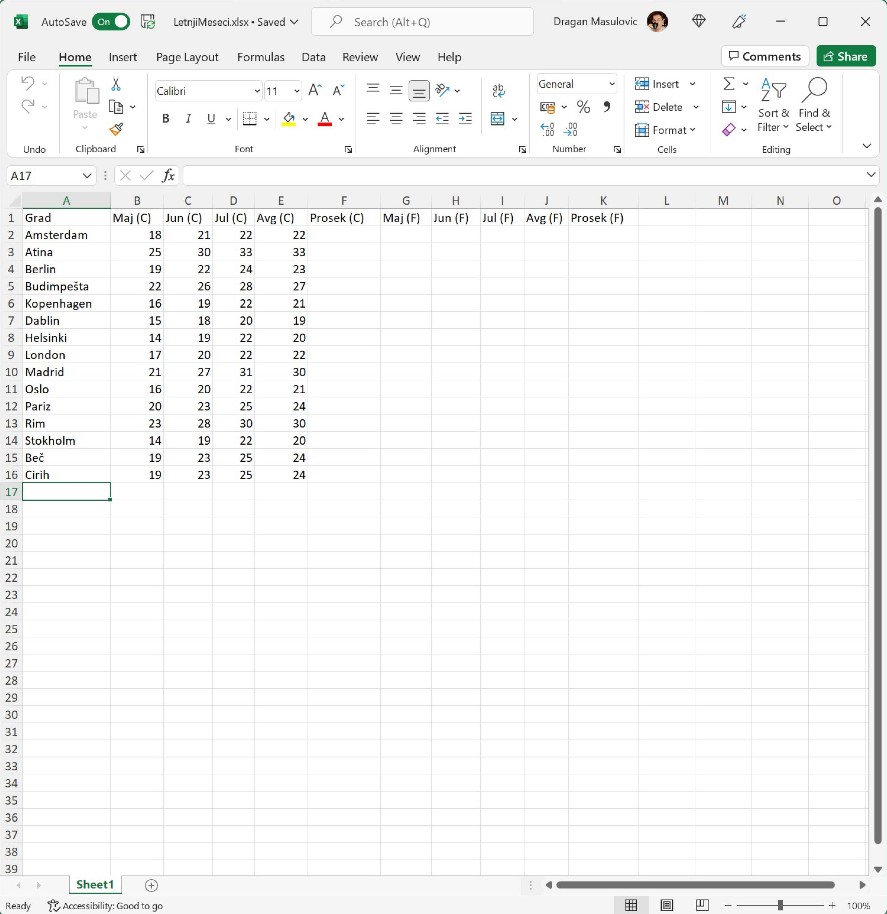
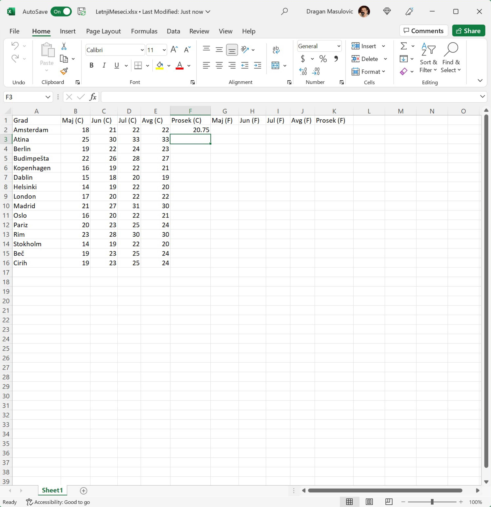
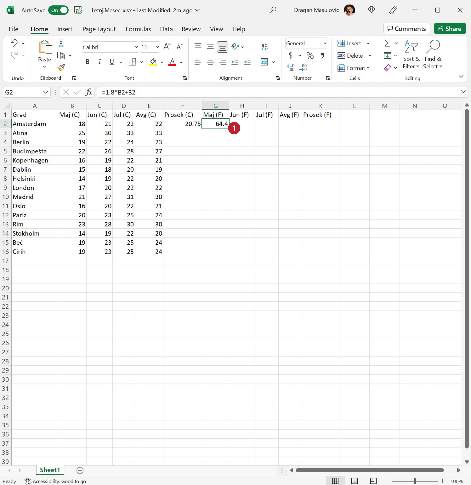

Уношење формула и брзо копирање
========================================================================================

У табели испод су дате очекиване температуре у степенима Целзијуса у неким европским градовима у мају, јуну, јулу и августу једне
године. Прерачунаћемо те податке у степене Фаренхајта, за сваки град одредити просек за четири наведена месеца,
и одредићемо најтоплије и најхладније градове по месецима.

Корак 1.
-----------------

Преузми табелу са следећег линка `LetnjiMeseci.xlsx <https://petljamediastorage.blob.core.windows.net/root/Media/Default/Kursevi/informatika_VIII/epodaci/LetnjiMeseci.xlsx>`_ тако што ћеш кликнути на
линк *десним тастером миша* и онда у малом менију који се појави одабрати опцију „Save link as...“.
Када отвориш табелу из Ексела треба да видиш следеће податке:

Корак 2.
-----------------

У ћелију F2 унеси формулу:
::

    =AVERAGE(B2:E2)

која ће израчунати просечну температуру за ова четири месеца у Амстердаму:

.. image:: ../../_images/DataTypes2.jpg
   :width: 600px
   :align: center

и притисни [ENTER]:

Корак 3.
---------------------

Сада ћемо у ћелију G2 да унесемо формулу која ће прерачунати температуру у мају у Амстердаму,
из степена Целзијуса у степене Фаренхајта, по формули:

.. math::
     t_F = 1,8 \cdot t_C + 32

Приликом уношења формуле морамо повести рачуна о томе да се множење означава звездицом ``*``:

.. image:: ../../_images/DataTypes4.jpg
   :width: 600px
   :align: center

Корак 4.
---------------

Исти посао треба урадити за јун, јул, август и за просек. Можемо исту формулу унети још четири пута, али је боље да се послужимо брзим копирањем. Ако кликнемо на ћелију G2 видећемо увек присутну „бубуљицу“ у доњем десном углу (1):

Ухватимо „бубуљицу“, развучемо до краја врсте и добијамо:

.. image:: ../../_images/DataTypes6.jpg
   :width: 600px
   :align: center

Формула у ћелији G2 је гласила:
::

   = 1.8 * B2 + 32

Ако погледамо шта пише у ћелији H2 видећемо да тамо стоји формула
::

   = 1.8 * C2 + 32

Као и раније, на основу формуле која је била уписана у ћелију G2 Ексел је простим алгоритмом генерисао
формуле и уписао их редом у све ћелије кроз које смо „развукли оквир“. Међутим, пошто смо овај пут „оквир развукли“
хоризонтално, Ексел је применио други алгоритам: сада се слова у адреси
ћелије редом повећавају, а бројеви у адреси ћелије се не мењају. Ево и табеларног прегледа:

.. csv-table::
   :header: "Ћелија", "Формула"
   :align: left

   "G2", "= 1.8 * B2 + 32"
   "H2", "= 1.8 * C2 + 32"
   "I2", "= 1.8 * D2 + 32"
   "J2", "= 1.8 * E2 + 32"
   "K2", "= 1.8 * F2 + 32"

.. infonote::

    Брзо копирање ради на један начин када оквир „развлачимо“ вертикално, а на други начин када га „развлачимо“ хоризонтално. Поента је да се у сваком случају „чува логика формуле“.

