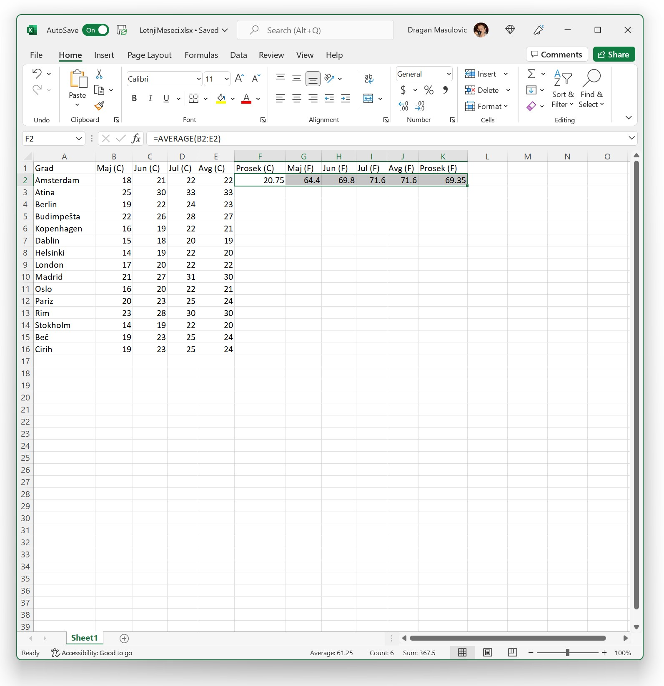
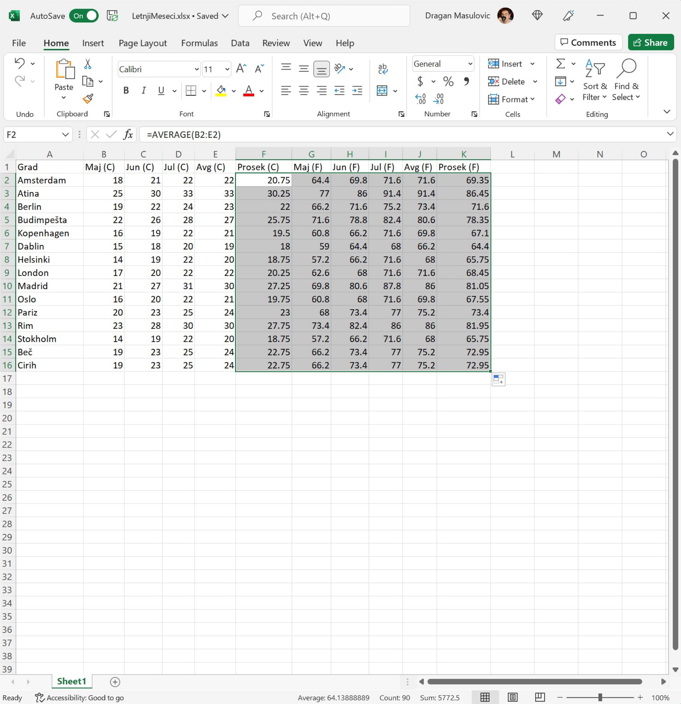
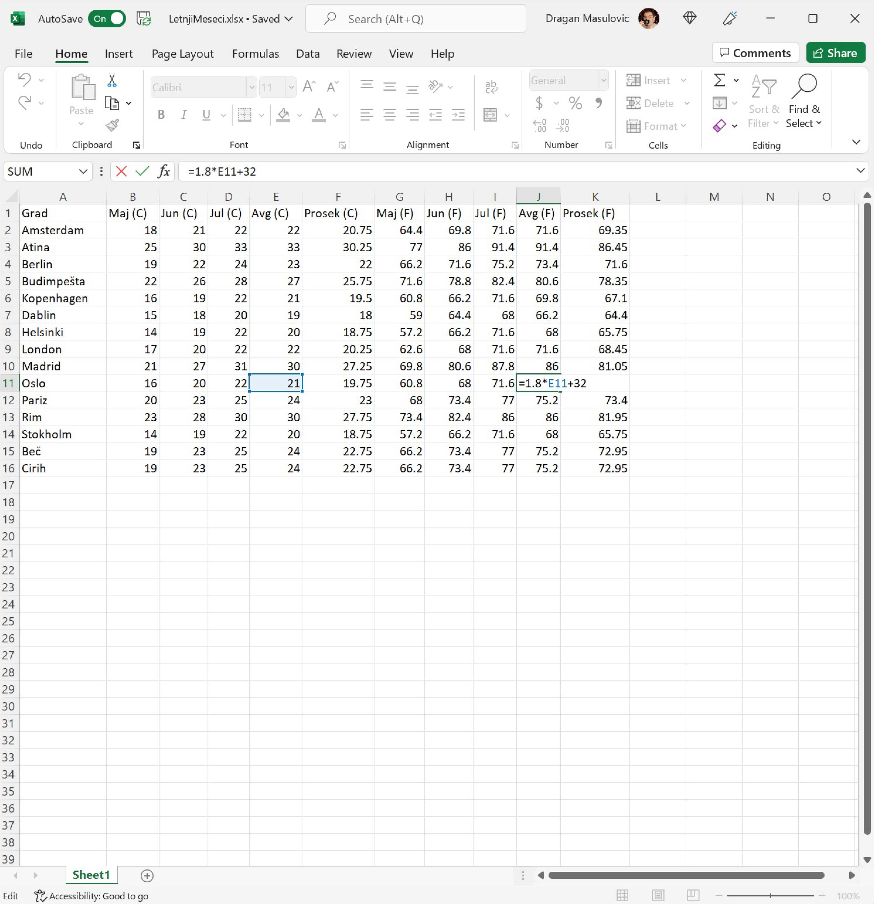

Селектовање групе ћелија
===============================

До сада смо попунили тек први ред табеле. Уместо да све ове кораке понављамо за сваки ред табеле посебно, послужићемо се још једним лукавством. Означићемо низ ћелија (ова операција се у жаргону зове „селектовање“ од енгл. *select* што значи „одабрати“) и онда ћемо брзим копирањем попунити све ћелије у табели.

Корак 5.
--------------

Пошто смо попунили први ред табеле, означићемо (такорећи *селектоваћемо*) низ ћелија F2:K2 тако што ћемо кликнути на
ћелију F2 (дакле, НЕ на „бубуљицу“ већ у срце ћелије F2) и *не пуштајући миша* развући ћемо оквир до ћелије K2:

Овим смо означили ћелије које су интересантне (јер садрже формуле које желимо да размножимо по целој табели).

Корак 6.
-----------------

Е, *сада ухватимо за „бубуљицу“* која се налази у доњем десном углу означеног распона и „развучемо“ до дна табеле:

Ексел је ископирао формуле које су се налазиле у означеним ћелијама и током копирања сваку формулу прилагодио позицији на којој се она налази. На пример, ако погледамо ћелију J11 (температура у степенима Фаренхајта у Ослу у августу) видећемо да је та вредност израчуната тако што је формула за конверзију примењена на ћелију E11 (температура у степенима Целзијуса у Ослу у августу), као што и треба:

Тако је овај део задатка решен.

.. Ево и демонстрације:

   .. ytpopup:: MW_2mlGs1qg
      :width: 735
      :height: 415
      :align: center

