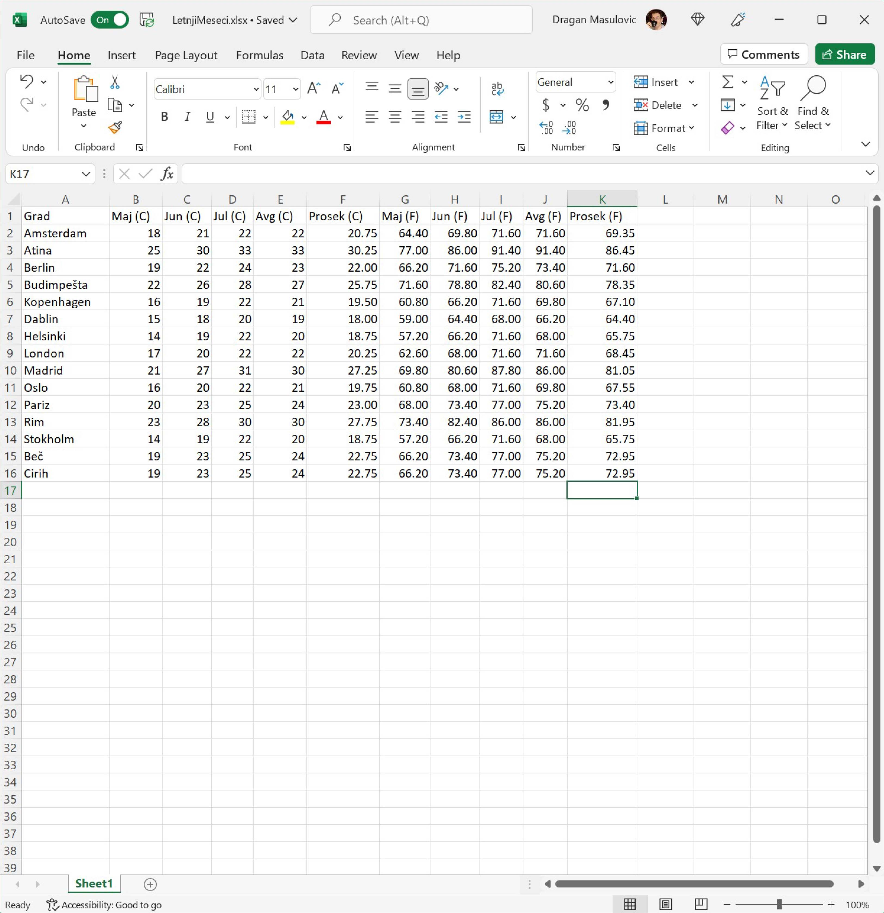
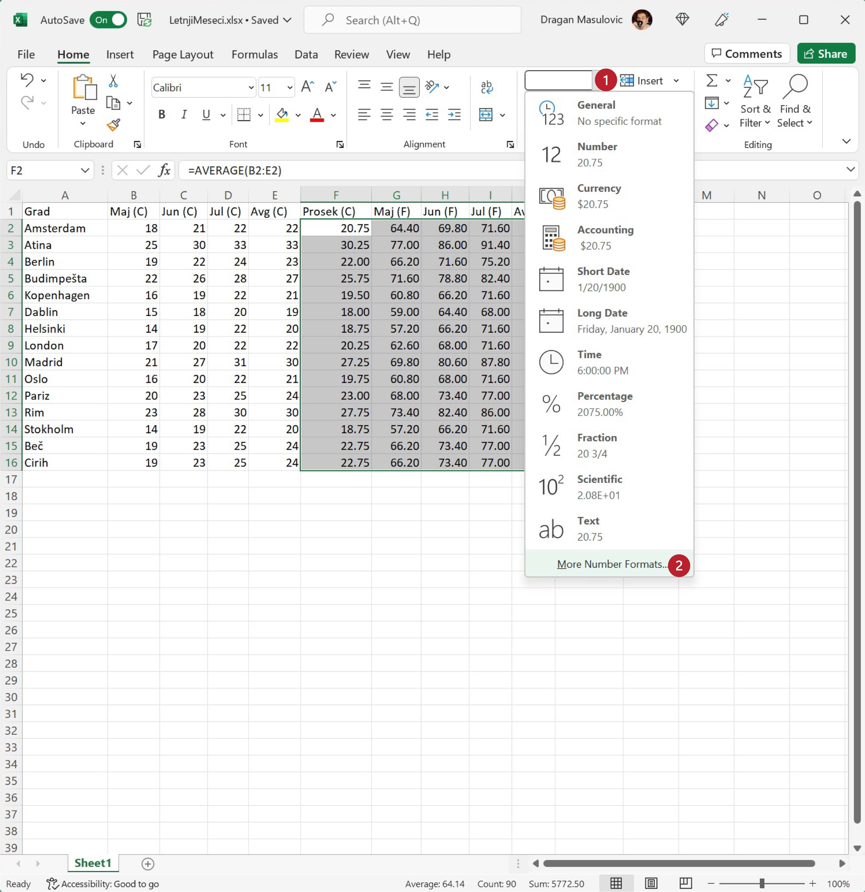

Форматирање децималних бројева
===================================

У табели сада има много децималних бројева. Неки немају децимале, неки имају само једну децималу, а неки две и табела изгледа доста неуредно.

:math:`\ `

Да би табела са много бројева (а такве су најчешће када се ради са Екселом) била прегледнија обично се Екселу наложи да бројеве са децималама приказује са унапред задатим бројем децимала, рецимо две. У том случају ће број као што је 42 бити приказан као 42.00, број 21.5 као 21.50, а број 3.1415 као 3.14.

:math:`\ `

За подешавање приказа бројева у табели користимо групу команди "Number":

Да бисмо објаснили Екселу у ком делу табеле бројеве треба приказати са задатим бројем децимала, селектоваћемо део табеле као у претходном кораку, с тим да ће овај пут селектовани део табеле имати више врста и колона.

Корак 7.
------------

Кликни мишем на ћелију F2 *и не пуштајући леви тастер на мишу* развуци оквир до ћелије K16 овако:

.. image:: ../../_images/DataTypes10.jpg
   :width: 600px
   :align: center

Кликни на стрелицу поред "General" и у менију који се појави одабери "Number":

.. image:: ../../_images/DataTypes11.jpg
   :width: 600px
   :align: center

Сви бројеви у селектованом делу табеле ће бити приказани са две децимале.

Ево и демонстрације:

.. ytpopup:: GHzElH7k1AQ
   :width: 735
   :height: 415
   :align: center

Приказивање бројева са две децимале је најчешћи захтев који корисници Ексела имају, и зато је подразумевано да ће Ексел приказати бројеве на две децимале. Ако из неких разлога желимо да прикажемо бројеве са три децимална места, или само једним, треба кликнути на стрелицу поред "General", па уместо "Number" одабрати "More Number Formats..." ("још формата бројева"):

и у прозору који се појавио унети жељени број децимала:

Ево и демонстрације:

.. ytpopup:: q5x1DT_-Zcg
   :width: 735
   :height: 415
   :align: center

