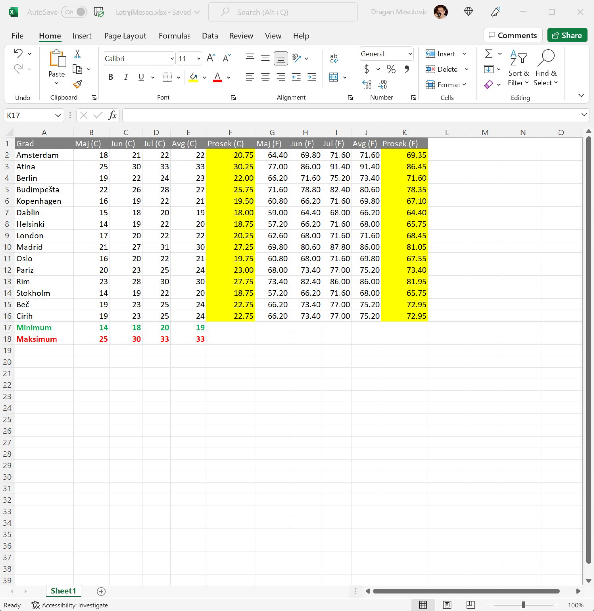
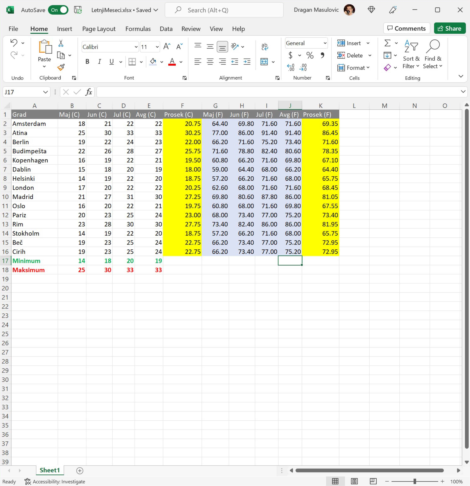
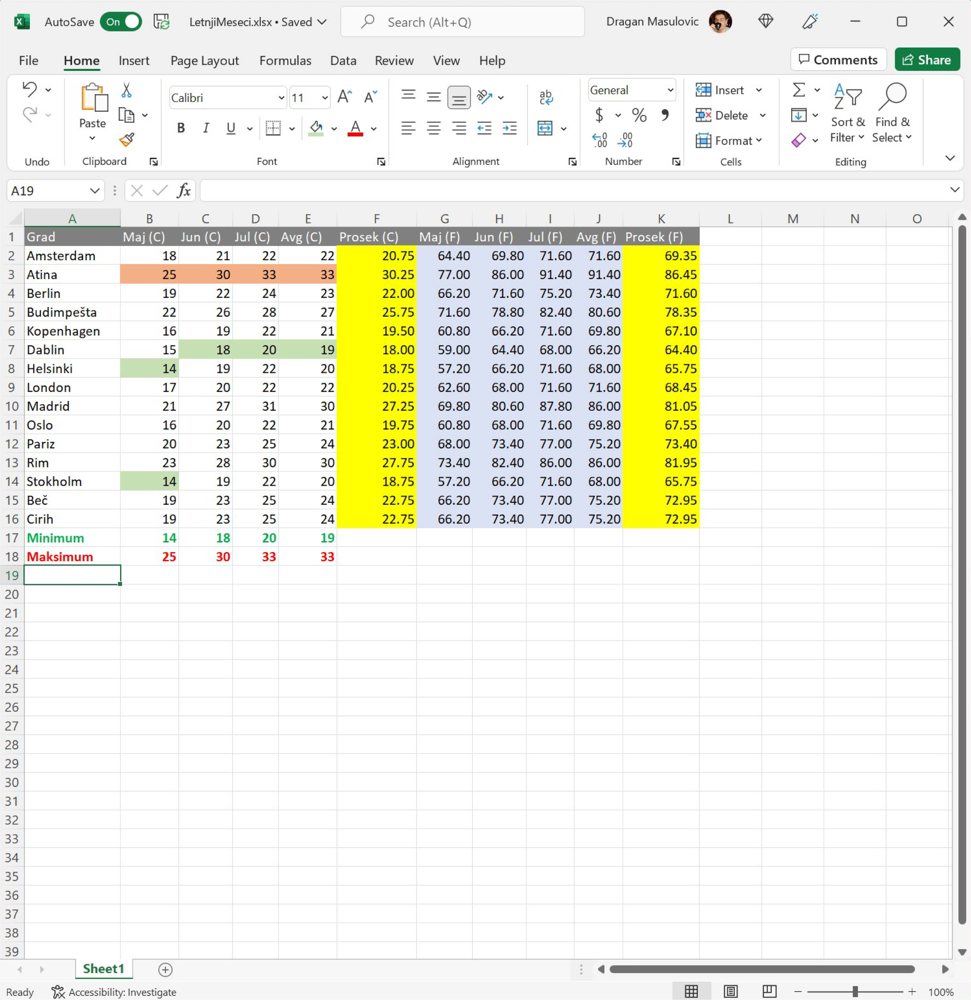

Уређивање табеле
=======================

Табела сада садржи све податке које смо желели у њу да спакујемо, али је веома непрегледна. Ми, људи, нисмо добри у тумачењу велике количине бројева -- много боље нам иду слике. Зато ћемо мало улепшати табелу како бисмо истакли оно што смо уочили и како бисмо раздвојили различите врсте података.

За истицање елемената у табели користимо сегмент команди које се налазе у групи „Font“:

.. image:: ../../_images/DataTypes22.jpg
   :width: 600px
   :align: center

Команде представљене иконама у овој групи већ познајеш:

.. image:: ../../_images/DataTypes23.jpg
   :width: 600px
   :align: center

Корак 12.
----------------

Постави боју слова у заглављу табеле (ћелије А1:К1) на бело, а боју позадине ћелија на тамно сиво тако што ћеш:

1. селектовати ћелије А1:К1
2. кликнути на стрелицу поред иконе за подешавање боје слова и одабрати белу боју, и
3. кликнути на стрелицу поред иконе за подешавање боје позадине ћелије и одабрати тамно сиву.

Корак 13.
-------------------

За слова у ћелијама А17:Е18 (минималне и максималне температуре):

1. као стил одабери **B** (енгл. *bold* што значи „подебљано“),
2. зеленом бојом обој слова која одговарају минималним температурама, а
3. црвеном бојом обој слова која одговарају максималним температурама.

.. image:: ../../_images/DataTypes25.jpg
   :width: 600px
   :align: center

Корак 14.
-------------------

Позадину ћелија које одговарају просечним температурама (F2:F16 и K2:K16) обој у жуто:

Корак 15.
------------------

Температуре које су исказане у степенима Фаренхајта (ћелије G2:J16) обој у светло плаво:

Ево и кратке демонстрације:

.. ytpopup:: UJO0UHws164
   :width: 735
   :height: 415
   :align: center

Корак 16.
-----------------

Коначно, у делу табеле B2:E16 где су температуре исказане у степенима Целзијуса:

1. обој у светло зелено позадину сваке ћелије која садржи температуру која је минимална за тај месец, и
2. обој у светло црвено позадину сваке ћелије која садржи температуру која је максимална за тај месец.

Треба да добијеш:

.. infonote::

    Шта закључујеш гледајући само у боје ћелија?

