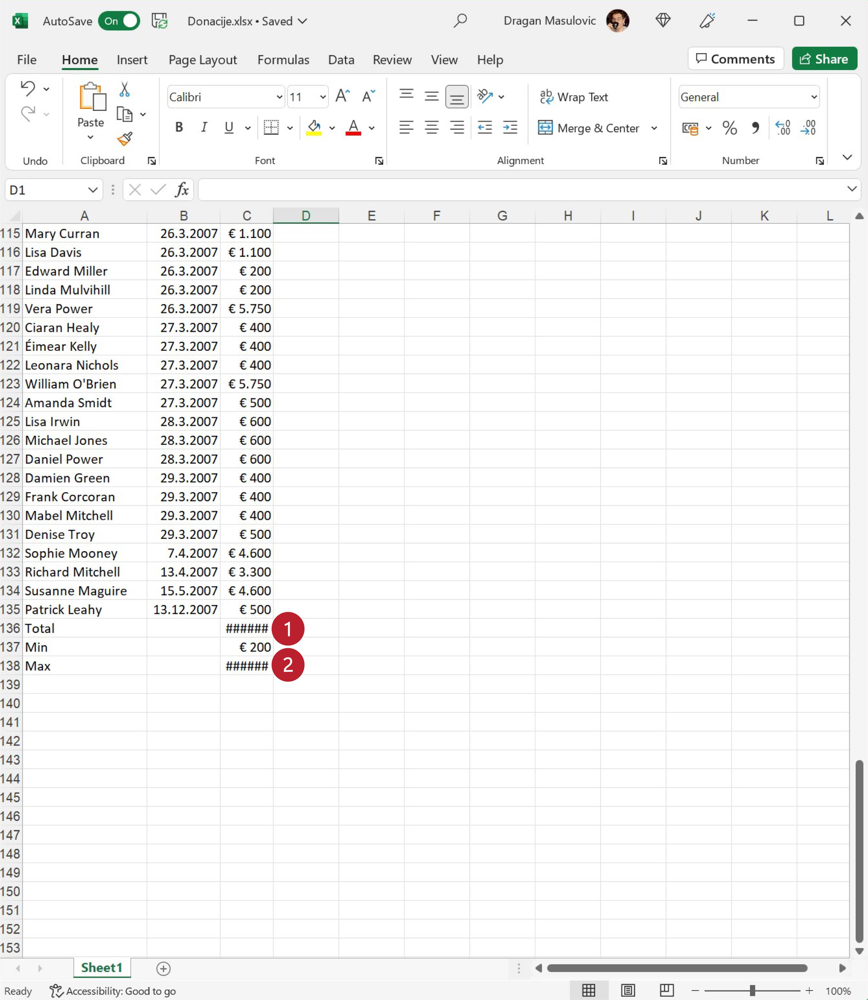
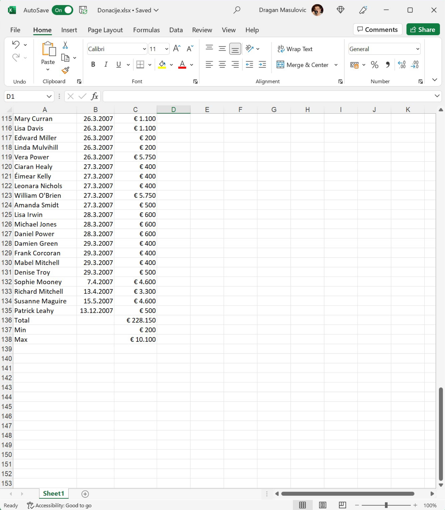

Донације -- валуте у Ексел табели
========================================

Погледаћемо сада списак донације које је примило једно спортско друштво.
За сваку донацију је наведено име донатора (у колони "Name"),
датум донације (у колони "Date") и износ (у колони "Amount").

Корак 1.
---------

Са следећег линка `Donacije.xlsx <https://petljamediastorage.blob.core.windows.net/root/Media/Default/Kursevi/informatika_VIII/epodaci/Donacije.xlsx>`_ преузми документ *Donacije.xlsx* и сними га на свој рачунар.

Корак 2.
---------

Покрени Ексел и отвори фајл. Видећеш да су у фајлу наведене донације:

.. image:: ../../_images/DataTypes301.jpg
   :width: 600px
   :align: center

Корак 3.
----------------

Сада ћемо израчунати укупну вредност донација, као и најмању и највећу донацију.
Корестећи клизач:

.. image:: ../../_images/DataTypes302.jpg
   :width: 600px
   :align: center

спусти се до дна табеле и додај три нове врсте:

* Total
* Min
* Max

.. image:: ../../_images/DataTypes303.jpg
   :width: 600px
   :align: center

Корак 4.
--------------

У поље C136 унеси формулу
::

    =SUM(C2:C135)

како би добио укупну вредност донација:

.. image:: ../../_images/DataTypes304.jpg
   :width: 600px
   :align: center

Потом у поље C137 унеси формулу
::

    =MIN(C2:C135)

а у поље C138 формулу
::

    =MАX(C2:C135)

како би добио вредност најмање и највеће донације:

Корак 5.
-------------------------

Пошто су све донације биле у еврима, форматираћемо све бројеве у колони C тако да се испред броја појави ознака за евро. Селектуј ћелије C2:C138

.. image:: ../../_images/DataTypes306.jpg
   :width: 600px
   :align: center

Кликни на стрелицу поред ознаке формата ћелије и појавиће се мали мени:

.. image:: ../../_images/DataTypes307.jpg
   :width: 600px
   :align: center

У њему постоји опција "Currency" (енгл. "валута", трећа од врха), али ако је одаберемо Ексел ће износе означити симболом за амерички долар. Зато ћемо да одаберемо "More Number Formats..." како је на горњој слици и предложено.

Добијамо нови дијалог:

.. image:: ../../_images/DataTypes308.jpg
   :width: 600px
   :align: center

У одељку "Category" (енгл. "Категорија") одаберемо "Currency" (енгл. "валута"). Ексел нам поново нуди симбол за амерички долар. Да бисмо променили симбол кликнемо на стрелицу која отвара избор расположивих симбола валута. Тако добијамо листу у којој потражимо симбол за евро (за ово треба стрпљења; симбол за евро уопште није близу врха):

.. image:: ../../_images/DataTypes309.jpg
   :width: 600px
   :align: center

Одаберемо симбол за евро и кликнемо ОК:

.. image:: ../../_images/DataTypes310.jpg
   :width: 600px
   :align: center

Ево и кратког видеа који илуструје овај поступак:

.. ytpopup:: -mwmmFrO1so
   :width: 735
   :height: 415
   :align: center

Табела сада изгледа овако:

.. questionnote::

        **ШТА ЈЕ САД? ГДЕ СУ НЕСТАЛИ ИЗНОСИ У ВРСТИ "Total" И "Max"?**

.. infonote::

        Када у некој ћелији Ексел прикаже
        ::
        
            #############
        
        то значи да се ту налази неки број, али је ћелија сувише уска да би тај број могао да буде приказан у целости. Само треба проширити колону C и све ће бити у реду:

Корак 6.
---------------

Сними табелу за крај.

