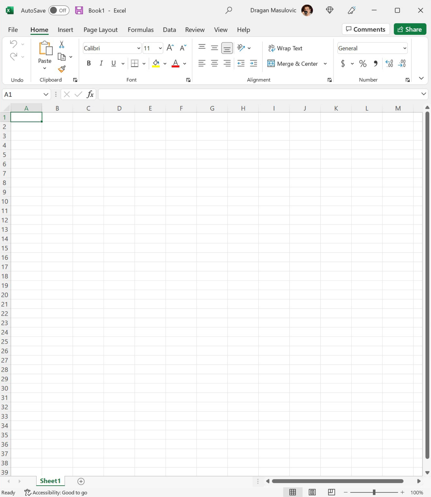
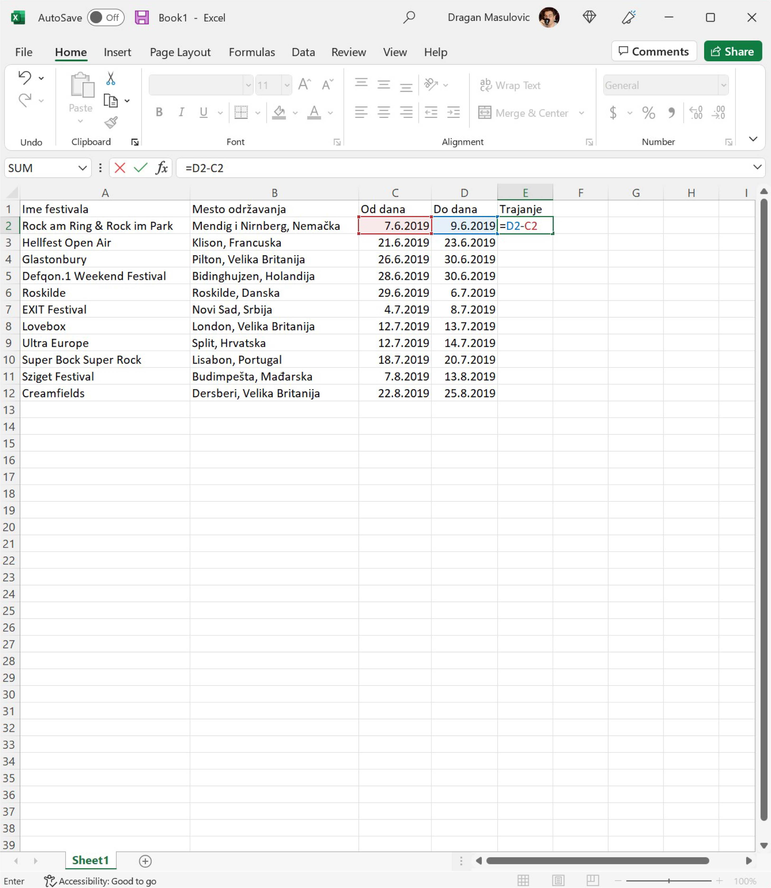
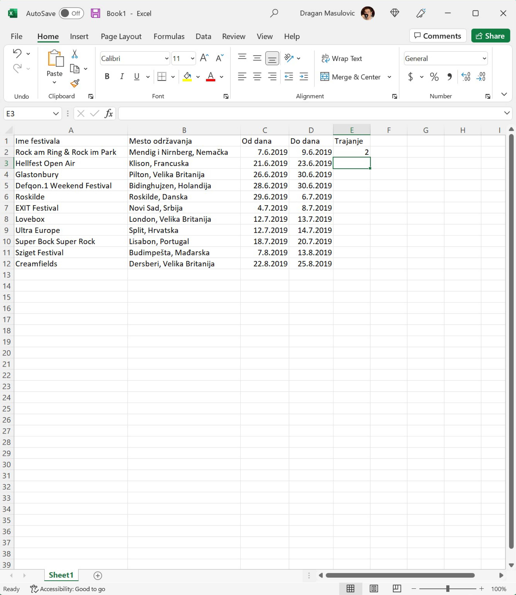
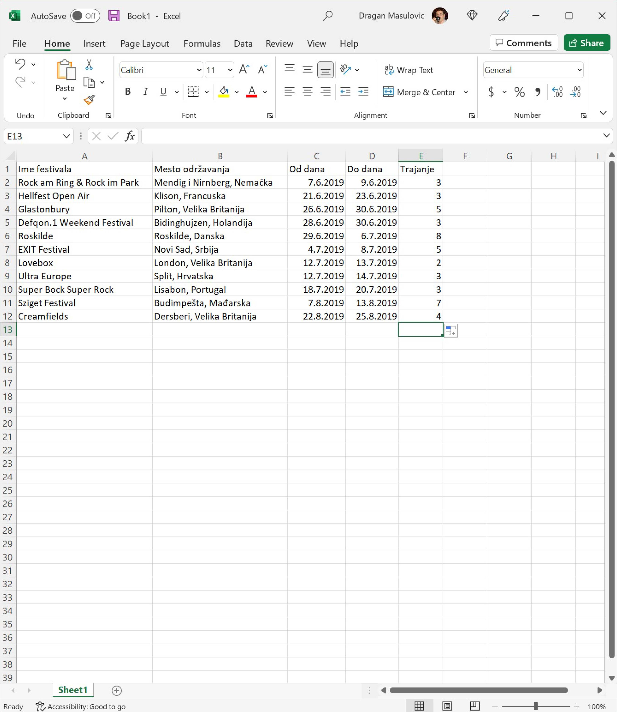

Музички фестивали у Европи -- датуми у Ексел табели
==========================================================

У овом примеру ћемо направити табелу која представља списак неких музичких фестивала у Европи.

Корак 1.
-----------

Покрени Ексел и направи празан документ:

Корак 2.
--------------

Прва врста ће представљати *заглавље табеле* и у ћелије ћемо унети имена колона:

* Име фестивала
* Место одржавања
* Од дана
* До дана

Прошири колоне тако да имена колона буду видљива у целости:

Корак 3.
--------------

У табелу унеси податке које желиш. Ми ћемо у табелу унети податке о следећим фестивалима:

.. csv-table:: Музички фестивали
   :header: "Ime festivala", "Mesto održavanja", "Od dana", "Do dana"
   :align: left

   "Rock am Ring & Rock im Park", "Mendig i Nirnberg, Nemačka", "7.6.2019.", "9.6.2019."
   "Hellfest Open Air", "Klison, Francuska", "21.6.2019.", "23.6.2019."
   "Glastonbury", "Pilton, Velika Britanija", "26.6.2019.", "30.6.2019."
   "Defqon.1 Weekend Festival", "Bidinghujzen, Holandija", "28.6.2019.", "30.6.2019."
   "Roskilde", "Roskilde, Danska", "29.6.2019.", "6.7.2019."
   "EXIT Festival", "Novi Sad, Srbija", "4.7.2019.", "8.7.2019."
   "Lovebox", "London, Velika Britanija", "12.7.2019.", "13.7.2019."
   "Ultra Europe", "Split, Hrvatska", "12.7.2019.", "14.7.2019."
   "Super Bock Super Rock", "Lisabon, Portugal", "18.7.2019.", "20.7.2019."
   "Sziget Festival", "Budimpešta, Mađarska", "7.8.2019.", "13.8.2019."
   "Creamfields", "Dersberi, Velika Britanija", "22.8.2019.", "25.8.2019."

Име фестивала и место одржавања су обични текстови које лако уносимо.
Датуме уносимо тако што у кућицу унесемо дан, месец и годину *раздвојене тачкама, али без тачке иза године*.
За први фестивал на нашем списку то су датуми:
::

    7.6.2019
    9.6.2019

Ексел ће препознати да су то датуми (енг. *date* значи „датум“):

.. Ево и кратког видеа:

   .. ytpopup:: KbKIapv2gaE
      :width: 735
      :height: 415
      :align: center

.. infonote::

   Понекад, уз другачија регионална подешавања (*Regional settings*), може се десити да Ексел
   не препозна овако представљене датуме. Тада се датум може унети у облику DD-MM-GG где смо
   употребили по две цифре за дан, месец и годину и раздвојили их цртицама. На пример, овако:
   ::

      07-06-10
      09-06-19

Унесимо податке о осталим фестивалима. У нашем примеру табела изгледа овако:

.. image:: ../../_images/DataTypes104.jpg
   :width: 600px
   :align: center

Корак 4.
----------------

Сада ћемо да израчунамо колико дана траје сваки фестивал. У кућицу E1 ћемо уписати „Trajanje“
(то је име нове колоне коју формирамо) и онда ћемо у кућицу E2 уписати формулу:
::

    =D2-C2

.. infonote::

        **О, да! Ексел уме да рачуна са датумима!**

Када притиснемо [ENTER] добијамо следеће стање:

Видимо да је Ексел за фестивал који се одржава 7.6, 8.6. и 9.6.2019. обрачунао да траје два дана. Разлог је у томе што се у пословном свету ова функција углавном користи за обрачун дневница (од 7.6. до 8.6. је једна дневница, и од 8.6. до 9.6. је друга дневница). Овај фестивал, с друге стране, траје три дана: цео 7.6, цео 8.6. и цео 9.6. Зато морамо да прилагодимо формулу нашој ситуацији и да унесемо:
::

    =D2-C2+1

.. image:: ../../_images/DataTypes107.jpg
   :width: 600px
   :align: center

Ако сада формулу брзо ископирамо наниже (кликнемо на ћелију Е2, ухватимо за „бубуљицу“ и развучемо наниже) добијамо:

Корак 5.
--------------------

Снимићемо табелу под именом „MuzickiFestivali.xlsx“
Сада ћемо израчунати просечно трајање фестивала у табели, као и најкраће и најдуже фестивале у табели.

Корак 6.
-------------------

Додај табели три нова реда: „Prosek“, „Najkraći“ и „Najduži“:

.. image:: ../../_images/DataTypes109.jpg
   :width: 600px
   :align: center

Корак 7.
---------------

У одговарајућа поља колоне E унеси следеће формуле:
::

    =AVERAGE(E2:E12)
    =MIN(E2:E12)
    =MAX(E2:E12)

.. image:: ../../_images/DataTypes110.jpg
   :width: 600px
   :align: center

Корак 8.
----------------

Поље које одговара просеку прикажи са две децимале:

Корак 9.
-----------------

Једном бојом обој *све податке* о фестивалу који траје најкраће, а другом *све податке* о фестивалу који траје најдуже:

Корак 10.
--------------------

Постави стил слова у ћелијама A1:E1 на **bold** (кликни на **B**), а у ћелијама A13:E15 на *italic* (кликни на *I*):

Корак 11.
-----------------------

Сада ћемо да подвучемо линију испод заглавља (прве врсте) и података о последњем фестивалу на списку (у нашем примеру то је дванаеста врста).

Селектуј ћелије А1:Е1.

.. image:: ../../_images/DataTypes114.jpg
   :width: 600px
   :align: center

Онда кликни на стрелицу поред иконе за уоквиравање ћелија и одабери „Bottom Border“:

Исто то уради заврсту која садржи податке о последњем фестивалу у табели. Добијамо:

.. image:: ../../_images/DataTypes116.jpg
   :width: 600px
   :align: center

Корак 12.
----------------------

Још само једна естетска ситница и готови смо! Датуми одржавања фестивала и трајање фестивала су поравнати по десној ивици,
док су имена одговарајућих колона (C, D и E) поравната по левој ивици. Поравнаћемо и њих по десној ивици, да нам табела буде лепша.
Томе служе команде из групе „Alignment“ („поравнавање“):

.. image:: ../../_images/DataTypes117.jpg
   :width: 600px
   :align: center

Вертикално поравнавање садржаја ћелије (1) може бити уз горњу ивицу, центрирано, или уз доњу ивицу.
Хоризонтално поравнавање садржаја ћелије (2) може бити уз леву ивицу, центрирано, или уз десну ивицу.
Команде „Wrap Text“ (3) и „Merge Cells“ (4) ћемо објаснити ускоро.

Желимо да поравнамо садржај уз десну ивицу. Зато селектуј ћелије C1:E1 и одабери поравнавање уз десну ивицу:

.. image:: ../../_images/DataTypes119.jpg
   :width: 600px
   :align: center

Тако добијамо коначан изглед табеле:

.. image:: ../../_images/DataTypes120.jpg
   :width: 600px
   :align: center

.. Ево и кратког видеа:

   .. ytpopup:: mN6BBRHD3CA
      :width: 735
      :height: 415
      :align: center

Корак 13.
---------------

Сними табелу.

