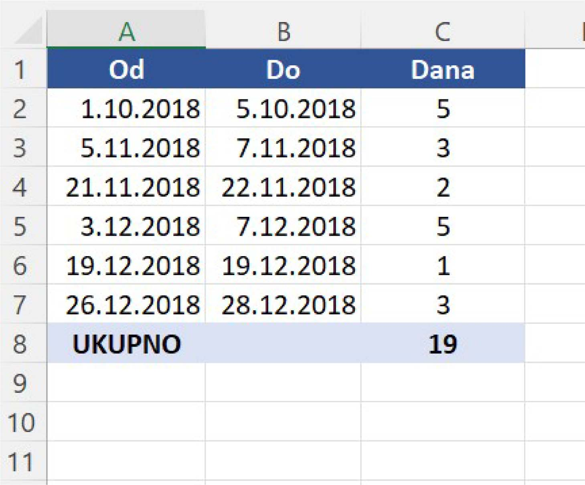
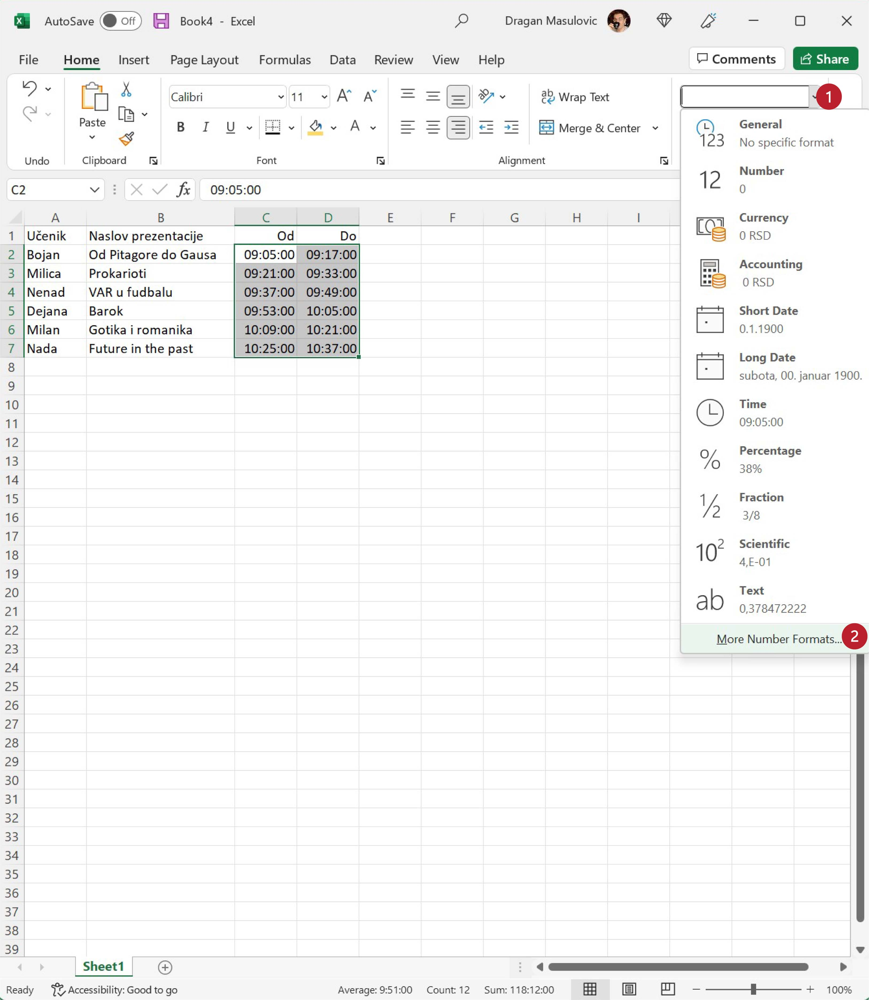
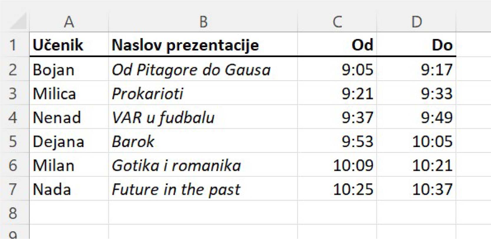

Задаци за вежбу
==========================

Задатак 1.
-------------

Направи Ексел табелу која садржи одсуствовања са наставе неког ученика. Табела треба да има три колоне:

* Od
* Do
* Dana

У колоне „Od“ и „Do“ унеси неколико података о одсуствима. Онда у колони „Dana“ израчунај колико је трајало свако одсуство. Користи формулу као што је ова:
::

    =B2-A2+1

У последњи ред табеле у колону „Od“ упиши „Ukupno“ и онда у колони „Dana“ израчунај колико je укупно одсуствовање корисећи формулу сличну овој:
::

    =SUM(C2:C7)

Улепшај табелу и сними је. Табела на крају треба да изгледа отприлике овако:

Задатак 2.
-----------------

Направи Ексел табелу која садржи дневник рада једног ученика. Табела треба да има следеће колоне:

* Datum
* Početak učenja
* Kraj učenja
* Trajanje

У табелу унеси податке о томе када је ученик почео да учи и када је завршио учење за неколико дана.
Онда за сваки дан израчунај колико времена је провео учећи. На крају табеле додај табели редове који се зову:

* Prosečno
* Min
* Max

па израчунај колико је тај ученик учио у просеку, колико је најмање времена провео учећи, а колико највише. Улепшај табелу и сними је.

Табела коју добијеш треба да изгледа отприлике овако:

.. image:: ../../_images/DataTypes214.jpg
   :width: 600px
   :align: center

Задатак 3.
------------------------

Направи Ексел табелу која садржи распоред излагања презентација из неког предмета. Табела треба да има три колоне:

* Učenik
* Naslov prezentacije
* Od
* Do

Први ученик креће са излагањем у 9:05 часова. Сваки ученик има 12 минута за излагање презентације, и предвиђено је 4 минута паузе између два излагања. Ако знаш када је ученик почео са излагањем, крај излагања ћеш добити тако што ћеш, на пример у ћелију D2 унети формулу:
::

    =C2+TIME(0,12,0)

Ова формула на садржај ћелије C2 (почетак излагања) додаје *време* (енг. *time*) у трајању од 0 сати, 12 минута и 0 секунди.

Да би се аутоматски израчунао почетак наредног излагања на крај последњег излагања треба додати 4 минута. На пример, у ћелију C3 треба унети формулу:
::

    =D2+TIME(0,4,0)

(Можеш да „развучеш наниже“ формуле у обе колоне како би брзо попунио табелу.)

Пошто нам у овом примеру секунде нису битне, форматирај ћелије које садрже време тако да се приказују само сати и минути како следи. Селектуј ћелије које садрже време почетка и краја сваког излагања, кликни на стрелицу поред ћелије која описује формат, па одабери „More Number Formats“:

У листи „Category“ одабери „Time“, у листи „Locale“ одабери „English (United States)“,
па онда у листи „Type“ одабери „13:30“, што представља пример формата:

Улепшај табелу и сними је. Табела на крају треба да изгледа отприлике овако:

