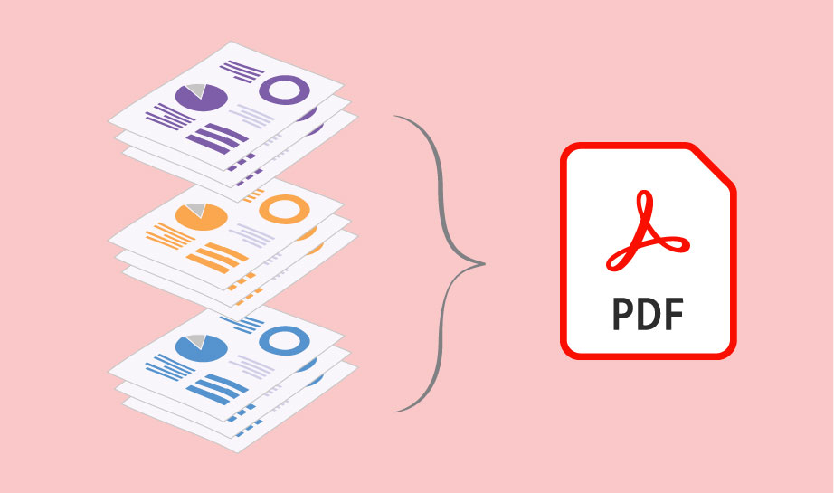

Проценти, штампање и генерисање ПДФ документа
========================================================================

На примеру табеле у којој су дати подаци о најдужим рекама Србије
подсетићемо се процената и како се приказује већа количина текста у ћелији.
Видећемо и како можемо да одштампамо документ или да га конвертујемо у ПДФ.

.. topic:: \ 

   **ПДФ (PDF)** је скраћеница од *Portable Document Format*, што значи „преносни формат за документе“.
   Он омогућује да се документ који је направљен на једном рачунару отвори, чита и штампа на
   *било ком другом рачунару* независно од произвођача рачунара, независно од оперативног система под
   којим рачунар ради, и независно од тога колико је стар рачунар.

На пример, документ направљен на персоналном рачунару (PC) који ради под оперативним системом
*Windows 11* може да се отвори и прочита на рачунару који ради под оперативним системом *Linux*,
или на лаптопу који ради под оперативним системом *macOS*, или на мобилном телефону који ради
под оперативним системом *Android*, или на таблет рачунару који ради под оперативним системом *iOS*.
И обрнуто: ПДФ документ који је направљен на таблет рачунару који ради под оперативним системом *iOS*
може без проблема да се прочита и одштампа на персоналном рачунару који ради под оперативним системом *Windows 11*.

.. infonote::

    Цена коју плаћамо за универзалност ПДФ формата је чињеница да ПДФ документ *не може да се мења!*
    Зато је веома важно запамтити следеће: ако си ПДФ документ направио од неког другог документа, рецимо од Ексел табеле,
    *увек мораш сачувати и полазни документ (Ексел табелу)!* Ексел не може да учита ПДФ документ
    и да на њему врши измене. Ако је потребно нешто променити, измене извршимо у оригиналном документу,
    рецимо Ексел табели, и онда поново од њега направимо ПДФ.

И поред овог ограничења, ПДФ је данас постао *de facto* стандард за размену докумената.
Ако некоме треба да пошаљеш неке документе, а није унапред договорено у ком формату се шаљу документи,
принципи *дигиталне етикеције* налажу да се у том случају шаље *искључиво ПДФ* верзија документа.
Разлог је једноставан: да би неко могао да прочита, рецимо, Ексел фајл, мора да купи одговарајући софтвер.
За ПДФ, међутим, постоје *бесплатни* читачи за све врсте дигиталних уређаја који су икада направљени.

У овој лекцији
-------------------------

У овој лекцији обрађујемо:

1. приказивање броја у облику процента,
2. рад са ћелијама табеле (приказивање веће количине текста у ћелији, спајање ћелија),
3. штампање документа,
4. генерисање ПДФ документа.