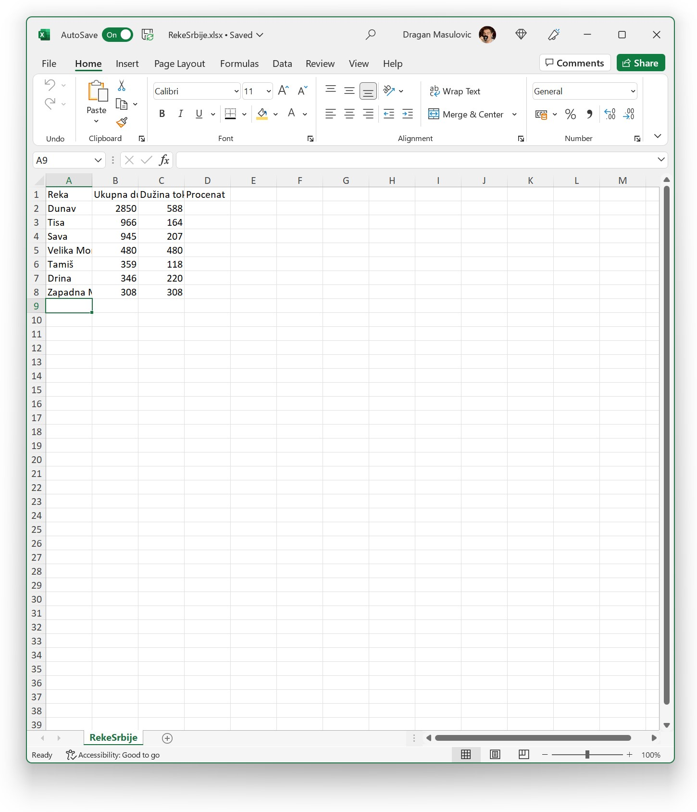
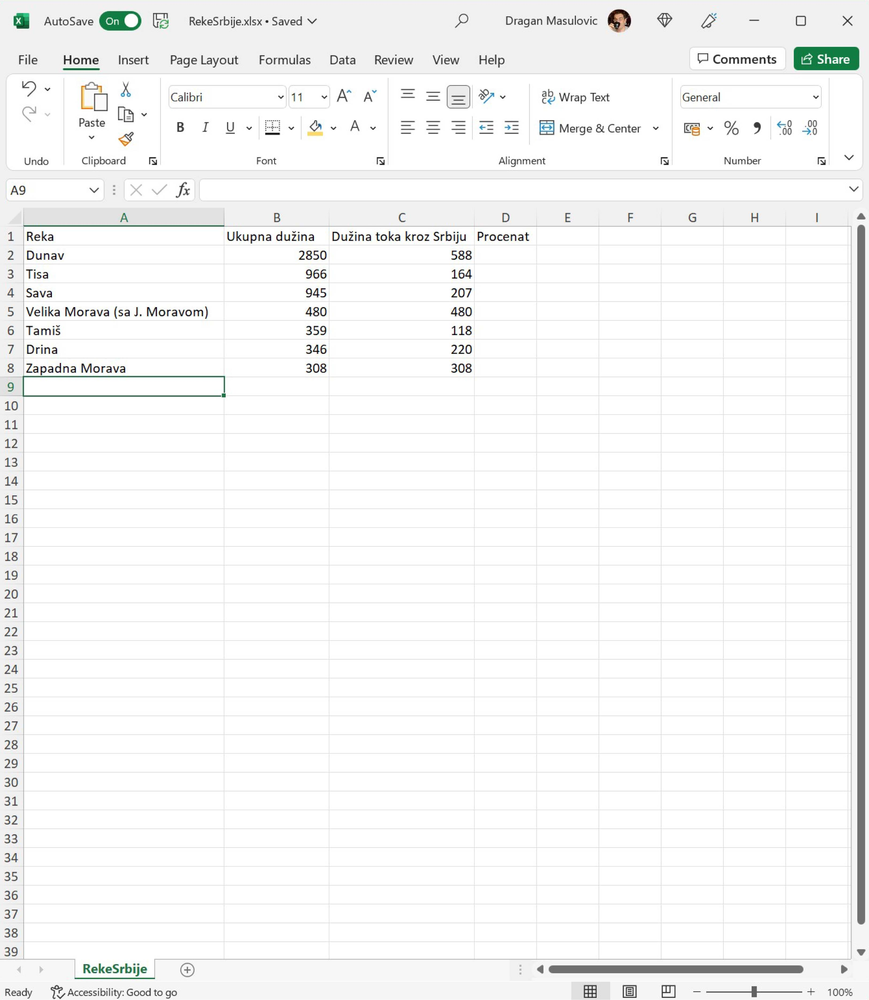
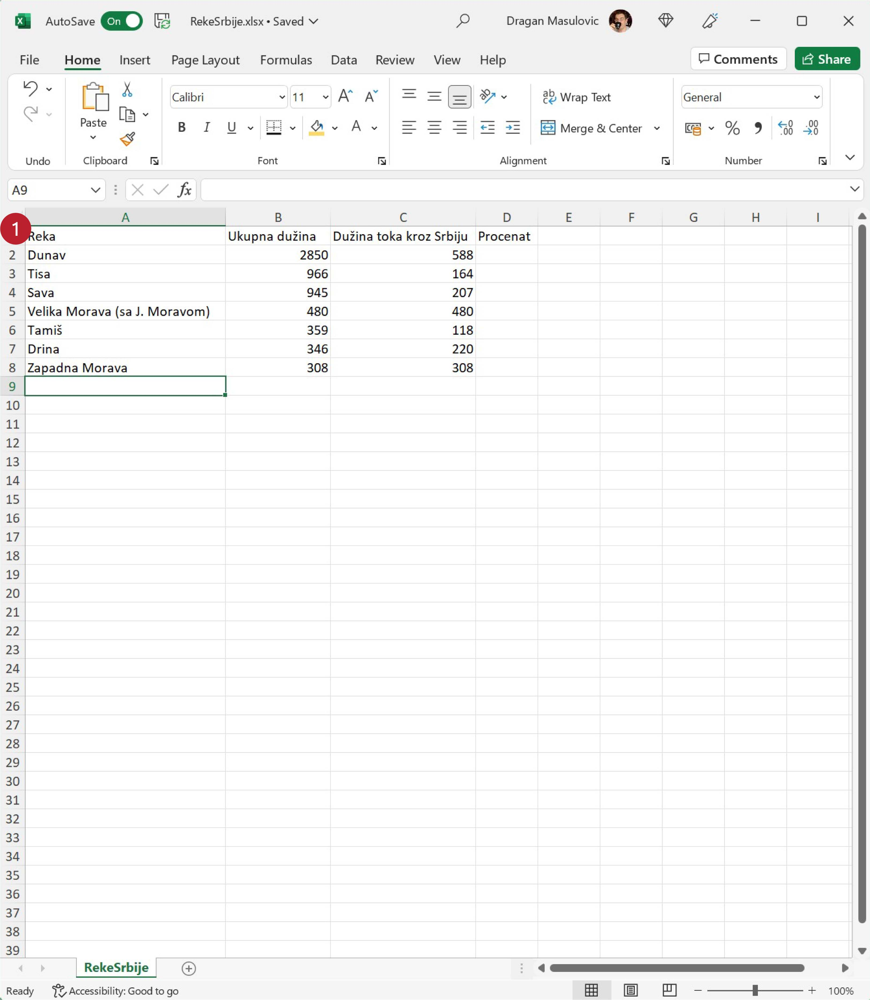
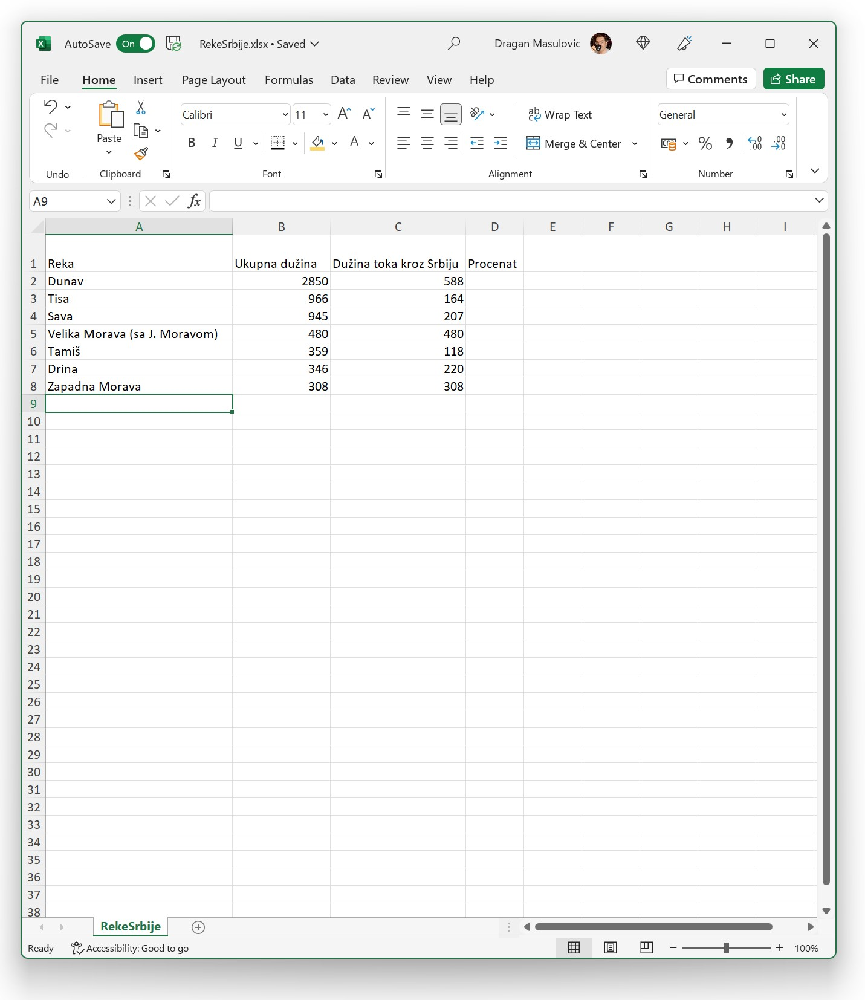
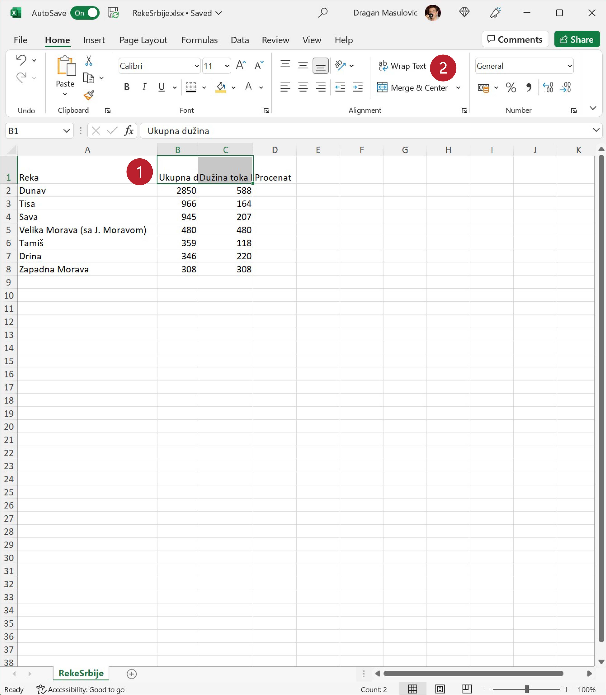
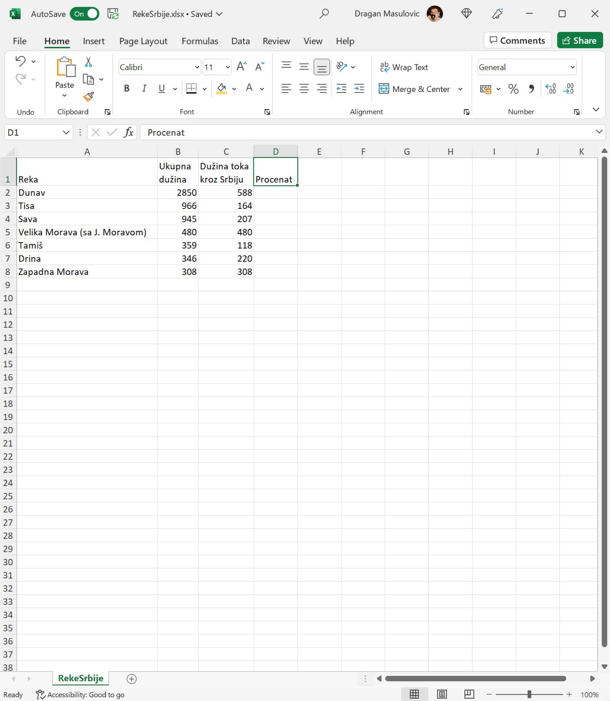

Проширивање врсте и приказивање садржаја ћелије у више редова
======================================================================

Са следећег линка `RekeSrbije.xlsx <https://petljamediastorage.blob.core.windows.net/root/Media/Default/Kursevi/informatika_VIII/epodaci/RekeSrbije.xlsx>`_
преузми документ *RekeSrbije.xlsx* која садржи податке о најдужим рекама у Србији и сними га на свој рачунар.

Корак 1.
----------------

Покрени Ексел и отвори документ:

Корак 2.
-------------------

Прошири колоне тако да се у потпуности види садржај ћелија:

Табела је ружна зато што је, рецимо, име колоне C дугачко, а бројеви који су уписани у ту колону су релативно мали. Има много празног простора и то отежава читање.

Зато ћемо табелу форматирати другачије.

Корак 3.
-----------------------

Сузи колоне B и C и прошири прву врсту. Да би проширио прву врсту „ухвати“ мишем границу између бројева ``1`` и ``2``:

и повуци наниже:

И даље се текст не види у целости: Ексел, наиме, неће сам од себе „смотати текст“ у два реда чак и када је ћелија довољно висока. Морамо му наредити да то уради. Селектуј ћелије B1 и C1, па онда кликни на икону која одговара операцији „Wrap Text“ (енгл. „смотај текст“):

Табела сада изгледа овако:

Ево и кратког видеа:

.. ytpopup:: f6Z-OHR3PlU
   :width: 735
   :height: 415
   :align: center

