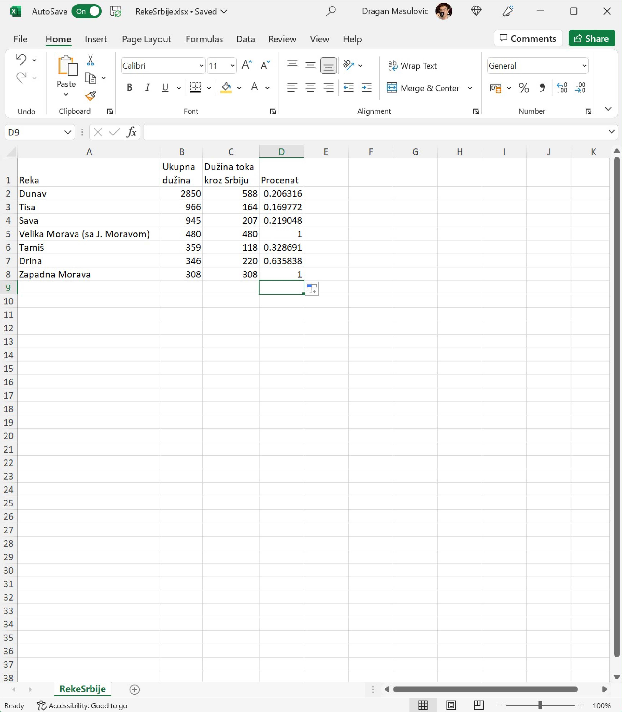
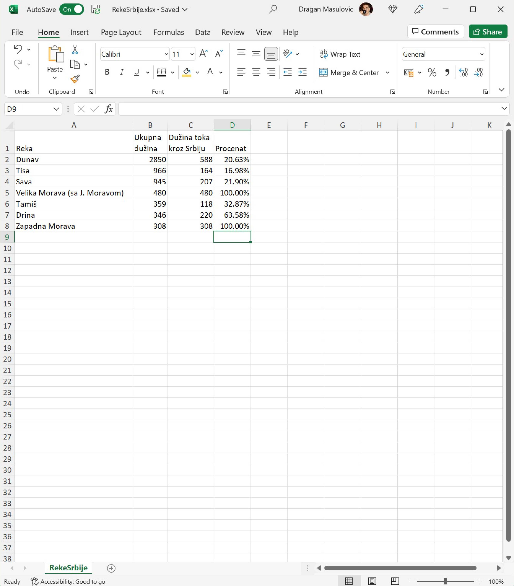

Приказивање бројева у облику процента
========================================

Да се подсетимо: реч *проценaт* потиче од латинског *pro centum* што значи „у стотини“. 
Зато је

.. math::
     47\% = \frac{47}{100} = \text{четрдесет седам од сто}.

.. questionnote::

    У једној школи која има 856 ученика њих 25% су одлични. Колико има одличних ученика у тој школи?

.. reveal:: ПБОП-01
    :showtitle: Прикажи одговор
    :hidetitle: Сакриј

        У тој школи има 214 одличних ученика јер је

        .. math::
             856 \cdot 25\% = 856 \cdot \frac{25}{100} = 214.

.. questionnote::

      Дунав је дугачак 2850 км, од чега 588 км протиче кроз Србију. Који проценат свог тока Дунав проводи у Србији?

.. reveal:: ПБОП-02
    :showtitle: Прикажи одговор
    :hidetitle: Сакриј

        Нека је то :math:`x\%`. Онда је

        .. math::
             2850 \cdot x\% = 2850 \cdot \frac{x}{100} = 588.
        
        Одатле се лако добија да је
        
        .. math::
             x = \frac{588 \cdot 100}{2850} \approx 20,63\%
        
        Дакле, приближно :math:`20,63\%` свог тока Дунав проводи у Србији.

.. infonote::

    Проценат, дакле, представља количник дела и целине, помножен са 100.
    
Да бисмо у Екселу израчунали проценте, довољно је израчунати количник дела и целине, и тако добијене бројеве *форматирати као проценат*.

Корак 4.
--------------

Сада ћемо за сваку од река на списку израчунати који проценат њеног тока пролази кроз Србију. 
У ћелију D2 унесемо формулу
::

    =C2/B2

што значи да рачунамо количник дела и целине (*удео* тока кроз Србију у целом току Дунава):

Исто урадимо и за остале реке у табели. Добијамо:

Да бисмо ове количнике приказали као проценте селектоваћемо ћелије D2:D8, кликнути на стрелицу поред формата податка и одабрати „Percentage“:

.. image:: ../../_images/Print9.jpg
   :width: 600px
   :align: center

Добијамо количнике форматиране као проценте, на две децимале:

.. Ево и кратког видеа:

   .. ytpopup:: u0rJyzPwLOA
      :width: 735
      :height: 415
      :align: center

