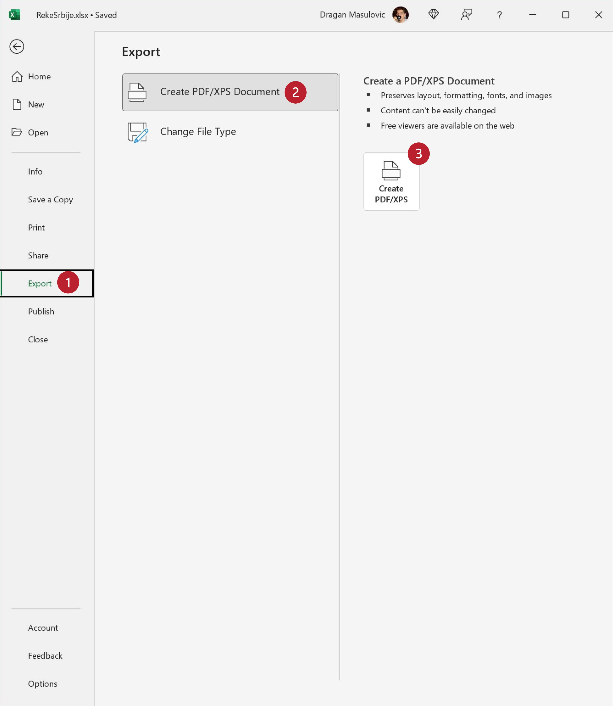

Снимање документа у ПДФ формату
======================================

Да бисмо претходни документ снимили у ПДФ формату треба да кликнемо на „File“:

.. image:: ../../_images/Print29.jpg
   :width: 600px
   :align: center

Потом одаберемо „Save a copy“ (енгл. „сачувај копију“):

Онда кликнемо на стрелицу поред формата документа како бисмо добили (огромну!) листу свих расположивих формата које Ексел подржава, и одаберемо формат ПДФ:

.. image:: ../../_images/Print31.jpg
   :width: 600px
   :align: center

На крају кликнемо на „Save“:

Ако ПДФ документ отворимо из неког програма за преглед ПДФ докумената видећемо нешто слично овоме:

.. image:: ../../_images/Print33.jpg
   :width: 600px
   :align: center

Ево и кратког видеа:

.. ytpopup:: Yu2hLG0wkLs
   :width: 735
   :height: 415
   :align: center

