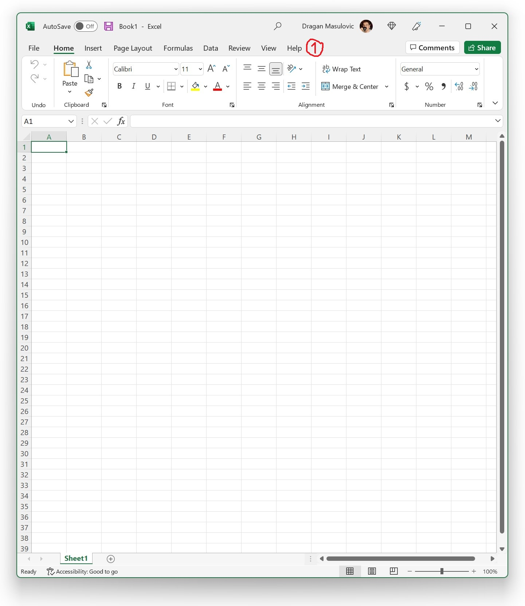

Визуелизација података
=======================

Увек је важно податке приказати у виду графикона зато што људи најлакше и најбрже обрађују визуелне податке. (Вероватно знаш за изреку да *једна слика вреди више од хиљаду речи*.) Научићемо да приказујемо податке разним врстама графикона. Важно је напоменути да није свака врста графикона погодна за приказивање сваке врсте података.

Ексел, наравно, има могућност да на основу података који су дати направи графикон. Одговарајуће опције се налазе на командној траци (енгл. *ribbon*) који се зове „Insert„. При врху прозора се налази списак свих командних трака:

Одабиром било које од њих можемо да добијемо нови сет команди, као што ћемо показати у наредном одељку. Кликом на „Home“ увек можемо да се вратимо на основну командну траку („да се вратимо кући“).

Ево и кратког видеа:

.. ytpopup:: DW5-RMn0fHE
   :width: 735
   :height: 415
   :align: center

