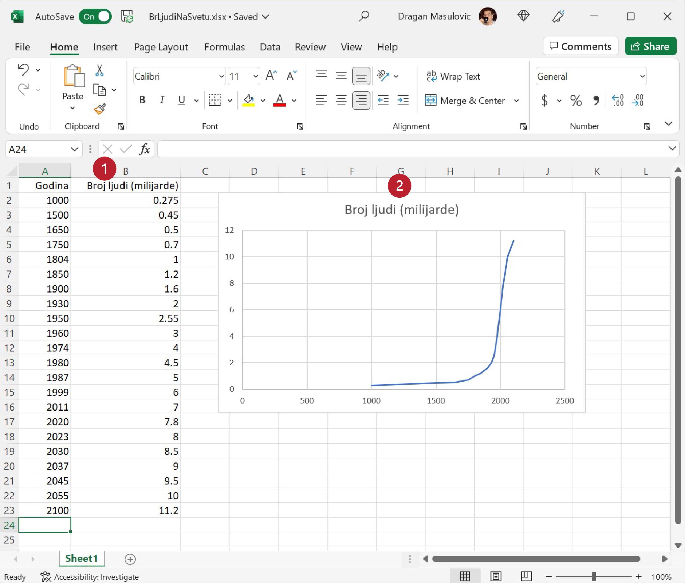

Промена величине у времену - Scatter дијаграм
====================================================

Најједноставнији тип дијаграма је дијаграм на коме однос две групе података представљамо тачкицама.
Тај тип дијаграма просто повеже тачкице у координатној равни и тако добијемо линију
која нам јасно показује како се неке величине мењају у времену.

Корак 1.
------------------

Са следећег линка преузми документ *BrLjudiNaSvetu.xlsx* и сними га на свој рачунар:

`Broj ljudi <https://petljamediastorage.blob.core.windows.net/root/Media/Default/Kursevi/informatika_VIII/epodaci/BrLjudiNaSvetu.xlsx>`_

Отвори документ и пређи на командну траку „Insert“ на којој су нам доступне нове могућности. За креирање графикона ће нам бити важне оне које се налазе у групи „Charts“ (енгл. „графикон“):

Корак 2.
-------------

У табели коју смо учитали приказан је процењени број становника наше планете у разним историјским периодима, при чему је број људи исказан у милијардама. Дакле, ради се о подацима који показују како се неки параметар (број становника наше планете) мењао у времену. Да бисмо ове податке приказали графиконом селектоваћемо целу табелу *укључујући и имена колона*:

.. image:: ../../_images/gr4.jpg
   :width: 600px
   :align: center

У највећем броју случајева Ексел може да закључи како треба да се зове табела
на основу имена колона табеле.

Корак 3.
----------------

На командној траци „Insert“ из групе „Charts“ одабраћемо опцију „Scatter (X,Y)“:

.. image:: ../../_images/gr5.jpg
   :width: 600px
   :align: center

како бисмо добили списак расположивих стилова ове врсте графикона:

.. image:: ../../_images/gr6.jpg
   :width: 600px
   :align: center

Одаберимо назначени стил (тачке спојене линијама):

Добијамо графикон који је део документа:

.. image:: ../../_images/gr8.jpg
   :width: 600px
   :align: center

Корак 4.
-------------------

Пошто је графикон превелики и прекрива податке, можемо га мало смањити („ухватимо“ мишем за истакнуту тачку у углу графикона и подесимо величину), а можемо га и преместити (клинемо у празан део оквира и *не отпуштајући тастер на мишу* преместимо графикон).
Примети да је Ексел исправно схватио како графикон треба да се зове:

Корак 5.
----------------

За крај ћемо снимити документ као Ексел документ и као ПДФ. Ако погледамо ПДФ документ, видећемо да је графикон заиста саставни део документа:

.. image:: ../../_images/gr10.jpg
   :width: 600px
   :align: center

Ево и кратког видеа:

.. ytpopup:: 6Yir930ZbJ4
   :width: 735
   :height: 415
   :align: center

