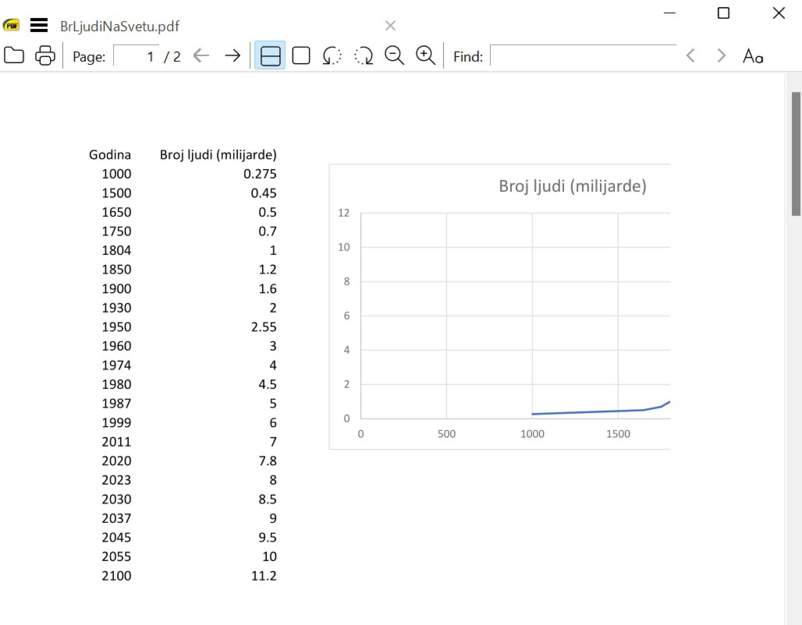
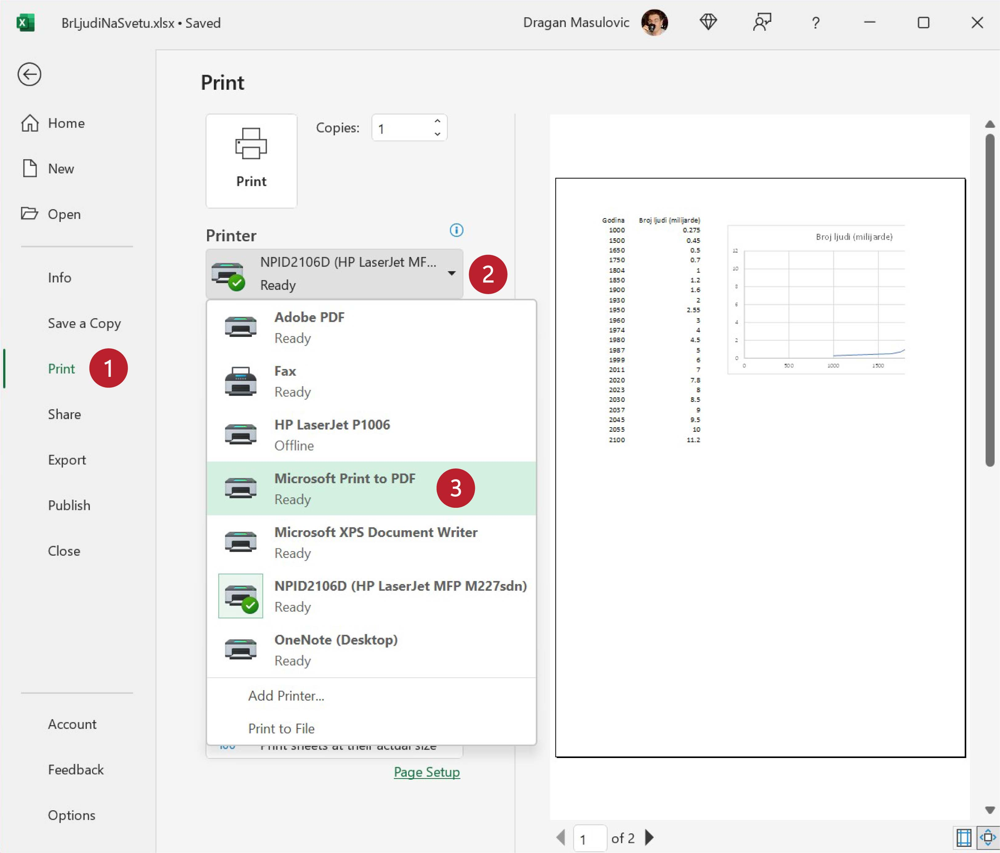

Промена величине у времену - Scatter дијаграм
====================================================

Најједноставнији тип дијаграма је дијаграм на коме однос две групе података представљамо тачкицама.
Тај тип дијаграма просто повеже тачкице у координатној равни и тако добијемо линију
која нам јасно показује како се неке величине мењају у времену.

Корак 1.
------------------

Са следећег линка преузми документ *BrLjudiNaSvetu.xlsx* и сними га на свој рачунар:

`Broj ljudi <https://petljamediastorage.blob.core.windows.net/root/Media/Default/Kursevi/informatika_VIII/epodaci/BrLjudiNaSvetu.xlsx>`_

Отвори документ.

Корак 2.
-------------

У табели коју смо учитали приказан је процењени број становника наше планете у разним историјским периодима,
при чему је број људи исказан у милијардама. Дакле, ради се о подацима који показују како се неки параметар
(број становника наше планете) мењао у времену.

:math:`\ `

Да бисмо ове податке приказали графиконом селектоваћемо све податке *укључујући и имена колона*:

.. image:: ../../_images/gr4.jpg
   :width: 600px
   :align: center

Корак 3.
----------------

Пређи сада на командну траку „Insert“ (1) на којој су нам доступне нове могућности.
За креирање графикона ће нам бити важне оне које се налазе у групи „Charts“ (енгл. „графикон“).
На командној траци „Insert“ из групе „Charts“ одабери опцију „Scatter (X,Y)“ (2),
па из низа графичких решења која су ти понуђена одабери неко стил који ти се свиђа (3):

.. image:: ../../_images/gr5.jpg
   :width: 600px
   :align: center

Добијамо графикон који је део документа:

Корак 4.
-------------------

Пошто је графикон превелики и прекрива податке,
можемо га преместити (клинемо у празан део оквира и *не отпуштајући тастер на мишу* преместимо графикон).
У највећем броју случајева Ексел може да закључи како треба да се зове табела
на основу имена колона табеле.

.. image:: ../../_images/gr9.jpg
   :width: 600px
   :align: center

Корак 5.
----------------

За крај ћемо снимити документ као Ексел документ и као ПДФ. Ако погледамо ПДФ документ,
видећемо да је графикон заиста саставни део документа **али и то да нам недостаје део графикона**:

.. questionnote::

   Шта се десило и шта да радимо?

.. Ево и кратког видеа:

   .. ytpopup:: 6Yir930ZbJ4
      :width: 735
      :height: 415
      :align: center

Корак 6.
----------------

Приликом снимања графикона у облику ПДФ документа рачунар је
припремио документ за штампу на папиру формата А4. Испоставило се да је
цео документ шири, па је вишак одсечен.

:math:`\ `

Уколико се деси да документ по ширини не може да стане на папир формата А4 можемо
мало да га модификујемо тако што ћемо:

- да сузимо колоне, и/или
- да смањимо графиконе („ухватимо“ мишем за истакнуту тачку у углу графикона и подесимо величину).

Међутим, постоји још једна могућност којој се често прибегава: *променити оријентацију папира*.
Лист папира је правоугаоник по коме може да се штампа *усправно* (како то најчешће и радимо)
или *хоризонтално*, по ширини.

.. infonote::

   Папир за штампање има две *оријентације*:

   - усправну, која се зове још и „Portrait“ (енгл. *портрет*), и
   - хоризонталну или положену, која се зове још и „Landscape“ (енгл. *пејсаж* или *крајолик*).

.. questionnote::

   Подсети се из ликовног како стоји платно када сликар слика протрет, а како када слика пејсаж.

Када желимо да снимио документ у ПДф формату и при томе желимо да модификујемо неке од
стандардних параметара, понашамо се *као да штампамо документ на „ПДФ штампач“*.

.. infonote::

   Сваки оперативни систем има *„ПДФ штампач“*. То није уређај
   на коме ће документ бити одштампан, већ се ради о услузи оперативног система
   која се понаша као штампач, али резултат њеног рада је ПДФ фајл који може да се сними на рачунар.

Дакле, решење које ћемо сада показати се своди на то да одштампамо документ
на „ПДФ штампач“.

:math:`\ `

Пређи на радну траку „File“, одабери „Print“ (1), кликни на стрелицу поред имена активног штампача (2),
па са списка расположивих штампача одабери „Microsoft Print to PDF“ (3):

Након тога одабери „Landscape“ као оријентацију папира (4), па кликни на дугме „Print“ (5):

У новом прозору који се појавио дај име свом ПДФ фајлу (6) и кликни на дугме „Save“ (7):

Ако сада погледамо ПДФ документ, видећемо да је графикон и даљњ саставни део документа,
као и да је све лепо стало на папир:

