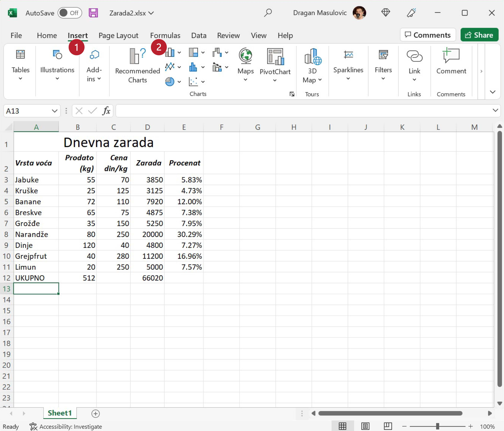

Компаративна анализа -- Стубичасти дијаграми
=================================================

Често подаци служе томе да се изврши *компаративна анализа*,
дакле, да се неке врсте упореде (*компарација* = упоређивање) и да се установи која врста је више,
а која мање заступљена у подацима. Тада је погодно податке представити *стубичастим дијаграмима*.

Корак 1.
-------------------

Са следећег линка преузми документ *Zarada2.xlsx* и сними га на свој рачунар:

`Zarade <https://petljamediastorage.blob.core.windows.net/root/Media/Default/Kursevi/informatika_VIII/epodaci/Zarada2.xlsx>`_

Табела садржи податке о продаји воћа и оствареној заради:

.. image:: ../../_images/Zarada201.jpg
   :width: 600px
   :align: center

Корак 2.
--------------

Желимо да илуструјемо зараду и да визуелизујемо допринос сваке врсте продатог воћа заради. Пређи на командну траку „Insert“ и уочи (немој још ништа да кликнеш!) опцију која црта хистограме (зову се још и *стубичасти дијаграми*, а на енглеском *column charts* или *bar charts*):

Корак 3.
-----------------

У овом примеру треба да прикажемо само део података из табеле, а при томе колоне које садрже те податке нису једна до друге. Зато ћемо морати да селектујемо *две групе података* овако:

1. селектуј ћелије A2:A11 као и раније, па
2. притисни тастер [CTRL] и *држећи га притиснутог* селектуј ћелије D2:D11

Треба да добијеш:

.. image:: ../../_images/Zarada203.jpg
   :width: 600px
   :align: center

*Обрати пажњу на то да смо у обе групе података селектовали и име колоне!*

Корак 4.
-------------------

Сада кликни на опцију која црта стубичасте дијаграме и одабери стил који ти се највише свиђа:

.. image:: ../../_images/Zarada204.jpg
   :width: 600px
   :align: center

Добили смо графикон:

.. image:: ../../_images/Zarada205.jpg
   :width: 600px
   :align: center

Корак 5.
------------------

Ако графикон прекрива текст можемо га мало смањити и померити:

.. image:: ../../_images/Zarada206.jpg
   :width: 600px
   :align: center

Ево и кратког видеа:

.. ytpopup:: XO3XXccnS0Y
   :width: 735
   :height: 415
   :align: center

