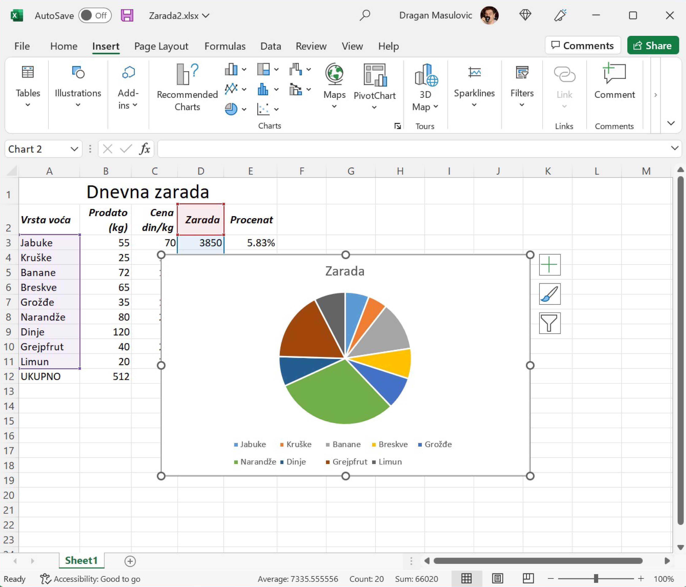
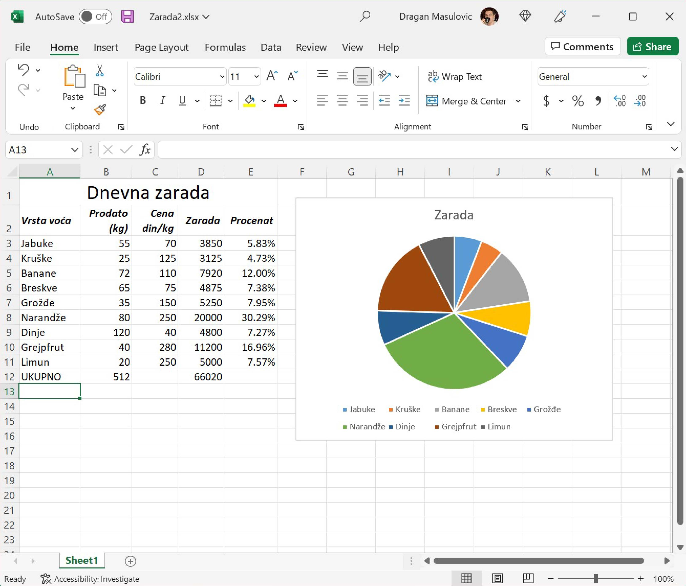

Визуелизација удела у целини -- Секторски дијаграми
========================================================

Ако желимо да визуелизујемо у којој мери појединачни делови учествују
у целини користимо *секторски дијаграм* (или *питасти дијаграм*, од енгл. *pie chart*).

Корак 1.
------------

Преузми поново документ *Zarada2.xlsx* и сними га на свој рачунар (ако треба, „прегази“ стару верзију документа):

`Zarade <https://petljamediastorage.blob.core.windows.net/root/Media/Default/Kursevi/informatika_VIII/epodaci/Zarada2.xlsx>`_

Корак 2.
-----------------

Пређи на командну траку „Insert“ и уочи (немој још ништа да кликнеш!) опцију која црта секторске дијаграме:

Корак 3.
------------------

Поново селектуј *две групе података*:

1. селектуј ћелије A2:A11 као и раније, па
2. притисни тастер [CTRL] и *држећи га притиснутог* селектуј ћелије D2:D11.

.. image:: ../../_images/Zarada203.jpg
   :width: 600px
   :align: center

Корак 4.
------------------

Сада кликни на опцију која црта секторске дијаграме и одабери стил који ти се највише свиђа:

Добили смо дијаграм:

који опет можемо мало уредити ако прекрива текст:

Ако кликнемо на дијаграм, Ексел ће нам приказати који подаци су приказани на дијаграму:

.. image:: ../../_images/Zarada211.jpg
   :width: 600px
   :align: center

Ево и кратког видеа:

.. ytpopup:: 7Q0ke48ERYw
   :width: 735
   :height: 415
   :align: center

