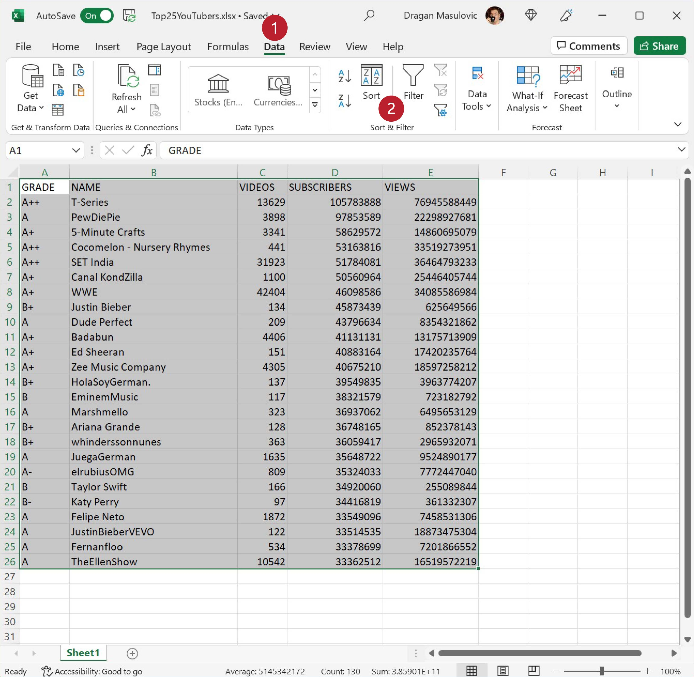

Сортирање података
=========================

Показаћемо сада како се у Екселу могу сортирати табеле.
Приликом сортирања табеле Ексел преуређује врсте табеле
тако да бројеви уписани у неку колону буду поређани по величини.

Корак 1.
-----------------

Са следећег линка преузми документ *Top25YouTubers.xlsx* и сними га на свој рачунар:

`YouTubers.xlsx <https://petljamediastorage.blob.core.windows.net/root/Media/Default/Kursevi/informatika_VIII/epodaci/Top25YouTubers.xlsx>`_

Табела садржи податке о првих 25 YouTube канала према броју претплатника на дан 1. јул 2019:

.. image:: ../../_images/YT1.jpg
   :width: 600px
   :align: center

За сваки канал је наведен његов YouTube ранг (GRADE), име канала (NAME), колико је видеа објављено на каналу (VIDEOS),
колико има претплатника (SUBSCRIBERS) и колико има прегледа (VIEWS). Табела jе сортирана по броју претплатника.

Корак 2.
----------------

Сортираћемо сада табелу по броју прегледа (VIEWS). Селектоваћемо целу табелу *заједно са првом врстом у којој су наведена имена колона*:

.. image:: ../../_images/YT2.jpg
   :width: 600px
   :align: center

Прећи ћемо на командну траку „Data“ и одабрати опцију „Sort“:

Појавиће се прозор у коме можемо да одаберемо колону по којој ће бити сортирана табела:

У одељку „Column“ (енгл. „колона“) кликнемо на стрелицу, па у листи која се појавила одаберемо „VIEWS“ јер желимо да сортирамо табелу по броју прегледа (колона „VIEWS“):

.. image:: ../../_images/YT5.jpg
   :width: 600px
   :align: center

Потом у одељку „Order“ (енгл. „редослед“) кликнемо на стрелицу, па у листи која се појавила одаберемо „Largest to Smallest“ јер желимо да сортирамо табелу од већих ка мањим вредностима. (Да смо којим случајем правили „листу срама“, одабрали бисмо опцију „Smallest to Largest“ која би наложила Екселу да сортира табелу од канала са најмање прегледа до канала са највише прегледа.)

Када кликнемо на „OK“ добијамо сортирану табелу (редови су испремештани тако да на првом месту буде канал са највише прегледа):

.. image:: ../../_images/YT7.jpg
   :width: 600px
   :align: center

Ево и кратког видеа:

.. ytpopup:: 8LVLF73jbhE
   :width: 735
   :height: 415
   :align: center

Корак 3.
----------------

Прикажимо број прегледа по каналима хистограмом. Означимо ћелије B1:B26 и онда *притиснемо тастер [CTRL] и држећи га притиснутог* означимо још и ћелије E1:E26.

.. image:: ../../_images/YT7b.jpg
   :width: 600px
   :align: center

Онда одаберемо командну траку „Insert“ и са ње опцију за креирање стубичастих дијаграма, па одаберемо стил који нам се највише свиђа. Ако је потребно, преместимо дијаграм да не прекрива податке:

