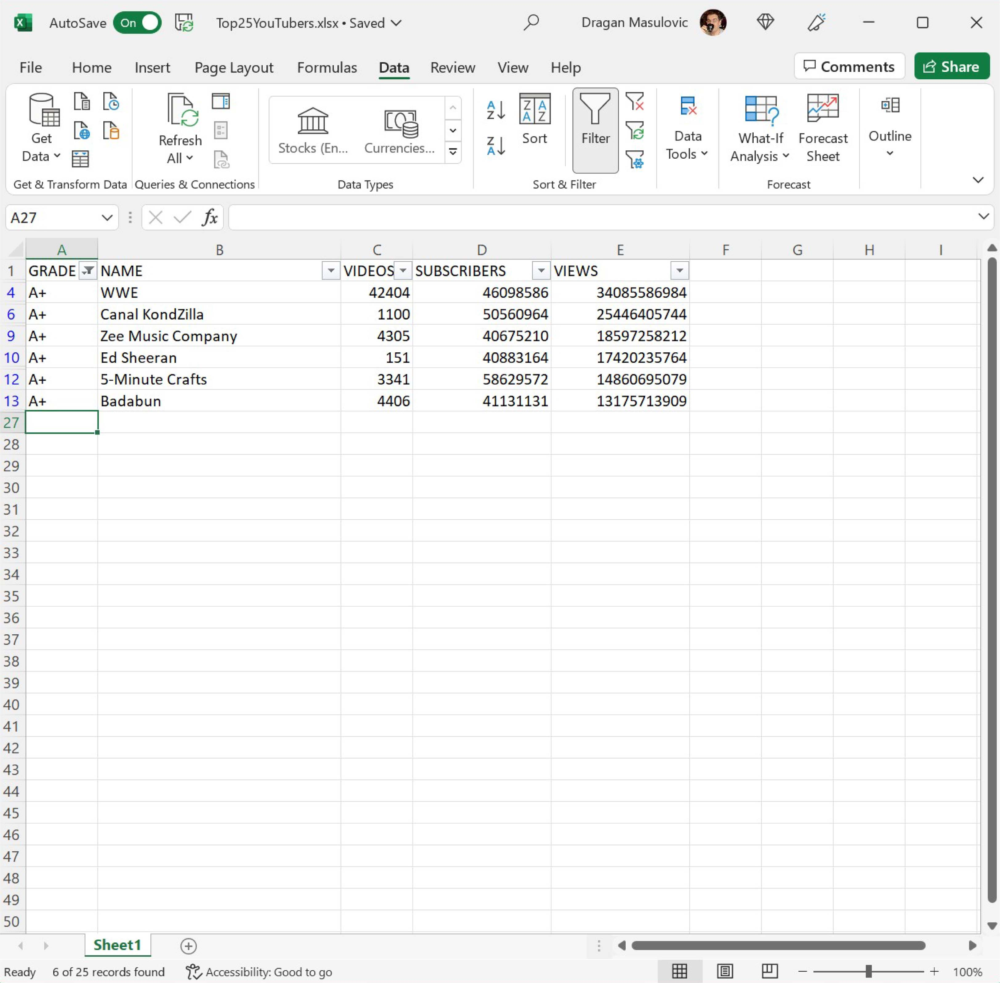
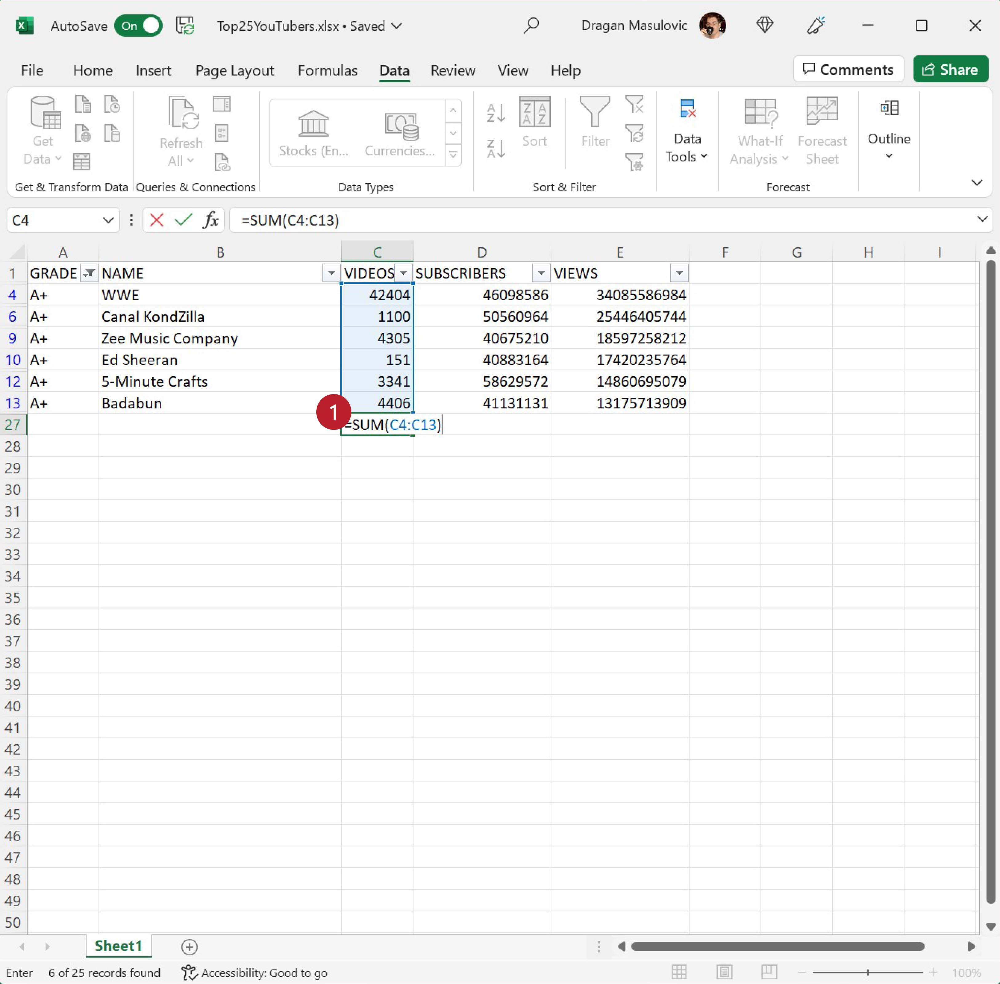

Филтрирање података
==============================

Филтрирање података се састоји у томе да се размотре само неки подаци из табеле.
Рецимо да нас занима колико укупно видеа су објавили канали чији ранг је А+ (не А-, А++ или А; само А+).
Једна могућност је да сортирамо табелу по колони „GRADE“ па да нађемо сегмент табеле у коме се налазе вредност А+.
Ово може бити озбиљан проблем ако је табела велика. Зато Ексел има могућност *аутофилтер* која аутоматски
генерише захтеве за филтрирање.

Корак 1.
-------------

Селектоваћемо *само први ред табеле* у коме се налазе имена колона:

.. image:: ../../_images/YT8.jpg
   :width: 600px
   :align: center

и онда на командној траци „Data“ и кликнути на „Filter“:

.. image:: ../../_images/YT9.jpg
   :width: 600px
   :align: center

Поред имена сваке колоне се појавила стрелица. Те стрелице нам дају приступ критеријумима за филтрирање табеле.

Корак 2.
-------------

Ако кликнемо на стрелицу поред „GRADE“ појавиће се мени на коме можемо да бирамо групе података које желимо да видимо:

.. image:: ../../_images/YT10.jpg
   :width: 600px
   :align: center

„Откачићемо“ све „квачице“ осим оне код „А+“ и потом кликнути на OK:

Тако смо „профилтрирали“ табелу и приказали само оне редове који у колони „GRADE“ садрже вредност А+:

Важно је напоменути да остали редови нису уклоњени из табеле. Они су и даље ту, само се не виде. То је лако закључити ако погледамо редне бројеве колона:

.. image:: ../../_images/YT13.jpg
   :width: 600px
   :align: center

Осим тога, специјални знак поред имена колоне „GRADE“ нам каже да је укључен аутофилтер на тој колони, а у дну прозора стоји порука „6 of 25 records found“ што значи да је филтрирањем пронађено 6 редова табеле (од укупно 25) који задовољавају услове.

Ево и кратког видеа:

.. ytpopup:: s4yc9FYrHDo
   :width: 735
   :height: 415
   :align: center

Корак 3.
-----------------

Сада можемо да утврдимо колико видеа су објавили канали чији ранг је А+ тако што ћемо сабрати бројеве у колони „VIDEOS“ у профилтрираној табели.

Ако пробамо да применимо функцију SUM распон ћелија који морамо да наведемо не одговара ситуацији:

јер ми *не желимо* да саберемо *све* ћелије од C4 до C13, већ *само оне ћелије распона C4:C13 које задовољавају услове филтера*. Зато ћемо сумирање морати да урадимо другачије.

Кликнемо на ћелију C27 и са командне траке „Formulas“ одаберемо „Autosum“:

„Autosum“ је малчице вештачки интелигентна опција која уме да проанализира контекст у коме желимо да одредимо збир и на основу тога које друге опције су укључене може да одабере праву функцију за сумирање. У нашем случају добијамо:

.. image:: ../../_images/YT16.jpg
   :width: 600px
   :align: center

Дакле, „Autosum“ се определио за функцију „SUBTOTAL(9, C2:C26)“ што значи да ће на цео распон C2:C26 бити примењена 9. могућност функције „SUBTOTAL“, а то је тачно рачунање збира уз примену филтера:

.. image:: ../../_images/YT17.jpg
   :width: 600px
   :align: center

Ево и кратког видеа:

.. ytpopup:: afTS-kOA-uc
   :width: 735
   :height: 415
   :align: center

