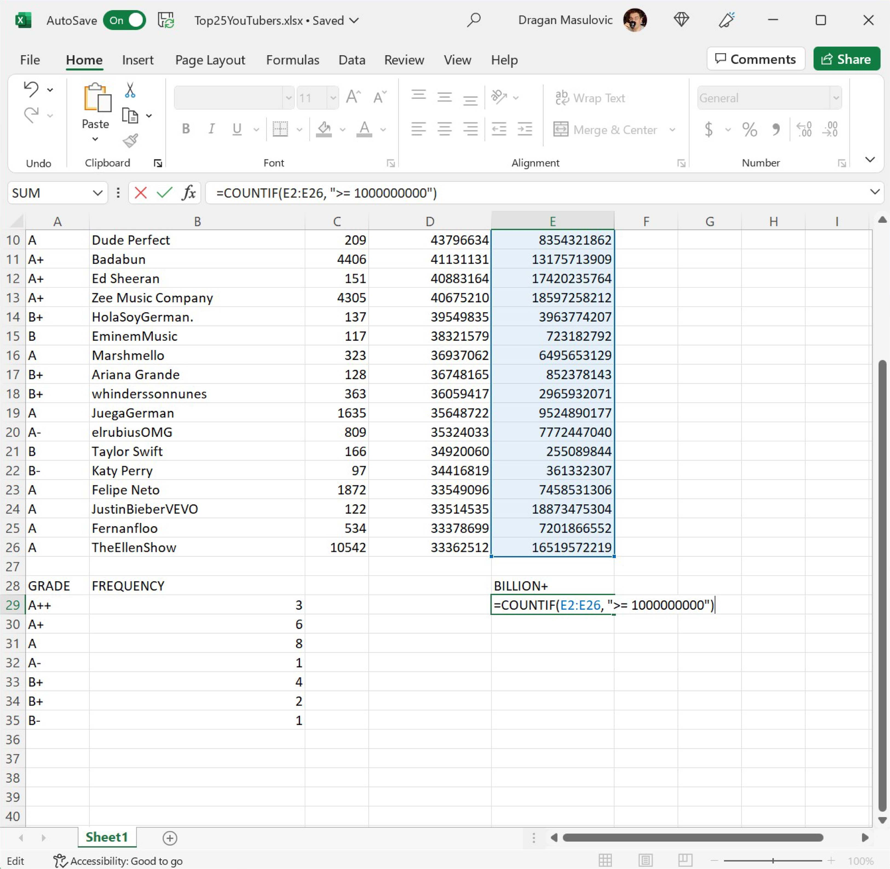

Фреквенцијска анализа
=======================

Фреквенцијска анализа низа података се своди на то да се преброји колико се пута који податак
појављује у низу (фреквенција = учесталост). Типичан пример фреквенцијске анализе би био да пребројимо
колико канала у табели коју смо до сада анализирали има рејтинг А++, колико А+, колико А, итд.

Корак 1.
-------------

Преузми поново документ *Top25YouTubers.xlsx* и сними га на свој рачунар да бисмо кренули од свежих података:

`YouTubers <https://petljamediastorage.blob.core.windows.net/root/Media/Default/Kursevi/informatika_VIII/epodaci/Top25YouTubers.xlsx>`_

Табела изгледа овако:

.. image:: ../../_images/FA1.jpg
   :width: 600px
   :align: center

Корак 2.
------------

Фреквенцијска анализа у односу са рејтинг канала се састоји у томе да за сваки од рејтинга који се појављују у колони А (А++, А+, А, А-, B+, B и B-) утврдимо колико се пута јављају у колони А.

У ћелију А28 унеси текст „GRADE“, а у ћелију B28 текст „FREQUENCY“; онда у ћелије А29, А30, А31, А32, А33, А34, A35 унеси рејтинге А++, А+, А, А-, B+, B и B-:

Корак 3.
------------

Да бисмо утврдили, рецимо, колико пута се у колони А јавља рејтинг А++ треба да кренемо да *бројимо* ћелије колоне А, али само *ако* је њихов садржај једнак са А++. Екселова функција која *броји* (енг. *count*) ћелије, али само *ако* (енг. *if*) је њихова вредност једнака датој, зове се COUNTIF.

У ћелију B29 унеси формулу:
::

    =COUNTIF(A2:A26, "A++")

.. image:: ../../_images/FA3.jpg
   :width: 600px
   :align: center

Ова функција ће проћи кроз ћелије А2:А26, пребројати колико пута се појављује А++ и тај број уписати у ћелију B29.

Потом у ћелије B30, B31, B32, B33, B34 и B35 редом унеси формуле:
::

    =COUNTIF(A2:A26, "A+")
    =COUNTIF(A2:A26, "A")
    =COUNTIF(A2:A26, "A-")
    =COUNTIF(A2:A26, "B+")
    =COUNTIF(A2:A26, "B")
    =COUNTIF(A2:A26, "B-")

Табела изгледа овако:

.. image:: ../../_images/FA5.jpg
   :width: 600px
   :align: center

Фреквенцијска анализа завршена.

Корак 4.
--------------

За крај ћемо утврдити колико канала у овој табели има милијарду прегледа или више. У ћелију Е28 упиши текст „BILLION+“ (без наводника, наравно; примети да се милијарда на енглеском каже *billion*, мада може и *milliard*, али да не улазимо у детаље):

.. image:: ../../_images/FA11.jpg
   :width: 600px
   :align: center

па у ћелију Е29 упиши формулу:
::

    =COUNTIF(E2:E26, ">= 1000000000")

Ова формула каже Екселу да утврди колико ћелија из опсега E2:E26 задовољава услов наведен под наводницима. На крају добијамо:

.. image:: ../../_images/FA13.jpg
   :width: 600px
   :align: center

