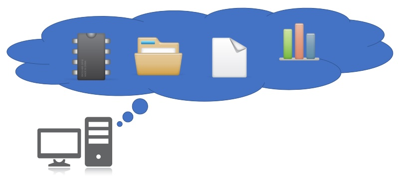

Сервиси „у облаку“ (cloud services)
=====================================

Огромна брзина протока информација кроз Интернет је омогућила брз и једноставан приступ удаљеним подацима, а потом и развој
*сервиса „у облаку“* (*cloud services*). Сервис „у облаку“ је програм који се извршава на удаљеном рачунару и кога
користимо преко Интернета. Типичан пример сервиса „у облаку“ којег користимо скоро сваки дан је *веб мејл*
(*web mail*), што представља систем за слање и примање електронске поште где се и програм преко којег шаљемо и примамо електронску пошту, као и подаци (електронска писма) налазе на удаљеном рачунару чији задатак је да опслужује кориснике веб сервиса. Зато се такви удаљени рачунари називају *сервери*.

Данас на располагању имамо на хиљаде разних сервиса „у облаку“ који се крећу од обичног чувања докумената,
преко могућности да групе корисника сарађују на обради докумената „у облаку“, па чак до изнајмљивања процесорског времена.

На пример, компанија Google за своје кориснике нуди

* Google Mail - електонску пошту „у облаку“
* Google Drive - сервис за складиштење докумената „у облаку“
* Google Docs, Sheets, Slides - сервис за креирање и уређивање текстова, табела и презентација „у облаку“.

Слично томе, компанија Microsoft за своје кориснике нуди

* Outlook - електонску пошту „у облаку“
* OneDrive - сервис за складиштење докумената „у облаку“
* Word, Excel, PowerPoint - сервис за креирање и уређивање текстова, табела и презентација „у облаку“
* Azure - сервис за извршавање апликација (програма) „у облаку“.

Наравно, Google и Microsoft нису једине компаније које нуде сервисе „у облаку“.

Определили смо се за Google-ове сервисе зато што су бесплатни и зато што верујемо да већина ученика
у Србији већ поседује кориснички налог код Google-а због популарности паметних телефона базираних на Андроиду.

У овој лекцији
-------------------

Циљ ове лекције је да покажемо:

1. како се приступа сервисима „у облаку“
2. како се користе сервиси „у облаку“ за рад са табелама за унакрсна израчунавања, и
3. како се могу поделити документи „у облаку“ тако да више корисника у исто време може да ради на једном документу (*сарадња*).

