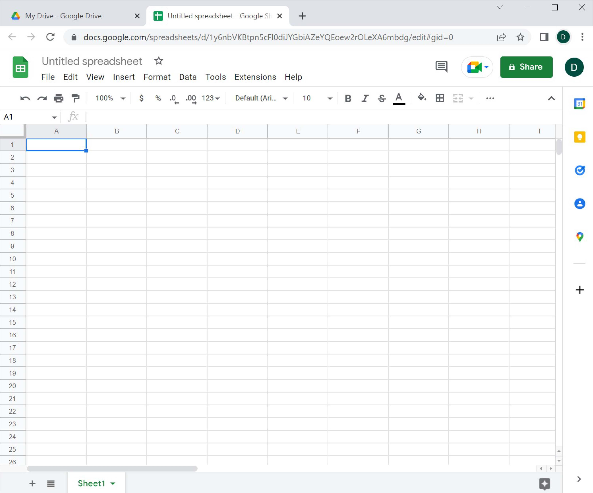
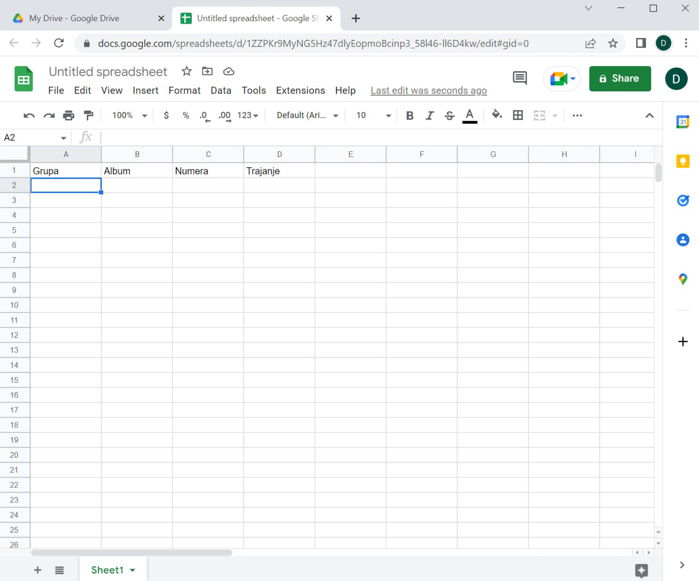

Креирање документа „у облаку“
====================================

Са документима „у облаку“ обично радимо тако што помоћу неког веб-прегледача
приступимо сервису и онда управљамо подацима кроз веб-прегледач.
Ми ћемо у овом курсу користити *drive.google.com*, 
што је комбиновани сервис за смештање података „у облак“, као и за креирање нових докумената „у облаку“. 

Корак 1.
-------------------

Иди на *drive.google.com*.
Добићеш приказ докумената који су већ похрањени на овај сервис (тренутно нема ниједног), 
као и могућност да креираш нове документе.

Корак 2.
--------------

Нови документ се креира кликом на „New“, након чега имамо могућност да одаберемо врсту документа коју желимо да креирамо. Ми ћемо се определити за „Google Sheets“ -> „Blank spreadsheet“:

што је празна табела за унакрсна израчунавања:

Организација радне површине веома личи на Ексел и већина елемената би требало да ти је разумљива.

Као пример, направићемо плеј-листу која има следеће колоне:

* Grupa
* Album
* Numera
* Trajanje

До сада већ свако зна да унесе податке у табелу, па би просто пуњење табеле подацима било бескрајно досадно.
Да бисмо ствари учинили интересантнијим показаћемо како више корисника може да ради на истом документу.

Корак 3.
-----------------

Поделите се у мање групе. Нека *један од чланова групе* направи овакву табелу:

Корак 4.
-----------------

Табела се тренутно зове „Untitled spreadsheet“. Преименоваћемо је у „Play-list“. Кликни на име табеле „Untitled spreadsheet“:

.. image:: ../../_images/Sh9.jpg
   :width: 600px
   :align: center

па у оквир који се појавио унеси „Play-list“ *без наводника*

и притисни [ENTER].

При раду са документима „у облаку“ *нема опције „Save“* која снима документ. Свака измена у документу се одмах прослеђује серверу. *Довољно је само затворити таб у прегледачу*:

.. image:: ../../_images/Sh11.jpg
   :width: 600px
   :align: center

Нови документ са именом „Play-list“ се појавио на списку докумената који су ускладиштени:

.. image:: ../../_images/Sh12.jpg
   :width: 600px
   :align: center

Ево и кратког видеа:

.. ytpopup:: VJCjI3EJxqM
   :width: 735
   :height: 415
   :align: center

