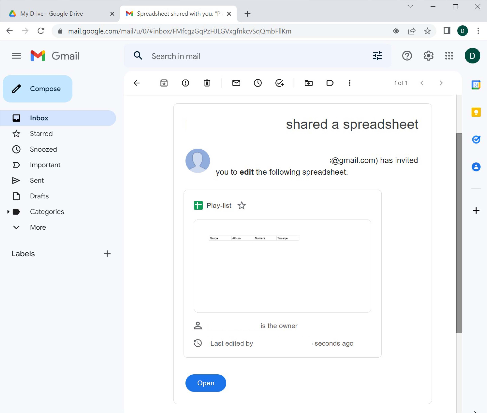
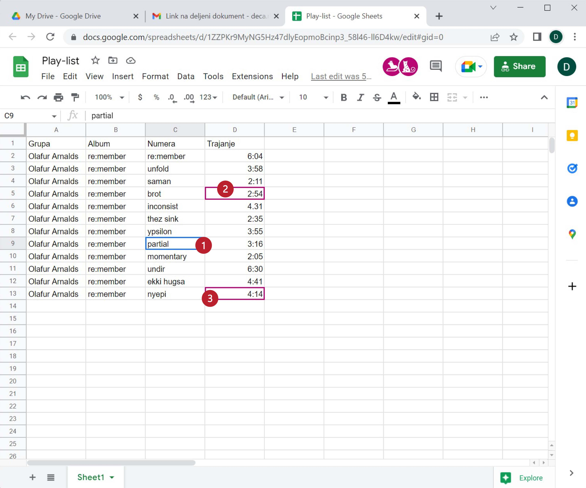

Дељење документа „у облаку“ и сарадња
===========================================

Сервиси у облаку ти нуде могућност да својим документима приступиш са било ког уређаја,
са било које тачке на планети (која има приступ Интернету), као и да поделиш своје документе
са другима тако да можете да радите заједно на истом документу!

Корак 1.
--------------

Сада ћемо поделити документ са другим корисницима. Кликни *десним* тастером миша на документ и из менија који се појавио одабери „Share“:

Појавиће се овакав дијалог:

У правоугаоник „People“ треба унети email адресе колега са којима ће табела бити подељена.

Потом треба кликнути на оловчицу како би се одредио начин на који ће документ бити подељен:

* „Can edit“ омогућује свима у групи да уносе податке у документ и да их мењају;
* „Can comment“ омогућује свима у групи да додају коментаре у документ, али само власник документа (онај ко га је креирао) може да га мења;
* „Can view“ омогућује свима у групи да виде документ, али само власник документа (онај ко га је креирао) може да га мења.

Можемо додати и кратак опис.

Коначно треба кликнути на [Send] („пошаљи“).

Ево и кратког видеа:

.. ytpopup:: f55A9KYwUnI
   :width: 735
   :height: 415
   :align: center

Корак 2.
-------------------

Сви чланови групе ће добити обавештење путем електронске поште да је документ подељен са њима:

Да би прихватили позив треба да отворе поруку и кликну на „Open in Sheets“:

Сачувај поруку са обавештењем да је документ подељен са тобом јер у сваком тренутку можеш
доћи до документа тако што ћеш отворити поруку и кликнути на „Open in Sheets“.
Друга могућност је да погледаш списак свих докумената који су са тобом подељени („Shared with me“).
Документ се налази и тамо:

.. image:: ../../_images/Sh17.jpg
   :width: 600px
   :align: center

Док више корисника ради на истом документу, свако има своју активну ћелију и тако се може пратити колико људи ради на документу и шта ко ради:

Ево и кратког видеа:

.. ytpopup:: dlgDeyxmFQQ
   :width: 735
   :height: 415
   :align: center

