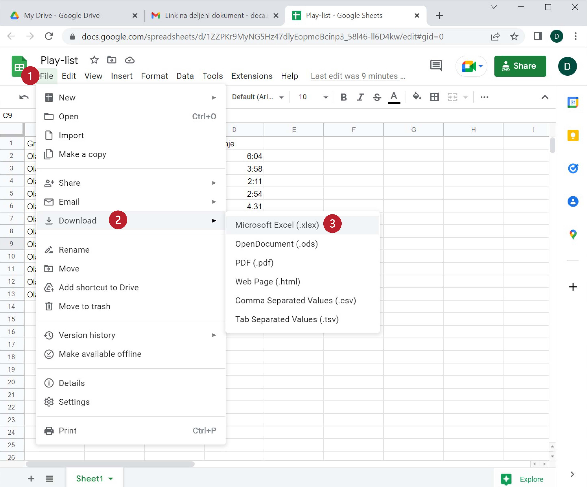

Преузимање документа
============================

Као што смо већ рекли, при раду са документима „у облаку“ *нема опције „Save“* која снима документ.
Свака измена у документу се одмах прослеђује серверу. Када завршимо рад на документу можемо га преузети и
снимити на свој рачунар: треба кликнути на „File“ (1), ту одабрати „Download“ (2) па из подменија „Microsoft Excel (.xlsx)“ (3):

Одговарајући Ексел фајл ће бити преузет са сервера.

.. infonote::

   Важно је да разумемо да *измене које вршимо на копији фајла који се налази на нашем рачунару неће бити видљиве осталим члановима тима!* Само измене које вршимо „у облаку“ ће бити доступне свима.

.. Ево и кратког видеа:

   .. ytpopup:: E1sDUZ9E7pY
      :width: 735
      :height: 415
      :align: center

